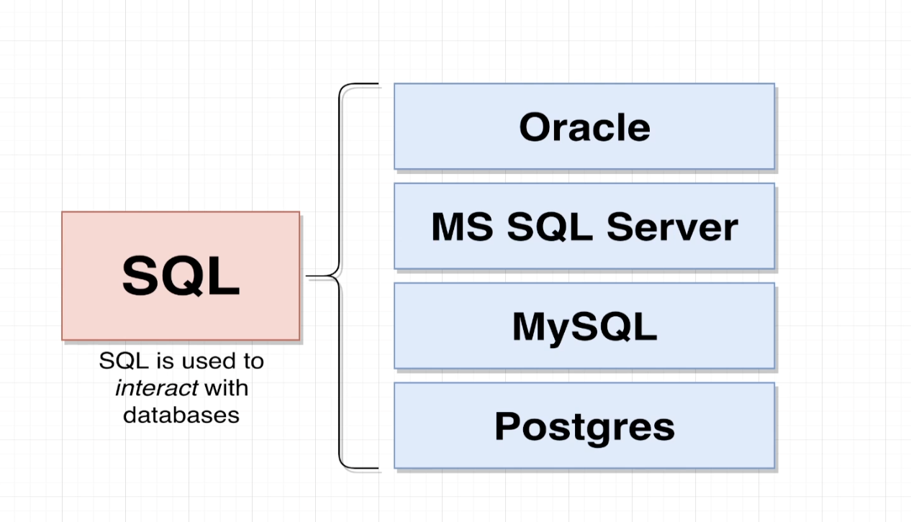
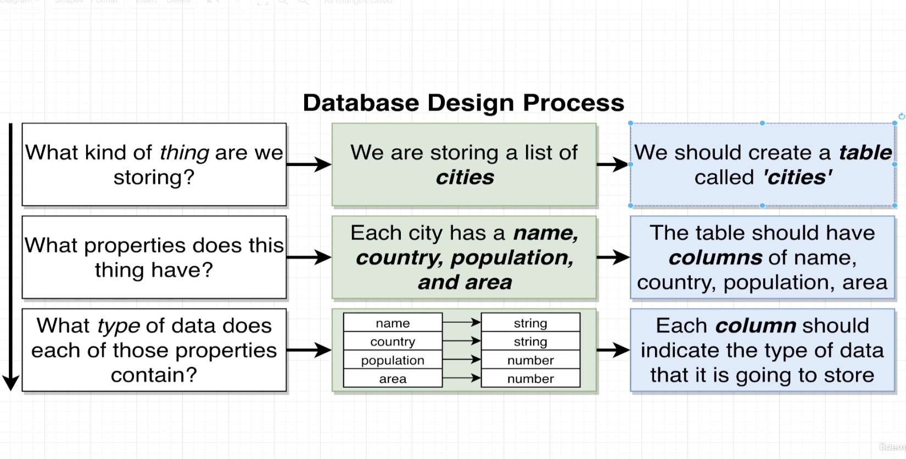

# SQL

- SQL is a communication language. It is how we interface or interact with our database. SQL is supported by many other databases as well, such as Oracle, Microsoft, SQL, MySQL and so on.

- Once you learn for one of these databases, you're generally going to be able to use that same knowledge and apply it to these other types of databases as well. There's not always 100% clean transfer of information or knowledge going from one database to another. But in general, if you just understand SQL, you're going to have an easier time working with these other types of databases.

# Database design process

