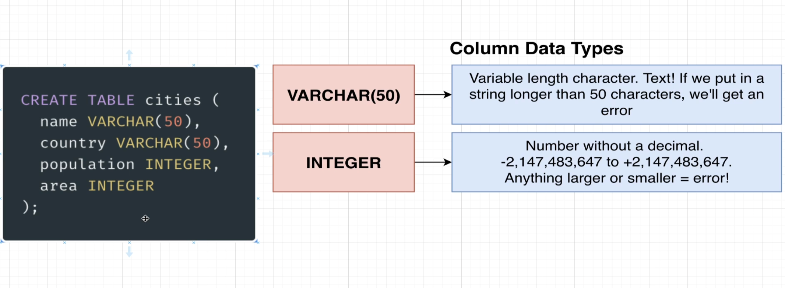
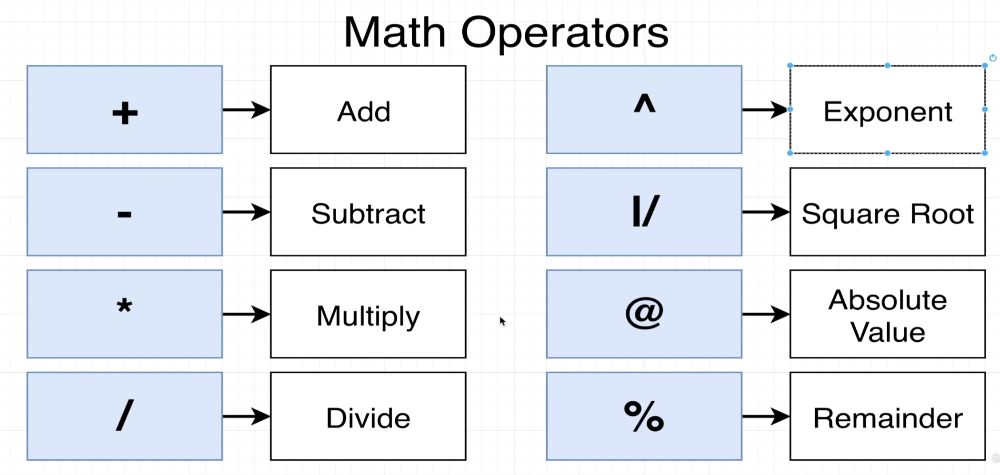

## Create table query analyzer

- Keywords are very special words inside of SQL that tell the database that we want to do a very specific thing or designate some particular option.

- keywords are always going to be capitalized and identifiers will always be lowercase.

- Identifiers are how we tell the database what we want to somehow operate on.

## varchar(50)

- if try to store longer than 50 characters then postgres is going to give error.

## integers

- integers in postgres will be numbers without decimal. They can range from -2 billion to 2 billon. If try to store anything larger or smaller then these then we are going to end up getting an error.

## Math operations

- We can perform these math operations between two columns. We can write sql to transform or process data before we receive it.

