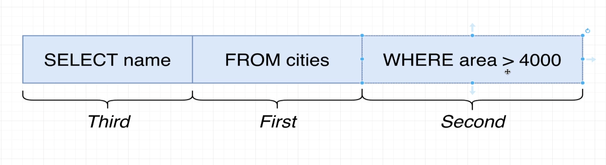

## Create table query analyzer

- Keywords are very special words inside of SQL that tell the database that we want to do a very specific thing or designate some particular option.

- keywords are always going to be capitalized and identifiers will always be lowercase.

- Identifiers are how we tell the database what we want to somehow operate on.

## varchar(50)

- if try to store longer than 50 characters then postgres is going to give error.

## integers

- integers in postgres will be numbers without decimal. They can range from -2 billion to 2 billon. If try to store anything larger or smaller then these then we are going to end up getting an error.

## Math operations

- We can perform these math operations between two columns. We can write sql to transform or process data before we receive it.

## String functions

- There are also a set of operators we can use to manipulate strings. And in addition to these operators, there's something else called functions we can use as well.

## Select query where clause sequence

- Here's the actual order in what in which you want to consider these steps being executed by Postgres.

- The first thing that really happens internally is Postgres takes a look at a data source. It's going to analyze your query and it's going to see that you are trying to pull in all the different rows from the city's table.

- After it gets that entire source of data, it then second applies that filtering criteria. So it says for each row, I only want to consider the rows that have an area greater than 4000.

- That's going to filter out or remove some rows out of our result set. And then for all the remaining entries or the remaining rows, then we are going to select some number of columns.

## Where clause

