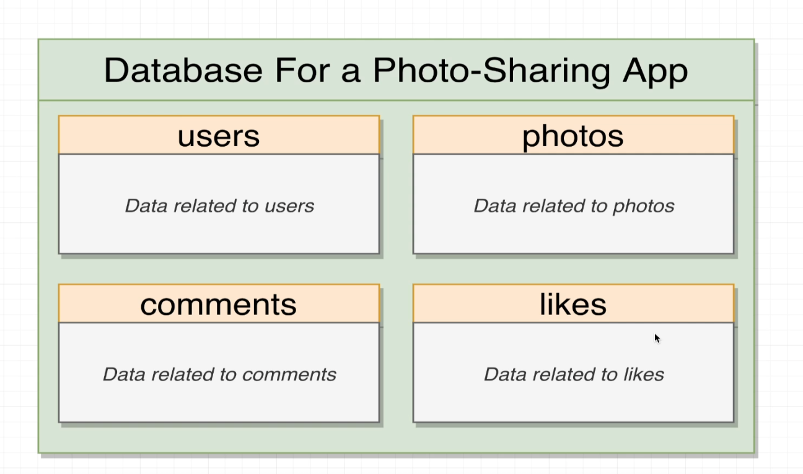
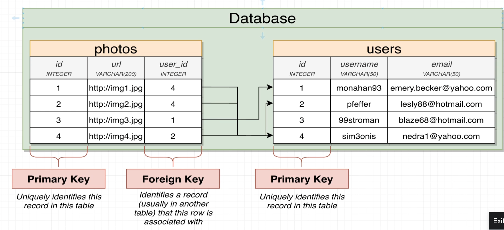
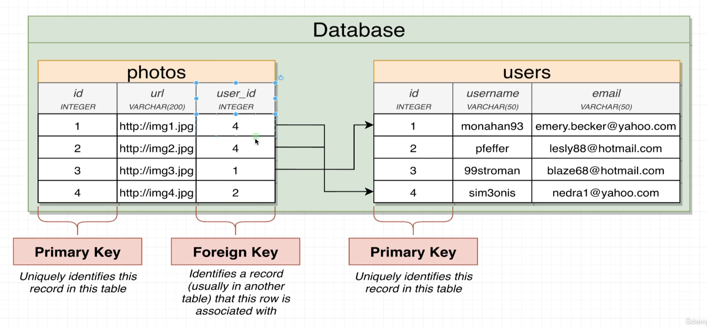
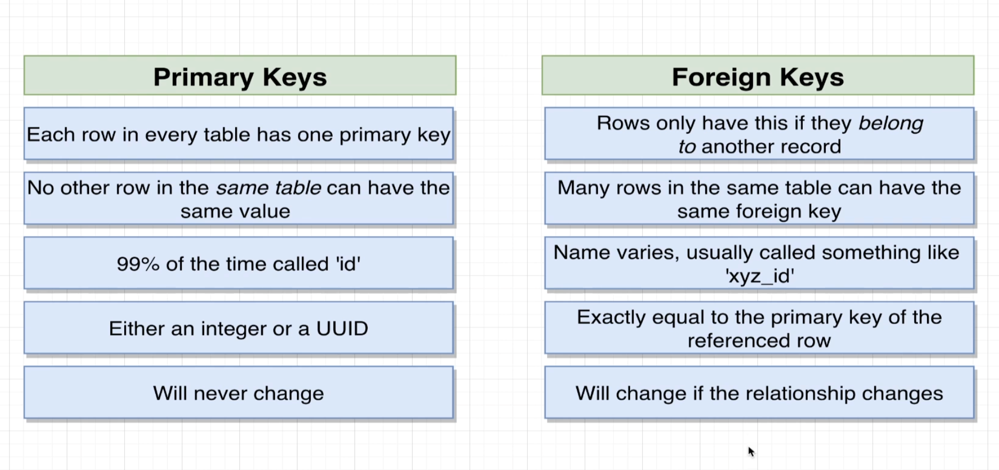
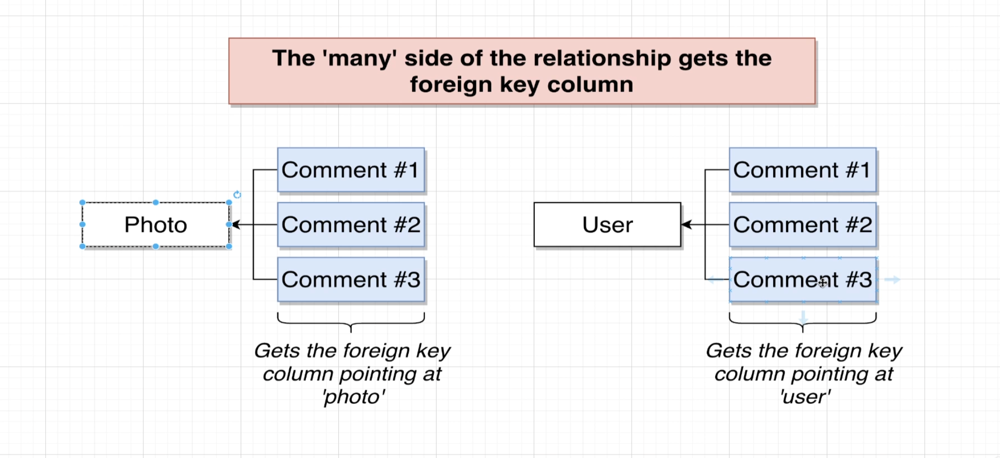
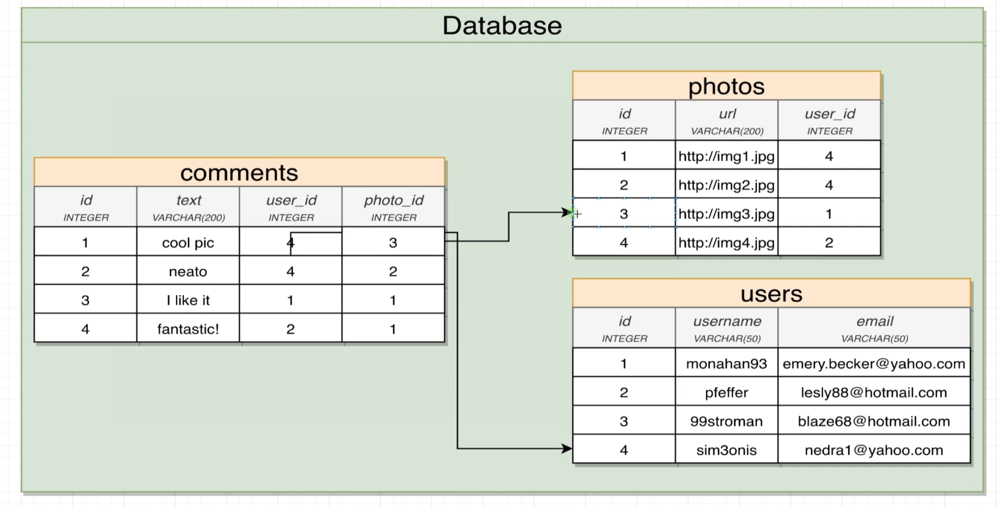
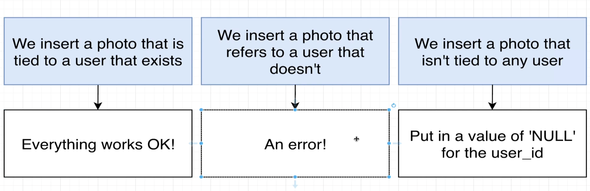

## Database for photo sharing application

## One to one and many to one relationship

## One to one

## many to many

## Four relationships

## Primary keys and foreign keys

- primary key is unique. value in primary key is unique and never going to be changed.
- goal of foreign key is to somehow relate 1 record in a table to another record in another or same table.

## Primary keys vs foreign keys

## Foreign keys

## Foreign key cases

## What if we delete a row in table

- If we delete a row in table with a SERIAL type column then there won't be any other record with the same id. No serial id ever gets reused even if the row ever gets deleted.

- By default, the option that gets used if we don't specify anything at all is on delete restrict.

- On delete Cascade is frequently a really good option if we want to try to delete a user and all the data associated with them.

