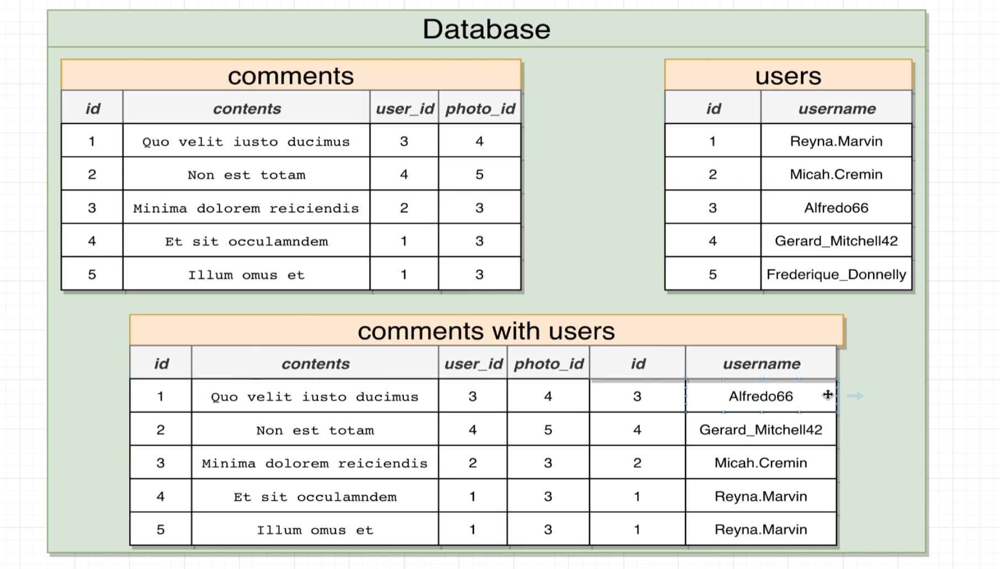
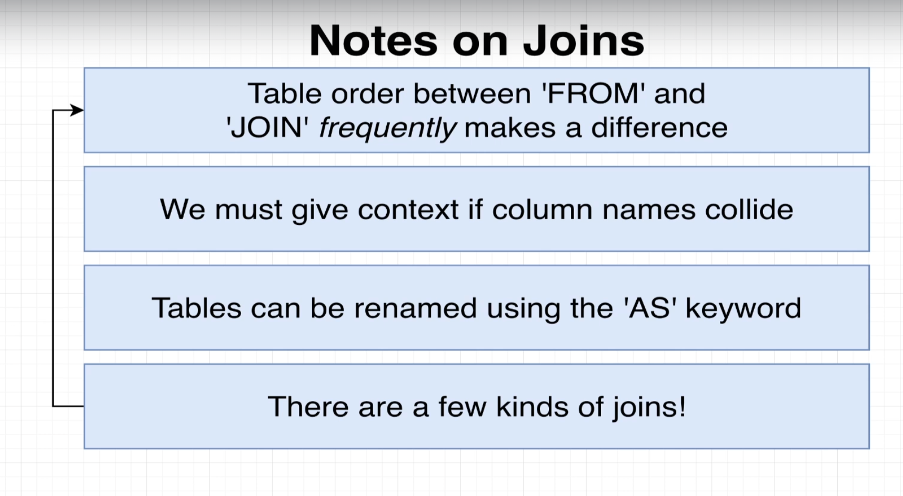
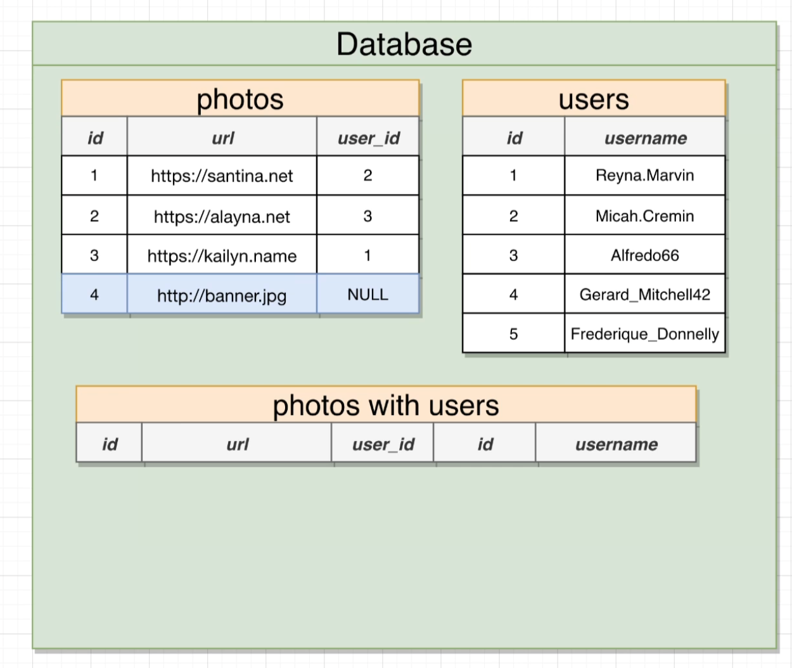
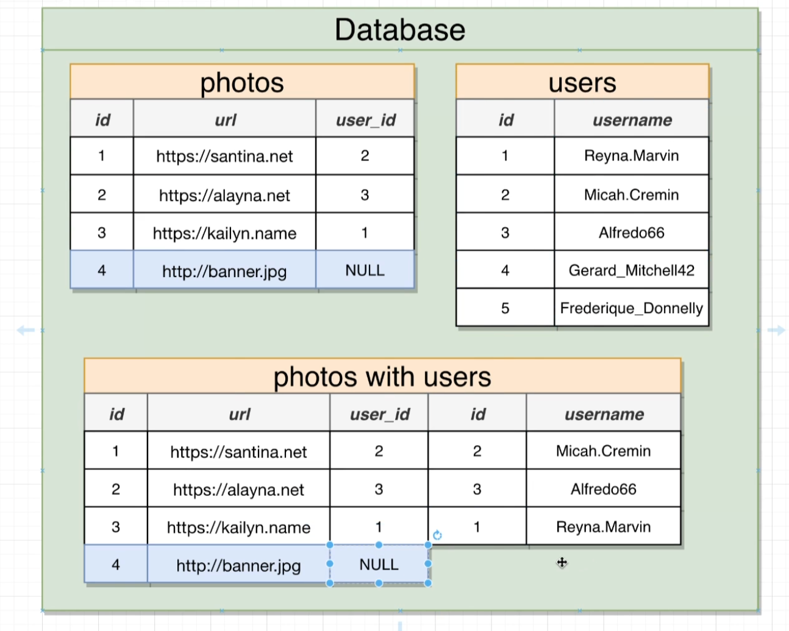
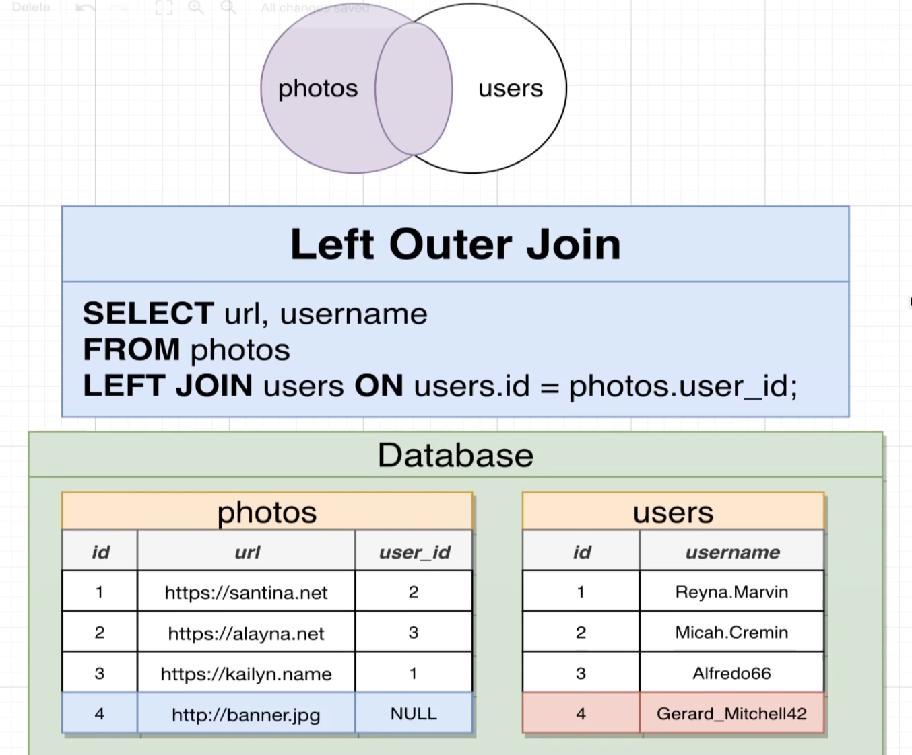
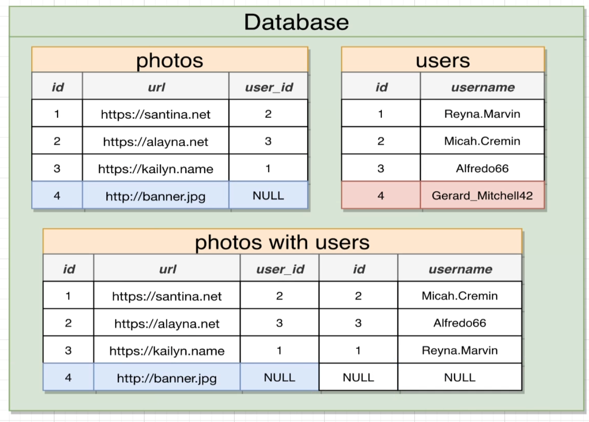
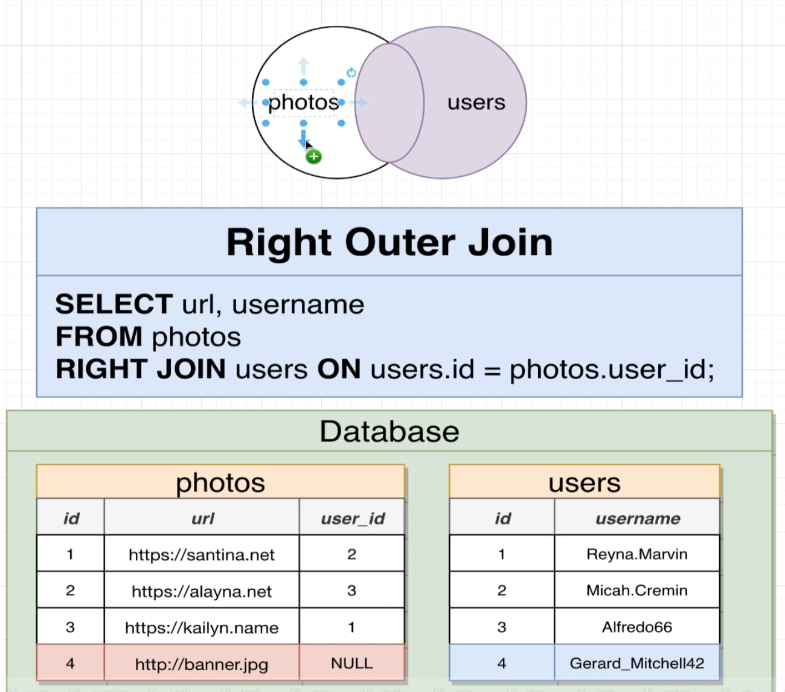
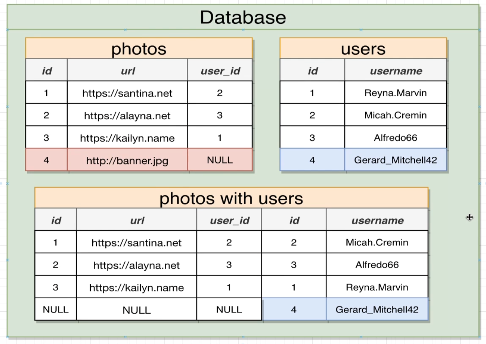
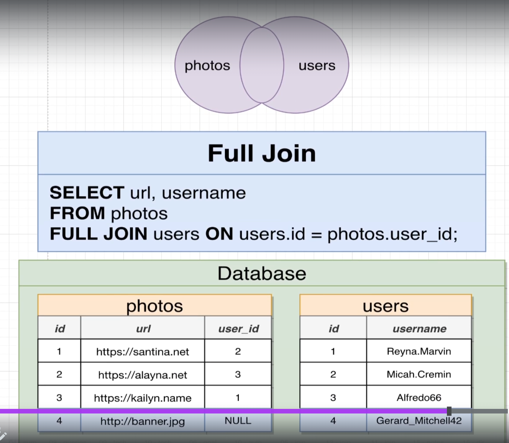
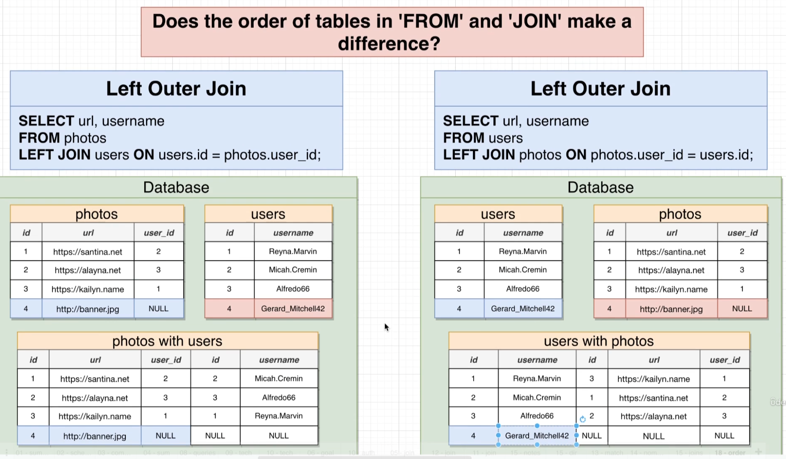

## join

- You can kind of imagine that our database is making a temporary copy of that initial table in this case comments. And then we can once again kind of imagine that this imaginary table right here gets renamed to something like comments with users. And then finally, we can also imagine that the database is then going to iterate through all these different rows and it's going to try to match each of these rows together with the row from the users table using the matching statement that we put on the other side of on.

- Here simple join statement won't print photo with null user id.

- If there is ever a row from our source table of photos that does not match up with the row from users, then that row right there gets dropped from the overall result set.

## Inner Join

- Whenever you use the keyword, join by itself inside of a query that is by default an inner join. You can write out either join or alternatively inner join to indicate that you want to do an inner join.

## Left outer join

## Right Outer join

## Full Join

## order matters

- yes, there is a difference in the order in which we list these tables in the from and join statement whenever we use a left or right outer, join the left and right outer joins. We definitely want to keep in mind the order of these tables so we list them out but with an inner join or a outer join in general, it doesn't make a difference.

