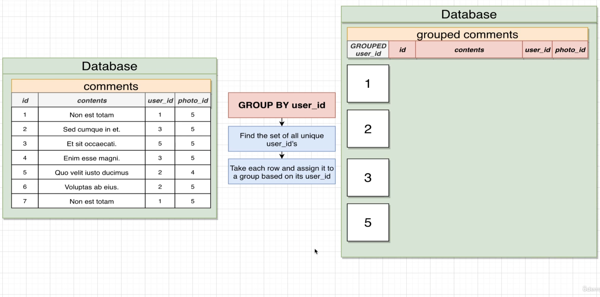

## Group and aggregates

## Group by

- We can kind of imagine that we are getting a very temporary imaginary table created inside the database.

- When we say group by user ID, that's going to create a new grouped column inside of this imaginary database.

- We can only select some very certain columns. We can only select in particular, the grouped column. We are not allowed to directly select any of the underlying columns inside of our original table.

- if we want to in any way work with these underlying columns, we can only select them by using an aggregate function,

## aggregate functions

- When we make use of an aggregate function, we cannot do a normal select. Next to it.

- We're going to most frequently use these aggregate functions by themselves or as a part of a larger group by statement.

- We cannot select a column and use an aggregate at the same time, or we end up with an error like so.

## combining group by and aggregates

- An aggregate function, if we use it while doing group by, is only going to be applied to each of these individual little subgroups.

- number of comments that each of our different users have created.

## Keywords

## difference between a where and a having

- Having is very similar to where. Its goal is to filter out some amount of information. The difference between where and having, however, is that where is going to operate on filtering out some number of rows, whereas having is going to filter out some number of groups.

- You are never going to see having without a group by. So you will always have a group by net right before a having.

- You don't have to have a having if you have a group by, but if you want to do any filtering on the groups you will make use of having.

- any time that we're talking about using some filtering along with an aggregate function, that is when we want to use having.
