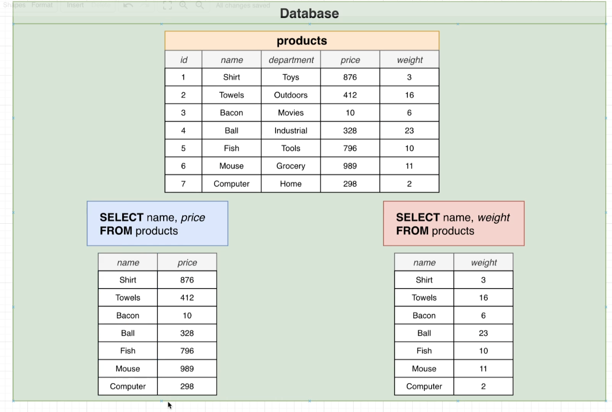
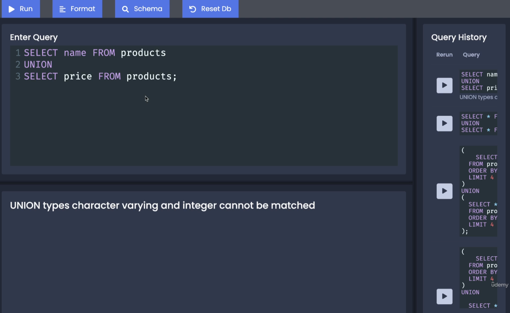
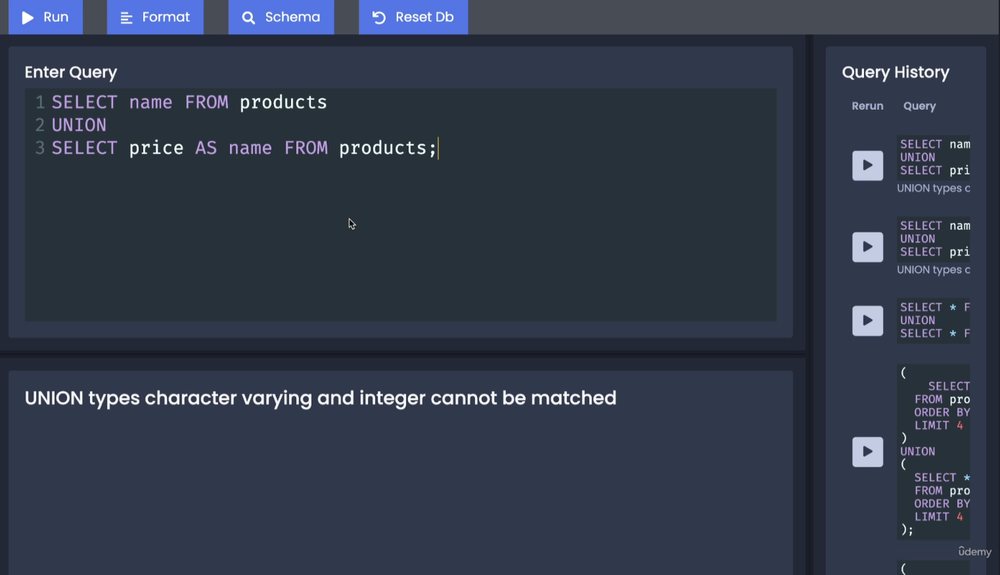
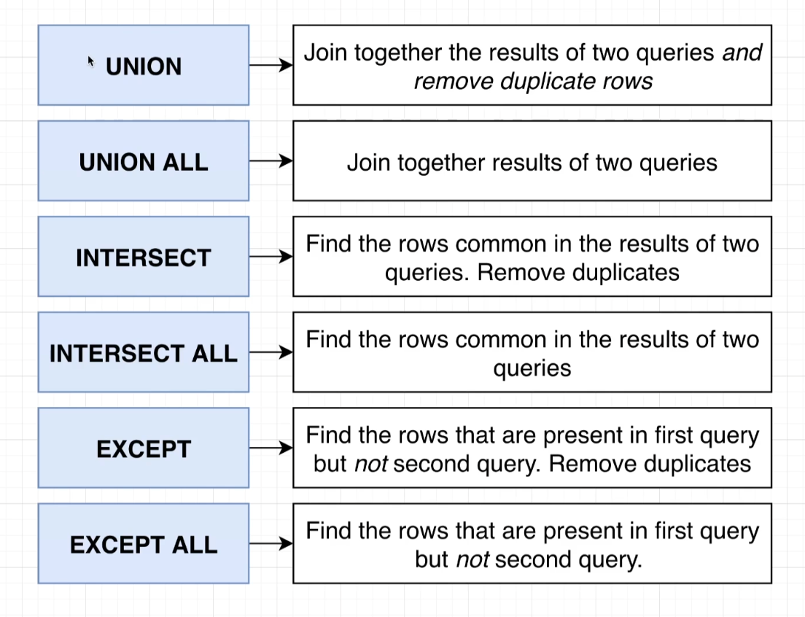

- We are only allowed to use the union keyword between the results of two queries where the results have the same columns, though they must have the same name and the data inside them must be the same type of data as well.

- Besides the union keyword, there are a couple of other keywords that we use to work with multiple sets of data.

  
