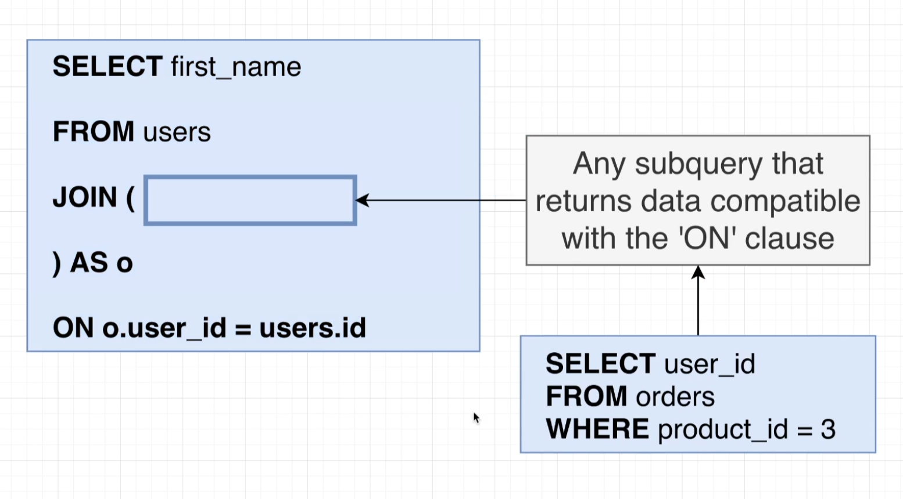

# Subquery

- The very first one inside the select statement is producing a single value. The two inside the from and join statements are producing a source of rows and then finally the last one down here inside the where clause is producing a single column.

- So one that produces a value, one that produces a set of rows and one that produces a single column, is the real trick to understanding this subquery stuff.

- The reason that making use of a subquery in different locations is challenging to understand is that whenever we write out these subqueries in different spots, we have to change the type or the shape of data that is being returned from the inner query.

- As you can see there are 4 different subqueries in the below example.

# Subquery in select

## Subquery in from

- The result of these subquery has only columns, name and price to weight ratio. So inside of our select statement, if we asked for just price by itself, we would get an error.

- we do not have to return a set of rows or columns from a subquery inside of a from clause. We can return just one single value as long as the outer select statements, the where and so on are compatible with it.

## One row and one column which referred to as a value. That's one single value

# Subquery in join

# Subquery in where

- So when we start talking about subqueries being used inside of a where clause and we start to think about the type or structure of data that is returned from the subquery, a valid subquery is going to be valid or not, depending upon the operator right here that we are using.

- So in some cases we are allowed to write a subquery that is going to return only one single value. In other cases, if we use a different operator, we might be allowed to write a subquery that's going to return a list or a single column of values. It all comes down to the operator that we are using.

- If we get back a single column of values, then we are allowed to use that with an in operator.

# Subquery with where operators

# Subquery examples

# Some/Any

- Some is actually an alias for any. So you can make use of the keyword any or some.

- The sum operator is going to make sure that 50 is greater than at least one of these two values. In this case, 50 is greater than 20. So this would evaluate to true.

