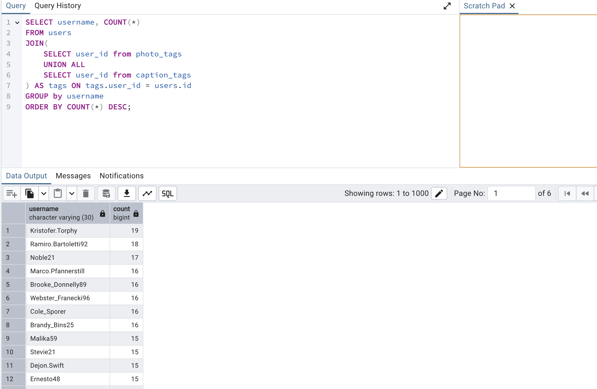

- Well, first off, I think that once again, we don't really need to have these two separate tables of tags. We really just need one collection of all the different tags.

- So we could do another union, as we've done before, between caption tags and photo tags. So if we do a union, we would take all the different rows, put them all together inside of one table, and then call the result. Maybe something like tags.

- So once we get to this point of this user tags table or this join table of sorts, we could then do a group by operation. And then we could count the number of rows for each of those different groups.

- Once we get those counts, we can then do some kind of order operation or a sorting operation to make sure that we get the most popular users at the top of the list.

- Maybe it was kind of a mistake when we were doing our initial database design to create these two separate tables because we just have to keep on having to take the union of them again and again and again.

# A possible solution merging table

- At this point, I think that we can come to the conclusion that having the separate tables of caption tags and photo tags is probably a design mistake. We've had to find the union between these two tables several times to execute some pretty basic queries, and we've not really found any benefit to having these two tables be separate. So I think that we probably maybe did make a mistake in our design here.

- The first really big issue is that we cannot copy over the IDs of all the different photo tags and caption tags to this new tags table. And the reason for that is that these photo tags and caption tags, tables, they might have rows that already have duplicate IDs inside them. it is very likely that photo tags and caption tags are going to have some identical IDs. That means that if there are any other records inside of our database that are pointing to that those different values, then all of a sudden we can have some foreign keys breaking.

- The other big issue here is that if we had a lot of other queries already written out inside of our application that made reference to specifically the photo tags or caption tags tables. Now all of a sudden they break because we're talking about deleting those tables.

# Solution 2

- So in solution number two, we're going to create something called a view. You can think of a view as being like a fake table that has a reference to rows or data from other tables inside of our database.

- You can think of a view as being like a fake table that has a reference to rows or data from other tables inside of our database. When we create a view, we can essentially wrap up some other information or present it in a cleaner form that already exists inside of our database.

- Ultimately, you can think of a view as being very similar in nature to a common table expression. The only issue with a common table expression, you might recall, is that we attach them to some other query. So in this case, we've got a common table expression up here at the top and we can only refer to this tag's CTE inside of the query that it is directly attached to. The nice thing about a view is that we get this very similar behavior where we can kind of wrap up some existing query, but we can create a view ahead of time and then refer to it at any future point in time in any other query. And we don't have to rewrite the view or anything like that.

- We should really think of a view as being very similar to a common table expression. The big difference is that we create a view ahead of time and then we can refer to it at any point in time after that.

- We are going to use a view in our case to take the union between two different tables in our case caption tags and photo tags. But we do not have to use a view for only a union. We can put any kind of query into a view.

- We're then going to write out our query inside these parentheses. So this is where we are going to kind of generate some data that's going to be accessible through The View.

- So with this view, we've essentially solved this issue of having two separate tables. We've kind of merged them together, but it's not any permanent change whatsoever. We can always remove this view if we want to, and none of the underlying data is going to go anywhere.

- All the underlying data inside of the two separate tables still exists. So if we have any queries that refer to those two separate tables of caption tags or photo tags, those existing queries are going to work just fine.

- So at this point, we've been talking about views which are essentially queries that we kind of wrap up and refer back to at some point in time in the future. Whenever we refer to a view, we are ultimately executing the underlying query kind of stored within it.

# Materialized views

- we're now going to take a look at a variation on a view called a materialized view. A materialized view is a query that we're going to kind of wrap up or kind of package, but the query is only going to be executed at very specific times.

- However, every time that we do actually execute the query, Postgres is going to take the results and save them and we can then refer back to those results without rerunning the query itself.

- So we make use of materialized views anytime that we have a very expensive query. In other words, a query that might take many seconds, minutes or even hours to actually execute. We can run a materialized view just one time and then hang on to the result set and refer back to the results without having to go and rerun the very expensive query.

- Left inner join

