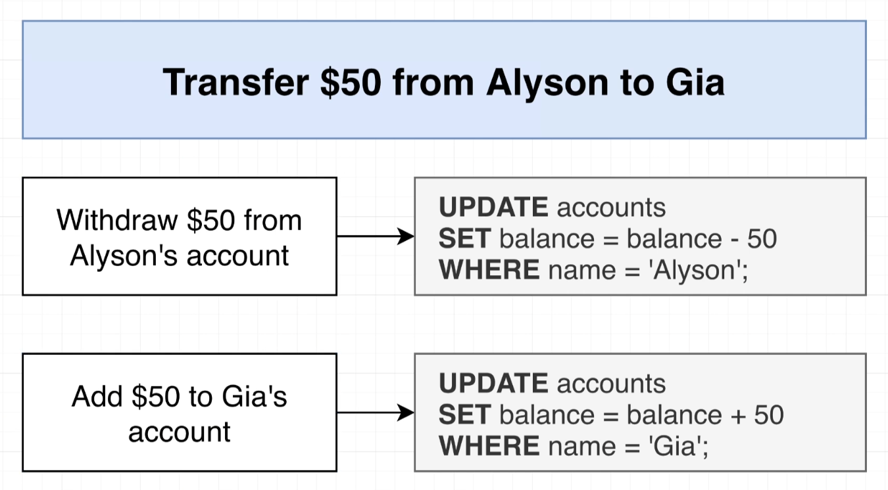
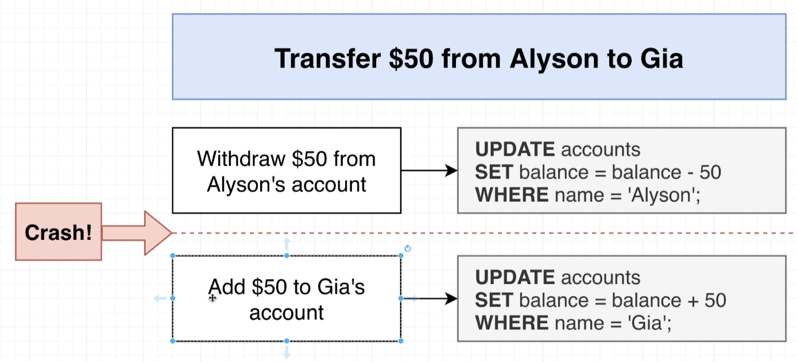

- so maybe we are running some application server on who knows, AWS or Digitalocean or even just on your computer and maybe unfortunately in between your server running this first query right here or this first update and the second update maybe unfortunately you have some kind of crash.

-  Now, when you crash, you might have already ran the statement that would subtract $50 from Allison's account, but you were never able to actually run the statement. That would add 50 to account.

- Eventually your server might come back online, but you might not have any infrastructure or any code in place to detect any of these kind of half executed steps.

- So this scenario is what transactions are all about. We are going to use a transaction to solve this kind of problem where we want to run some kind of updates in series and we need to make sure that all the different updates are always executed or none of them are executed.

