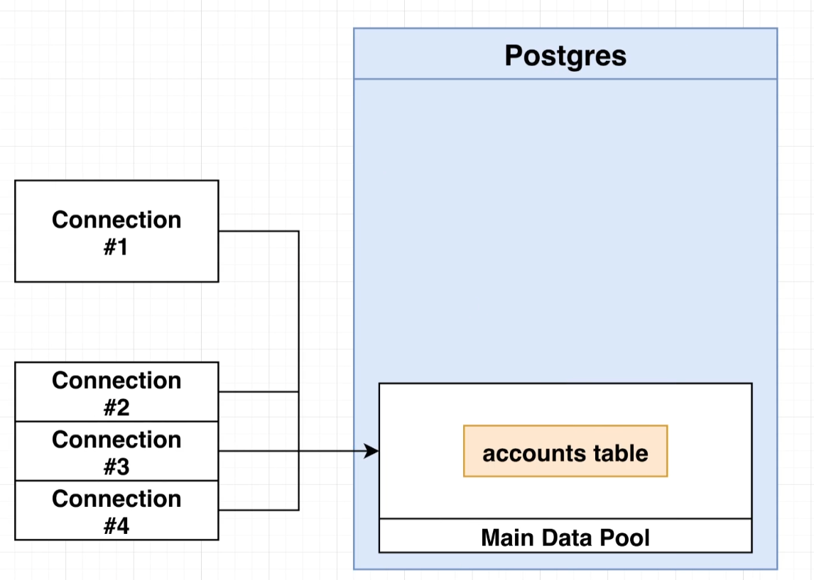
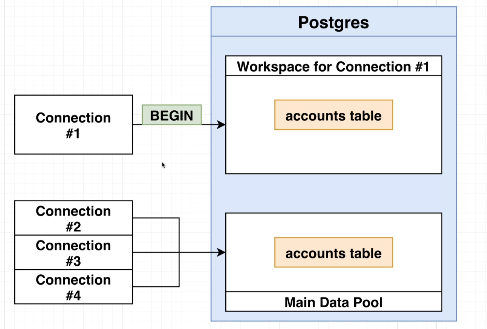

- so maybe we are running some application server on who knows, AWS or Digitalocean or even just on your computer and maybe unfortunately in between your server running this first query right here or this first update and the second update maybe unfortunately you have some kind of crash.

-  Now, when you crash, you might have already ran the statement that would subtract $50 from Allison's account, but you were never able to actually run the statement. That would add 50 to account.

- Eventually your server might come back online, but you might not have any infrastructure or any code in place to detect any of these kind of half executed steps.

- So this scenario is what transactions are all about. We are going to use a transaction to solve this kind of problem where we want to run some kind of updates in series and we need to make sure that all the different updates are always executed or none of them are executed.

- So inside this diagram, we've got our Postgres database. We are connecting to a Postgres database by creating something called a connection. Every query to a window that you open up inside of Pgadmin or any time that you connect to your database from some other kind of application or even some code that you might write, you are creating a different and unique connection.

- So if I go over to my left hand navigation right now, right click on Instagram and click on Query Tool that opens up a second query tool window. I now have two separate windows open. Each of these windows are issuing or connecting to Postgres with a separate and unique connection.

- Whenever you open up a connection to your database, you are connecting to your well database and you have access to all of the data inside that database, such as the accounts, table users, table posts and so on.

- The data that you are looking at is the exact same data that all the other connections are looking at as well.

- I just mean to say all these connections see the exact same data.

- Well, as soon as we open up a transaction, we can imagine that this is what occurs When you execute begin, you can picture in your mind That our database is creating a separate workspace of data just for connection number one.

