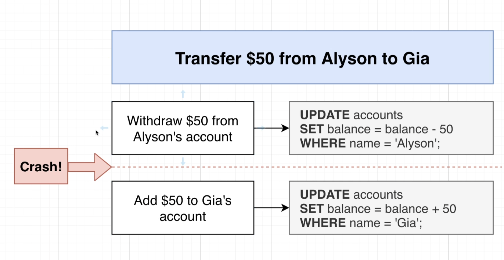

- so maybe we are running some application server on who knows, AWS or Digitalocean or even just on your computer and maybe unfortunately in between your server running this first query right here or this first update and the second update maybe unfortunately you have some kind of crash.

-  Now, when you crash, you might have already ran the statement that would subtract $50 from Allison's account, but you were never able to actually run the statement. That would add 50 to account.

- Eventually your server might come back online, but you might not have any infrastructure or any code in place to detect any of these kind of half executed steps.

- So this scenario is what transactions are all about. We are going to use a transaction to solve this kind of problem where we want to run some kind of updates in series and we need to make sure that all the different updates are always executed or none of them are executed.

- So inside this diagram, we've got our Postgres database. We are connecting to a Postgres database by creating something called a connection. Every query to a window that you open up inside of Pgadmin or any time that you connect to your database from some other kind of application or even some code that you might write, you are creating a different and unique connection.

- So if I go over to my left hand navigation right now, right click on Instagram and click on Query Tool that opens up a second query tool window. I now have two separate windows open. Each of these windows are issuing or connecting to Postgres with a separate and unique connection.

- Whenever you open up a connection to your database, you are connecting to your well database and you have access to all of the data inside that database, such as the accounts, table users, table posts and so on.

- The data that you are looking at is the exact same data that all the other connections are looking at as well.

- I just mean to say all these connections see the exact same data.

- Well, as soon as we open up a transaction, we can imagine that this is what occurs When you execute begin, you can picture in your mind That our database is creating a separate workspace of data just for connection number one. And we can further imagine that we are taking a copy of all the different tables, all of our different rows, everything out of our main database and making a copy into this separate, isolated workspace.

- Now very important behind the scenes. We are not actually copying any data whatsoever just by opening a transaction.

- We are not copying any tables, any rows, anything like that. This is just a very convenient way to imagine what is going on behind the scenes.

- So now connection number one is the only connection that can access any data inside this workspace. So now we can start to freely make changes to this accounts table and no other connections are going to see those changes whatsoever.

- So we have now made some number of changes to all the data inside of this separate little workspace. So now the big question is how do we take those changes and somehow merge them back in to the main data pool?

- So first, after making some number of updates, if we want to merge those changes back into the main data pool and allow everyone else to see that data, we can run the commit keyword by itself.

- Alternatively, if we decide for any reason that we don't want to save those changes, if we don't want to merge them back in, then we can run the rollback keyword.

- So if we run rollback, that is going to delete the separate workspace. We're not going to save any changes. And connection number one will continue to take a look at the main data pool.

- Another scenario that we can fall into if connection number one runs some kind of query that results in an error. So, for example, if we do a select star from some table that doesn't exist, that would result in an error. Whenever you have this separate workspace and get an error inside of it, the workspace or really the transaction is what we're referring to here enters an aborted state. You have to manually run a command of rollback to get out of that aborted state until you run rollback. You will not be able to issue any other queries or statements inside of that transaction.

- So in other words, if you have some kind of error, you got to run rollback. You're going to delete everything inside there. And connection number one falls back to looking at the main data pool again.

- If we ever, for some reason, lose this connection. So if the connection is just suddenly terminated because the process that is making the connection crashes. So like our server or something like that, if we crash, then Postgres will detect that and it's going to automatically clean up that transaction and delete all that stuff. And so we will not commit any of those changes back to our main data pool.

- let's open up a transaction. Remember we do that with begin.

- By opening dashboard and So I'm going to manually terminate both those windows. So click that red x right there and the red x right there. So now those connections have been terminated just 100% stopped. So in theory we no longer have any transactions running.

- Postgres should have automatically recognized that that connection has died and cleaned up the transaction tied to it.

- If we open the two connections then we will get database connection popup if we try to run any query in them.

- We're going to make sure that if we ever need to run some number of queries in sequence and they all have to be executed or none of them be executed, we're just going to wrap them all inside of a transaction.

