- Schema migrations are all about making very careful and well-planned changes to the structure of your database. So we are talking about adding columns to a table, removing columns, changing the name of a column, adding tables, removing tables, and so on.

[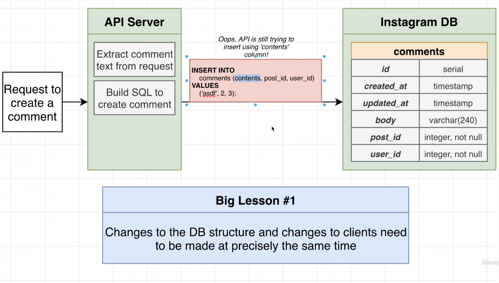](./pictures/migration_issues_01.png)

[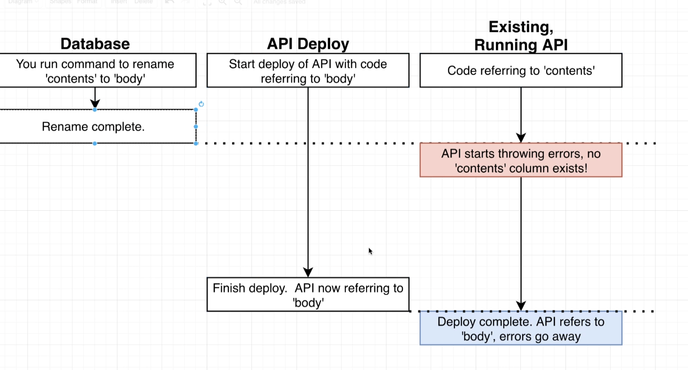](./pictures/migration_issues_02.png)

[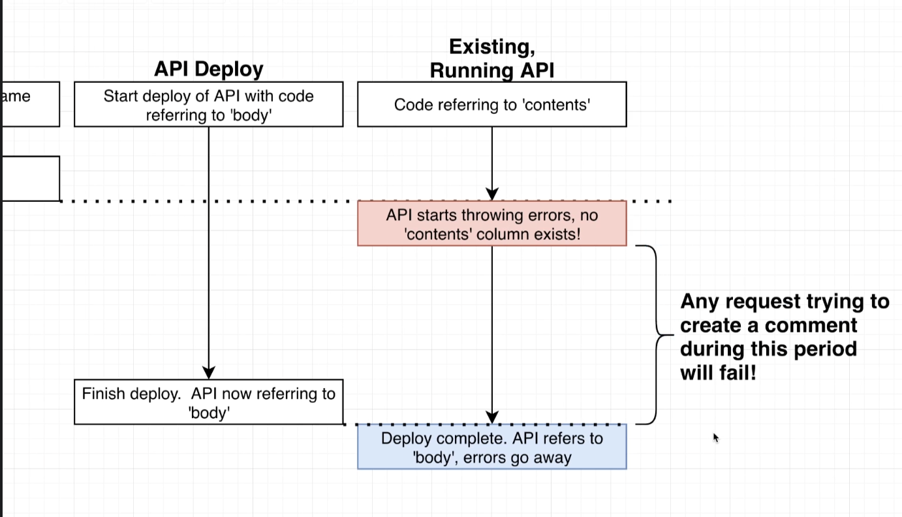](./pictures/migration_issues_03.png)

[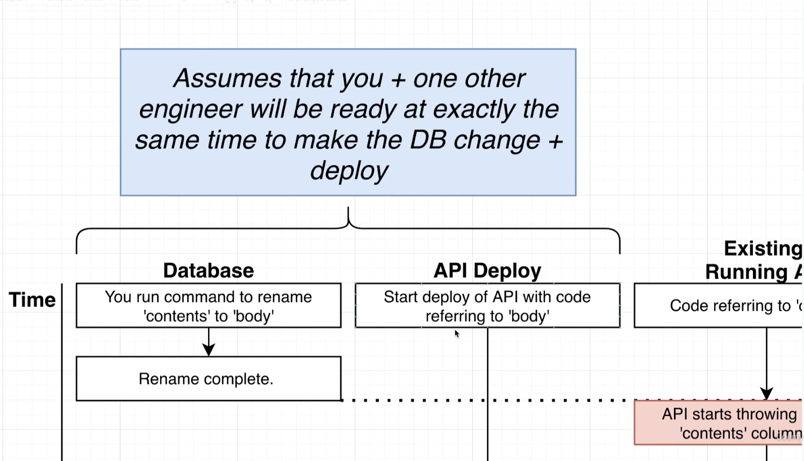](./pictures/migration_issues_04.png)

[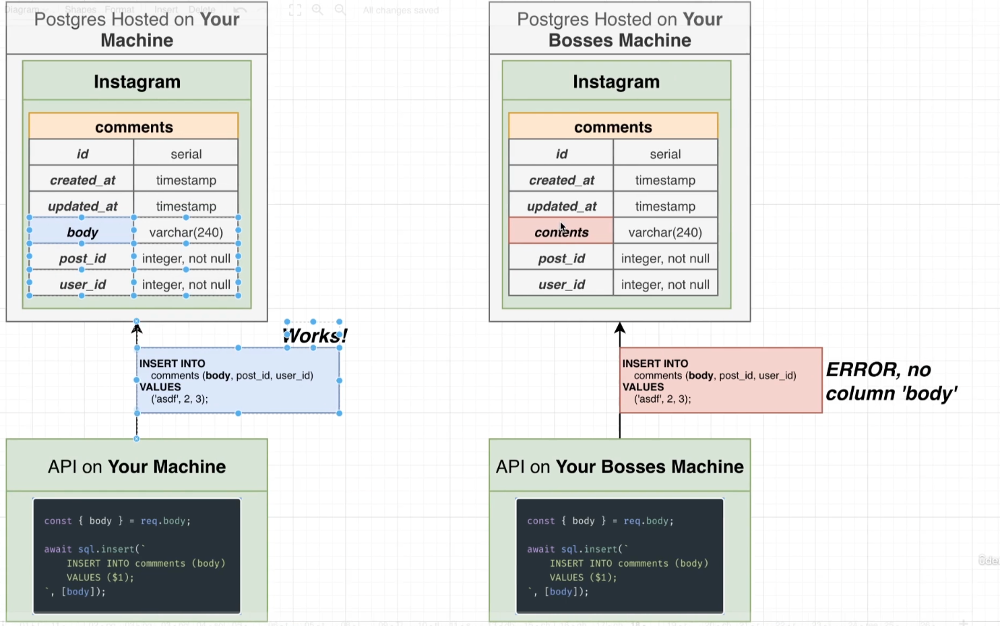](./pictures/migration_issues_05.png)

[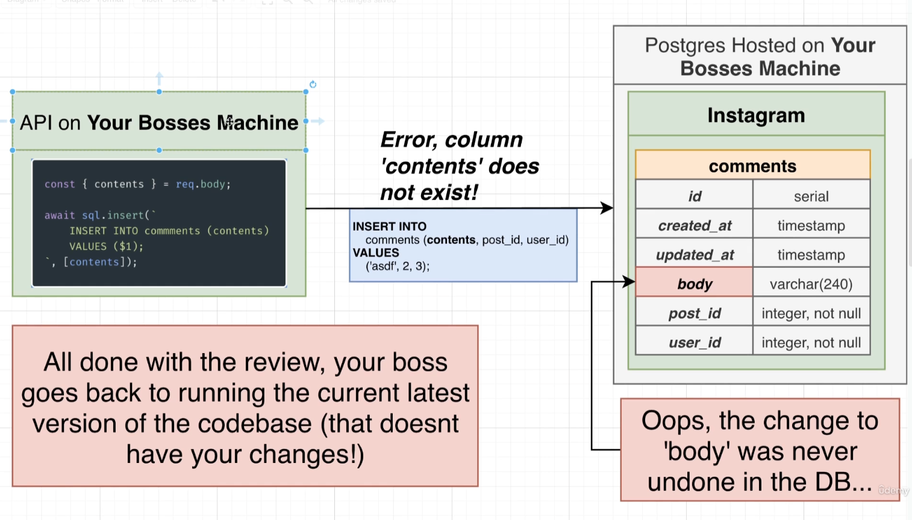](./pictures/migration_issues_06.png)

[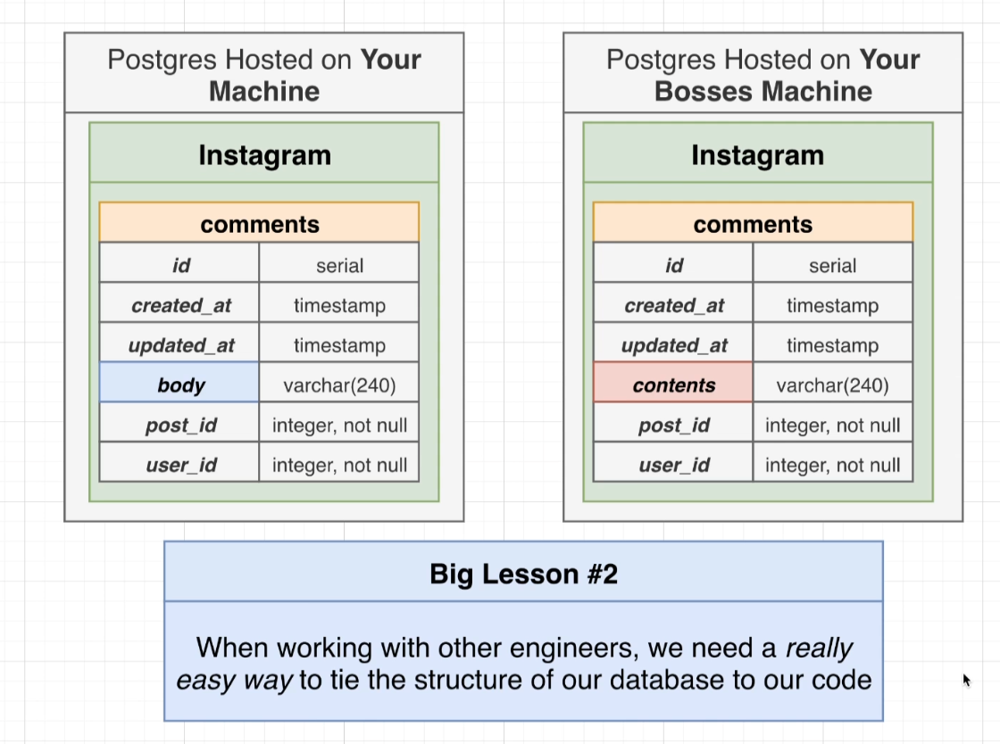](./pictures/migration_issues_07.png)

- Lesson number one was that whenever we change the structure of our database, we needed to make sure that we changed our clients, that we're connecting to that database at the same time. Big lesson number two was that whenever we were working with other engineers, we really need a way to tie the structure of our database to some specific version of our code.

-  we have been making changes to the structure of our database by opening up Pgadmin, accessing some database, and then writing out some command that changes the structure of our database. So in other words, all changes were made directly inside of Pgadmin.

- Moving forward, wherever possible, we're going to instead author something called a schema migration file.

- Schema Migration files are files that contain some amount of code that describe a very precise and very detailed change that we want to make to our database.

- So, for example, if we wanted to take our comments table and rename the contents column over to body, we are going to write out a schema migration file. That migration file is going to contain some code that says I want to rename contents over to body.

[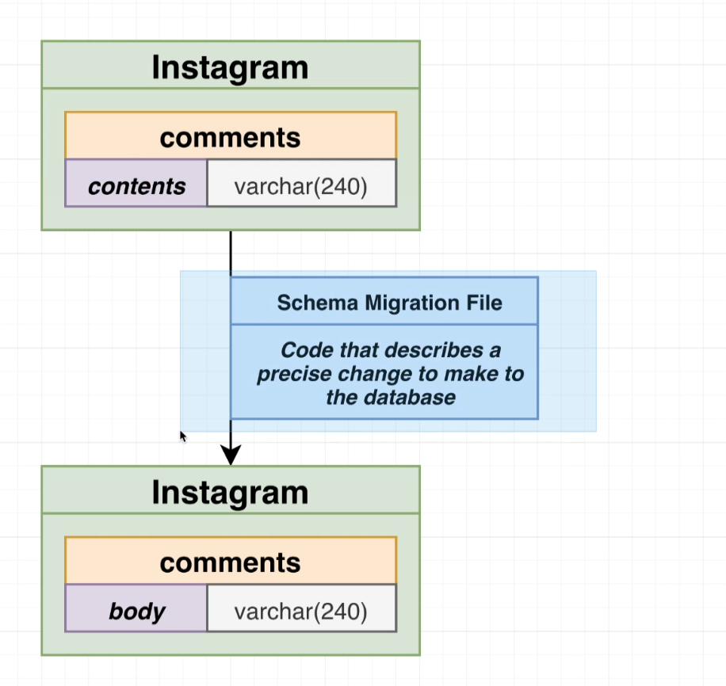](./pictures/schema_migration_file.png)

- Well, a migration file can be written in any programming language you want. This entire idea of schema migrations is not tied to any particular language. So you can author a migration file with Python, Java, JavaScript, cplusplus anything you want to write it with.

- In general, a schema migration file is going to contain two different sections. Inside of it, we refer to one section as up or upgrade, and the other we might refer to as down or rollback or downgrade. The up section will contain some SQL that is going to somehow advance or upgrade the structure or change the structure of our database. So in our example that we walk through in the last video, we might have an up section inside of migration file where we rename our contents column over to body.

- The down section is also going to contain some SQL that is going to exactly undo whatever the up command did. So if our up command renamed contents to body are down would do the exact opposite. We would rename body back to contents.

[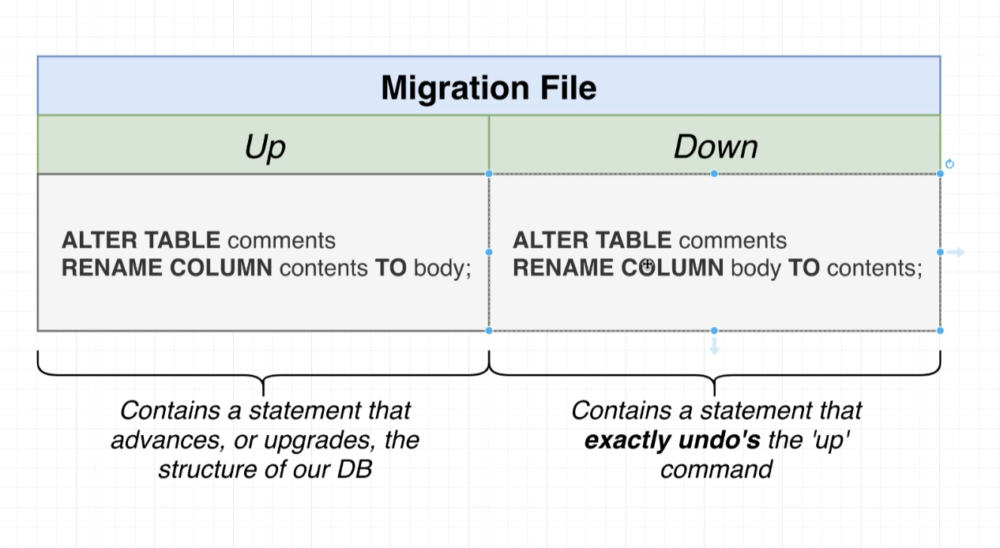](./pictures/schema_migration_file_structure.png)

- Once we author a migration file, we then apply it to our database.

[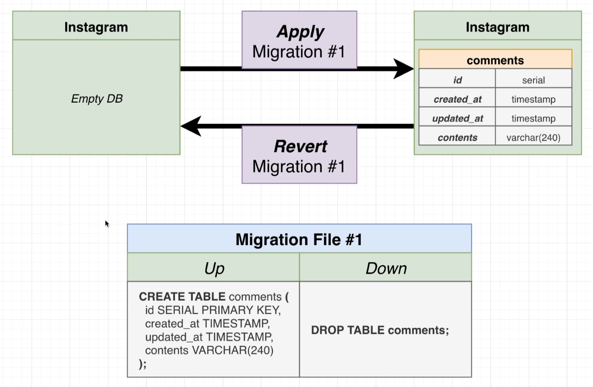](./pictures/migration_file_apply.png)

- So every migration file contains everything you need to make a change and undo a change.

- Any single project can have many different migration files inside of it.

- rather than opening up Pgadmin and writing out some SQL that would create some tables for you. You could instead create a migration file that describes setting up the initial structure of that database.

- Now, the very nice thing about migration files is that you can take a project with a bunch of migration files inside of it and hand it off to any brand new engineer working at your company.

- That brand new engineer could then run all the migration files and they would be guaranteed that they've got the most up to date, perfect and exact structure of the database.

- The other nice thing about migration files is that if you ever write a migration and then decide that it's not quite right, you could run the down migration tied to it. So you would undo that migration, make some change, fix everything up and then reapply the up.

[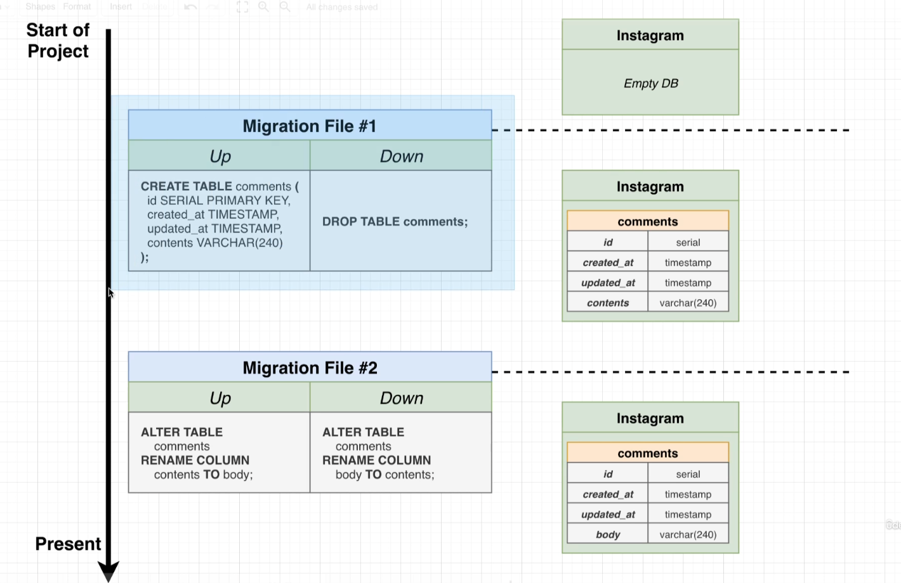](./pictures/migration_files_multiple.png)

- So in theory, this could shrink down that window of time where we have a differing version of our API and a different version of our database structure down to a very small period of time.

- Inside of any given code review request, we can say that we have some new version of some code that needs to be reviewed and we can pair it along with that.

-  A migration file that describes the exact changes to the structure that need to be made to our database in order to safely execute this new code. So then in theory, another engineer could take all the code for this code review request. They could apply the migration, which would give them the correct structure of the database to run this new version of the API. The other engineer could then evaluate and test all this code. And then finally, once they were complete with the review, that engineer could then revert this migration and that would take them back to the current structure of the database that would allow them to run whatever current code, base or version of the code or the version. The API is really out there.

[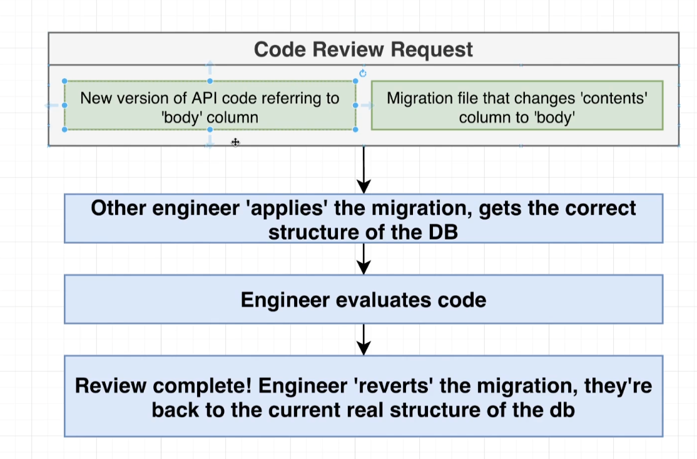](./pictures/code_review_request_01.png)

[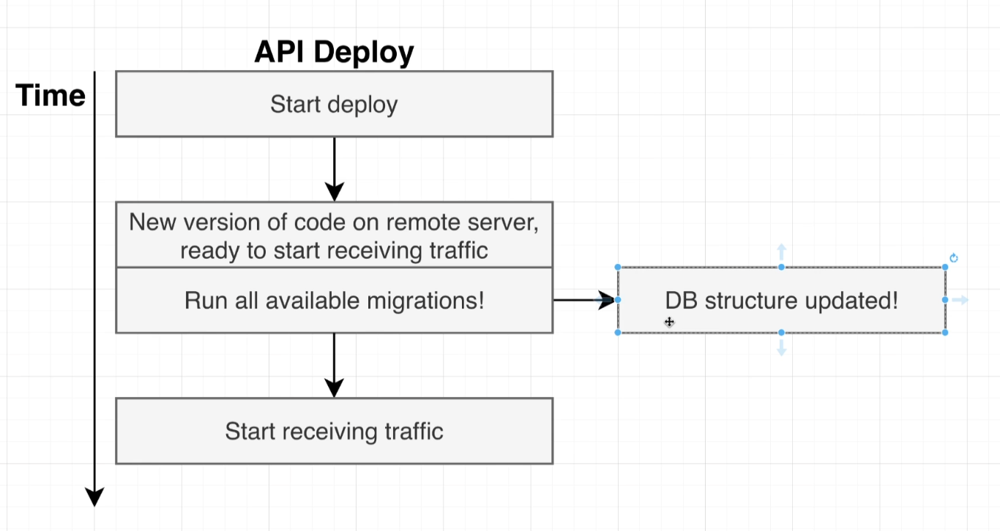](./pictures/code_review_request_02.png)

# Libraries for creating/Running data schema migrations

[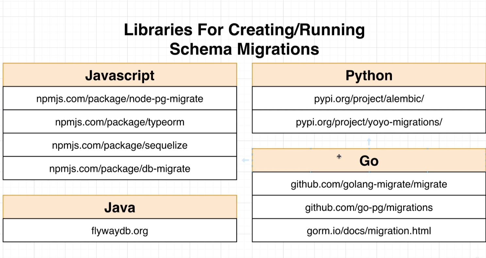](./pictures/data_migration_language_options.png)

# Project creating migration

[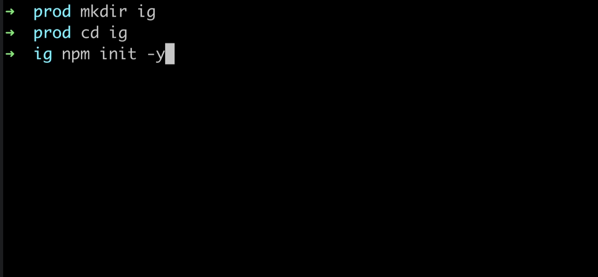](./pictures/create_migration_file_02.png)

[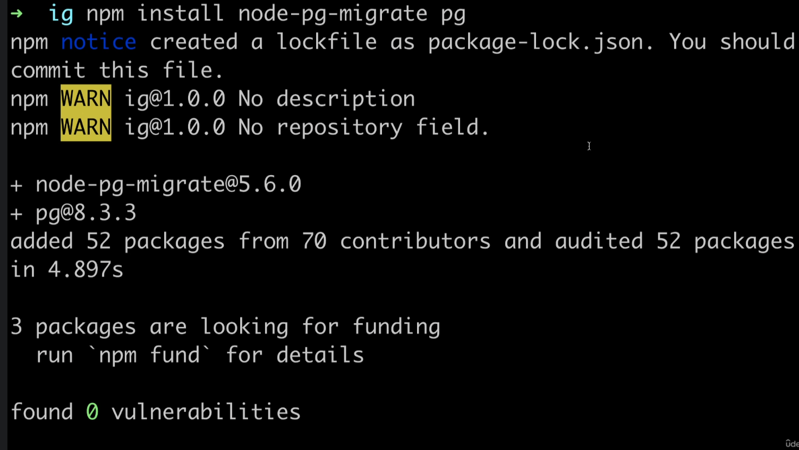](./pictures/create_migration_file_03.png)

[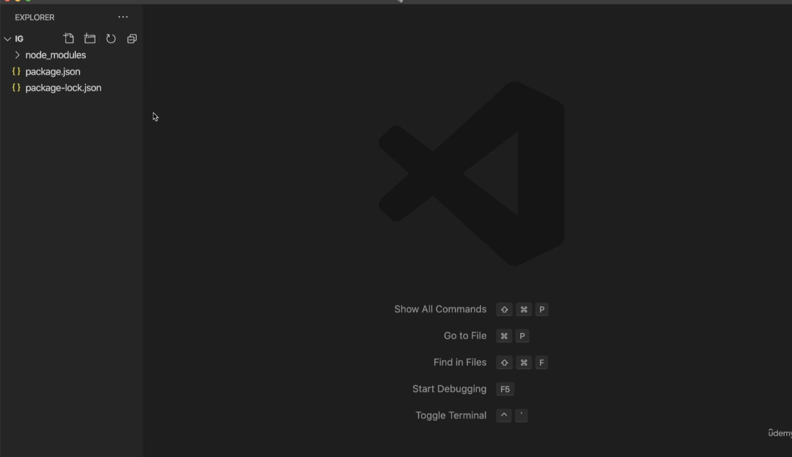](./pictures/create_migration_file_04.png)

- You'll see that there is a new migrations folder inside of here. And inside there is a file called Table comments. The number at the very start of this is a timestamp. So that is the time at which this migration was created.

- That timestamp is going to tell this migration library later on. So node migrate what order these different migrations should be executed in because we would want to make sure that we always run this migration file first. In other words, the migration file that actually creates the table before we ever try to run a migration that would try to change it in some way.

- Then inside this file we can see very easily that there is a function right here called up and a function called down.

- They are going to contain or produce some amount of SQL or run some command or do whatever to either advance the structure of our database in some way. And then down is going to contain some SQL or run some command or do whatever that is going to revert or do the exact opposite of whatever we did with up.

- you might have noticed that this argument pgm right here is essentially an object that we can use to create tables or change tables, add columns, all that kind of stuff. But we are not going to rely upon any kind of automatic migration generation or anything like that, anything to automate the process of making changes to our different tables. So instead, we going to write out pgm.SQL. We're then going to put in a multi-line string which in JavaScript we indicate with a set of backticks that is a character to the left of the one on your keyboard. And then we are going to write out some raw SQL inside of here that we want to execute.

- So again, we are not relying upon any kind of built in function that is going to create the table for us.

# Exceute the migration

- So to execute the migration, it's going to be a little bit different depending upon your operating system.

- You'll also notice that there is another table inside of here called Migrations. This table was created for you automatically by the Node migrate module. If you do a right click on there and then go to view data all the rows. You'll see that this table essentially just lists out the name of a migration that has been executed and when it was actually executed. So that table is used by many different migration frameworks or a table very similar to it, I should say, is used by many different migration frameworks just to keep track of what migrations have actually been executed and make sure that you don't run that same migration again.

- If you go and run the same command once again back at our terminal and try to do that same migration again. It'll just say, okay, there's no migrations to run because our module has detected that we already

- If for any reason we decided that this migration was not written correctly or if we did something wrong, or if we just don't want to have our database in this structure anymore, we could run the same exact command. But at the very end, instead of up, we will put in down. So down is going to undo the most recent migration.

- So we just dropped table comments.

- So now if we go back over to Pgadmin yet again and refresh tables, now the table is gone and we've only got migrations, which again just keeps track of which migrations we have actually executed. If you refresh that table now migrations, you'll see that there are no rows inside there and that indicates that we have not actually executed any migrations.

- After adding the second migration file we run the migration again then It looks like that created first the comments table for me and then went ahead and applied that renaming step.

- And when we do a down, it's only going to revert one step at a time.

[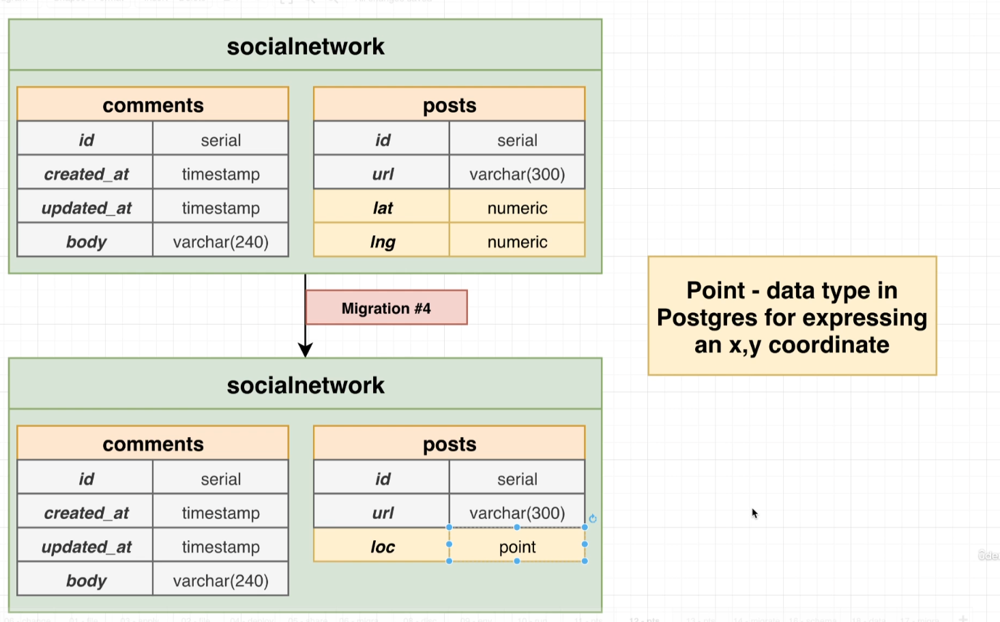](./pictures/post_migration.png)
