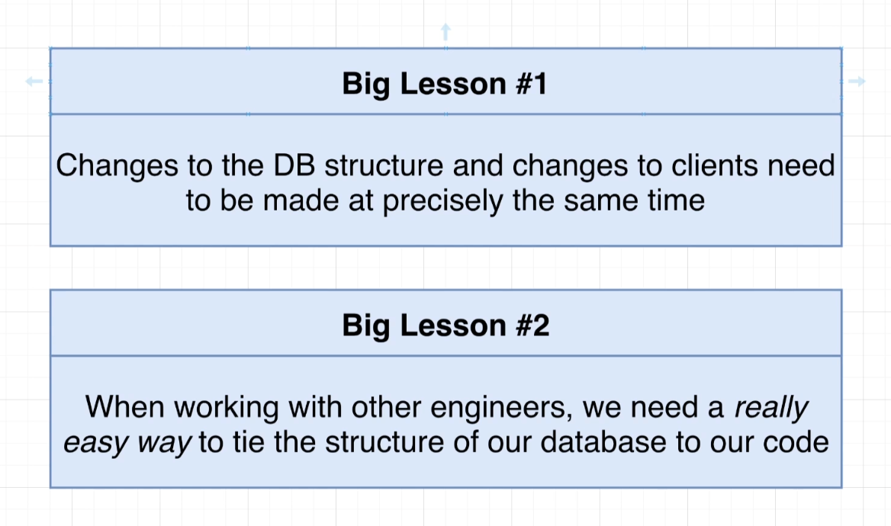

- Schema migrations are all about making very careful and well-planned changes to the structure of your database. So we are talking about adding columns to a table, removing columns, changing the name of a column, adding tables, removing tables, and so on.

- Lesson number one was that whenever we change the structure of our database, we needed to make sure that we changed our clients, that we're connecting to that database at the same time. Big lesson number two was that whenever we were working with other engineers, we really need a way to tie the structure of our database to some specific version of our code.

-  we have been making changes to the structure of our database by opening up Pgadmin, accessing some database, and then writing out some command that changes the structure of our database. So in other words, all changes were made directly inside of Pgadmin.

- Moving forward, wherever possible, we're going to instead author something called a schema migration file.

- Schema Migration files are files that contain some amount of code that describe a very precise and very detailed change that we want to make to our database.

- So, for example, if we wanted to take our comments table and rename the contents column over to body, we are going to write out a schema migration file. That migration file is going to contain some code that says I want to rename contents over to body.

- Well, a migration file can be written in any programming language you want. This entire idea of schema migrations is not tied to any particular language. So you can author a migration file with Python, Java, JavaScript, cplusplus anything you want to write it with.

- In general, a schema migration file is going to contain two different sections. Inside of it, we refer to one section as up or upgrade, and the other we might refer to as down or rollback or downgrade. The up section will contain some SQL that is going to somehow advance or upgrade the structure or change the structure of our database. So in our example that we walk through in the last video, we might have an up section inside of migration file where we rename our contents column over to body.

- The down section is also going to contain some SQL that is going to exactly undo whatever the up command did. So if our up command renamed contents to body are down would do the exact opposite. We would rename body back to contents.

- Once we author a migration file, we then apply it to our database.

