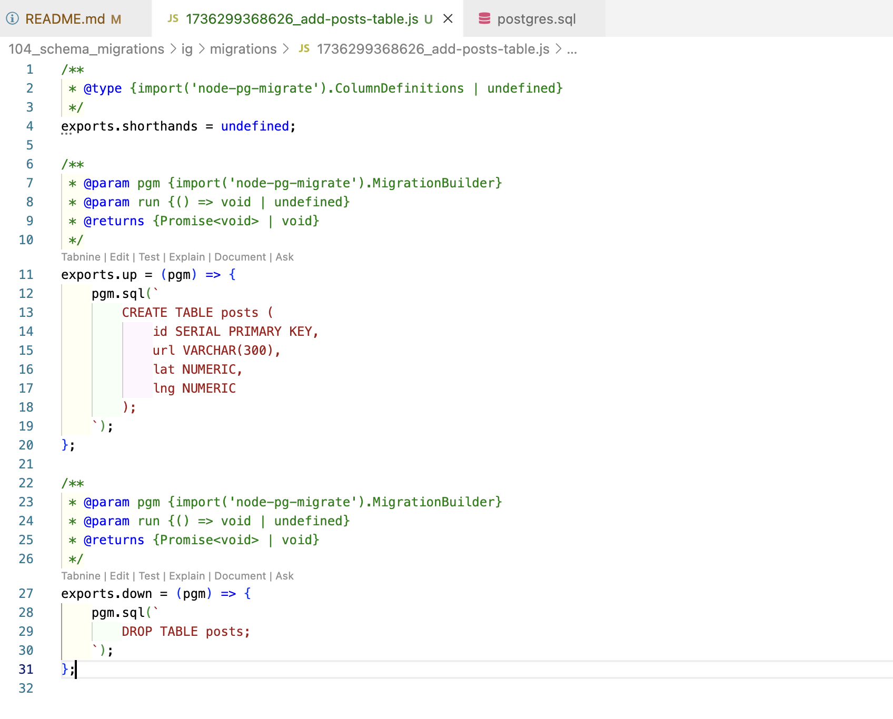

- Schema migrations are all about making very careful and well-planned changes to the structure of your database. So we are talking about adding columns to a table, removing columns, changing the name of a column, adding tables, removing tables, and so on.

- Lesson number one was that whenever we change the structure of our database, we needed to make sure that we changed our clients, that we're connecting to that database at the same time. Big lesson number two was that whenever we were working with other engineers, we really need a way to tie the structure of our database to some specific version of our code.

-  we have been making changes to the structure of our database by opening up Pgadmin, accessing some database, and then writing out some command that changes the structure of our database. So in other words, all changes were made directly inside of Pgadmin.

- Moving forward, wherever possible, we're going to instead author something called a schema migration file.

- Schema Migration files are files that contain some amount of code that describe a very precise and very detailed change that we want to make to our database.

- So, for example, if we wanted to take our comments table and rename the contents column over to body, we are going to write out a schema migration file. That migration file is going to contain some code that says I want to rename contents over to body.

- Well, a migration file can be written in any programming language you want. This entire idea of schema migrations is not tied to any particular language. So you can author a migration file with Python, Java, JavaScript, cplusplus anything you want to write it with.

- In general, a schema migration file is going to contain two different sections. Inside of it, we refer to one section as up or upgrade, and the other we might refer to as down or rollback or downgrade. The up section will contain some SQL that is going to somehow advance or upgrade the structure or change the structure of our database. So in our example that we walk through in the last video, we might have an up section inside of migration file where we rename our contents column over to body.

- The down section is also going to contain some SQL that is going to exactly undo whatever the up command did. So if our up command renamed contents to body are down would do the exact opposite. We would rename body back to contents.

- Once we author a migration file, we then apply it to our database.

- So every migration file contains everything you need to make a change and undo a change.

- Any single project can have many different migration files inside of it.

- rather than opening up Pgadmin and writing out some SQL that would create some tables for you. You could instead create a migration file that describes setting up the initial structure of that database.

- Now, the very nice thing about migration files is that you can take a project with a bunch of migration files inside of it and hand it off to any brand new engineer working at your company.

- That brand new engineer could then run all the migration files and they would be guaranteed that they've got the most up to date, perfect and exact structure of the database.

- The other nice thing about migration files is that if you ever write a migration and then decide that it's not quite right, you could run the down migration tied to it. So you would undo that migration, make some change, fix everything up and then reapply the up.

- So in theory, this could shrink down that window of time where we have a differing version of our API and a different version of our database structure down to a very small period of time.

- Inside of any given code review request, we can say that we have some new version of some code that needs to be reviewed and we can pair it along with that.

-  A migration file that describes the exact changes to the structure that need to be made to our database in order to safely execute this new code. So then in theory, another engineer could take all the code for this code review request. They could apply the migration, which would give them the correct structure of the database to run this new version of the API. The other engineer could then evaluate and test all this code. And then finally, once they were complete with the review, that engineer could then revert this migration and that would take them back to the current structure of the database that would allow them to run whatever current code, base or version of the code or the version. The API is really out there.

# Libraries for creating/Running data schema migrations

# Project creating migration

- You'll see that there is a new migrations folder inside of here. And inside there is a file called Table comments. The number at the very start of this is a timestamp. So that is the time at which this migration was created.

- That timestamp is going to tell this migration library later on. So node migrate what order these different migrations should be executed in because we would want to make sure that we always run this migration file first. In other words, the migration file that actually creates the table before we ever try to run a migration that would try to change it in some way.

- Then inside this file we can see very easily that there is a function right here called up and a function called down.

- They are going to contain or produce some amount of SQL or run some command or do whatever to either advance the structure of our database in some way. And then down is going to contain some SQL or run some command or do whatever that is going to revert or do the exact opposite of whatever we did with up.

- you might have noticed that this argument pgm right here is essentially an object that we can use to create tables or change tables, add columns, all that kind of stuff. But we are not going to rely upon any kind of automatic migration generation or anything like that, anything to automate the process of making changes to our different tables. So instead, we going to write out pgm.SQL. We're then going to put in a multi-line string which in JavaScript we indicate with a set of backticks that is a character to the left of the one on your keyboard. And then we are going to write out some raw SQL inside of here that we want to execute.

- So again, we are not relying upon any kind of built in function that is going to create the table for us.

# Exceute the migration

- So to execute the migration, it's going to be a little bit different depending upon your operating system.

- You'll also notice that there is another table inside of here called Migrations. This table was created for you automatically by the Node migrate module. If you do a right click on there and then go to view data all the rows. You'll see that this table essentially just lists out the name of a migration that has been executed and when it was actually executed. So that table is used by many different migration frameworks or a table very similar to it, I should say, is used by many different migration frameworks just to keep track of what migrations have actually been executed and make sure that you don't run that same migration again.

- If you go and run the same command once again back at our terminal and try to do that same migration again. It'll just say, okay, there's no migrations to run because our module has detected that we already

- If for any reason we decided that this migration was not written correctly or if we did something wrong, or if we just don't want to have our database in this structure anymore, we could run the same exact command. But at the very end, instead of up, we will put in down. So down is going to undo the most recent migration.

- So we just dropped table comments.

- So now if we go back over to Pgadmin yet again and refresh tables, now the table is gone and we've only got migrations, which again just keeps track of which migrations we have actually executed. If you refresh that table now migrations, you'll see that there are no rows inside there and that indicates that we have not actually executed any migrations.

- After adding the second migration file we run the migration again then It looks like that created first the comments table for me and then went ahead and applied that renaming step.

- And when we do a down, it's only going to revert one step at a time.

# Data migration and schema migration together

- Well, as I'm going to show you, if we try to do everything inside of one step, we can very easily get into trouble really, really quickly.

- Whenever we add a column to a table that is generally just about instantaneous in nature. So we could add this column location and a millisecond later the column would be in place.

- Copying millions of different values around is going to take some amount of time.

- After that, we would then drop columns, latitude and longitude and just like adding a column, dropping a column is just about instantaneous in nature.

- When you drop a column, Postgres does not go back into your different heap files and delete any data. It just says, Hey, this column is dead. And then over time it's going to clean up all the values inside those column, the column that you dropped automatically.

- Whenever we run a migration, it is very common to place the migration or execute it inside of a transaction. That's to make sure that if we ever start to do some amount of work, say up here, like adding a column, removing a column, then copying some data around, and then get down to, say, dropping a column down here. If anything goes wrong with dropping the column, we probably want to undo all the work that we had previously done during the migration.

- So we really do not want to ever have a migration in a kind of half executed state. And to prevent that, well, we just run it inside of a transaction.

- And to prevent that, well, we just run it inside of a transaction. So if at any point in time, any one of these steps fail, we're going to roll back the entire transaction and the entire thing gets cancelled. No changes actually made to our database.

- And when we imagine that we're opening up that separate workspace, it's kind of like we can kind of imagine again, this is not what really goes on behind the scenes, but we can imagine that we're kind of creating a copy of all the data inside of our database and putting it into that separate workspace. We then do some amount of work inside that separate workspace, and then if there are no errors, we commit the transaction, which essentially merges all the changes we made back into the real world of our database.

- Now, in that meantime, while we are doing the copy operation, we still might have our API server up and running like the actual application up and running and we are still accepting requests and possibly also creating posts.

- So this is one of the big downsides of trying to do a data migration and a schema migration at the same time. If you're doing everything inside of a transaction and you probably really want to do it inside of a transaction, you can end up in this really weird state where any additional records that you added into a table while that transaction was running might accidentally get deleted.

# Data migration and schema migration Separately

- So step number one up here, we're going to run a schema migration that is going to add a column called Location or look to our post table. So we can imagine that we would add in a new column. And we would have all the values inside that column by default be null.

- Now, in between step two and step one, we can allow for just about any period of time we could run step one on a Friday, take the weekend off, come back on Monday, and then run this next step. We can even allow a month to pass in between. The nice thing about this entire approach or this entire flow that we're going through is that you can allow just about any amount of time to pass in between each step.

- So in step number two, we're going to deploy a new version of our API or essentially our application server. And it's going to make sure that any time that we create a new post or possibly update a post, we're going to write new values to both the columns latitude, longitude and location.

- So in other words, if we came into our post table and we tried to create a new post right here, let's say number three. We would make sure that we put in some appropriate latitude, longitude and the appropriate location as well.

- We would then repeat that process for any number of posts that are created during the step.

- In step number three, we're going to go back and backfill all the previous rows we had ever created. Now, this step does not have to be in the form of some kind of schema migration file. We could very easily write a separate script authored in maybe Java or Python or JavaScript, some kind of separate little program that can go and take a look at all the rows inside this table, calculate the new location value and update that column.

- So now at this point in time. We have a location for all of our different rows.

- So the next step, we're going to update our code once again. So this is updating our API or our application server, and we're going to make sure that we write only to our location column.

- And then finally, very last step, because our application no longer really cares about the latitude longitude columns because we are not writing to them anymore. And presumably we would also not be reading from them. We can finally drop those columns so we can drop latitude and longitude like so.

- All of our different rows have a defined value for location, and at no point in time were we ever in a scenario where we kind of missed out on copying some different values over or ran into any kind of issues like that that we saw previously back on that other approach.

- So this is the process that I recommend you taking a look at any time that you have to do a schema, migration and a data migration together, you're going to break it up into a series of different operations.

# Creating post table

# Web server setup

- pg being the module that we're going to use to connect to Postgres.

- Then after that we'll put together two route handlers. One route handler is going to show a user a list of all of our different posts, and a form to create a new post.

- The other route handler is going to receive a form submission and create a new post inside the database.

# updating loc for all the rows

- This approach has a couple of different downsides tied to it. First off, remember, our post table might have a ton of different records inside of it. Well, if we wrote some kind of query like that and executed it. We could accidentally load up a million different records into our JavaScript server. And in that case, chances are we would eventually run out of memory and our node server would just crash entirely.

- Another way we could approach this is to use something called batching. So if we make use of batching, we would try to load up just a set of all of our records at once. So we could do that with something as simple as limit 5000 or something similar to that. So that means give us the first 5000 posts where location is null. We can then do the update for those 5000 records and then save the updates back over to the database.

- When we start doing batching, this kind of implies that we're going to kind of have a multiple different batches running and each batch will be running sequentially. So in other words, we'll do one batch, process everything, save it back to the database, open up another batch, do all the processing, save it back over and so on. It's entirely possible that by the time we get to the very last batch, there could be some kind of error in our logic in how we do the update or how we calculate it. We might only see that error when we get to that very last batch. So if we only see that error at the very end and that error crashes our program, now we're kind of left in a halfway between state where some number of rows have been updated and the other rows have not.

- The other downside to this is that it requires us to manually connect to our database from a JavaScript environment. This is sometimes a little bit challenging as you're going to see a little bit later on in this course. If you provision a database, for example, on AWS or Amazon Web Services, that database will frequently be very locked down and it will be challenging to connect to it from any arbitrary location with any kind of arbitrary JavaScript file or something like that. And so there might be scenarios where just trying to connect to your database from a node environment will be a little bit challenging.

- The one very big upside to this approach, however, is that we can very easily run really complex business logic or do some kind of complex validation on all these records before we process the update.

- One very big upside is that we are not moving any information or records between the database and the JavaScript world. That means that this update is, in theory, going to run a lot faster than if we were trying to load up all these rows into our JavaScript world.

- One very big downside to this approach is that it's of course a lot harder to implement any kind of complex validation because again, we don't really have the ability to execute any kind of JavaScript or inspect any of the individual rows that are being updated in any way.

- There's one other issue I want to mention very briefly around both option number one and option number two. This is an issue that only starts to come up once you have many, many records inside of a given table. So we're talking about on the realm of hundreds of thousands of records or millions of records.

- So whenever we do an update with either approach, we might want to run the entire update inside of one single transaction. There's a really good reason for doing that. It means that if we start to process all these rows and we get to that very last row, if something goes wrong with updating that last row, it might mean that there's some kind of bug or issue in our update logic. So if we threw an error on the update of that very last row, then the transaction would automatically cancel.

- So doing the update inside of a transaction generally probably a good idea and it's probably something we want to do.

- Let's imagine that we open up a transaction and inside of our transaction, we start to take a look at all of our different rows that need to be updated. So we might see row three right here. We would see that it has a location of null. So that means we need to do an update. So we would say, okay, our new location is going to be 25, comma 24. So we would put in 25, 24 right there. And then internally, Postgres says, Hey, this value right here has been updated. Whenever a transaction is going to update a value, that entire row is going to get locked.

- We can kind of imagine that transaction number one updated at row three. And after that, it's then going to move on to row four and then five and so on. So at this point in time, this row has been locked. This row is going to be locked. And essentially it cannot be updated by any other transaction until transaction number one has either committed or rolled back.

- So in other words, no other transaction can update that value right there until transaction number one has processed all the other rows inside this table. So in other words, no other transaction can update that value right there until transaction number one has processed all the other rows inside this table. So if in this period of time some user makes a request to our application and they say, Hey, I'm trying to update the location of Post with ID 3. So they're trying to update that one right there. Well, unfortunately, that value is locked. And so this transaction number two is not allowed to update any value inside this row until transaction number one is completed.

- Now, transaction number two is not going to fail entirely. It's just going to sit around and wait until transaction number one is either committed or rolled back.

- So this is going to be an issue if transaction number one. Essentially, our update process is going to be running for a very long time means that during that period, no other transaction or essentially any other attempt to modify these same rows is going to succeed.

- Okay, so long story short, whenever we are doing this really big update of a ton of different rows, there will be some period of time where nothing else can update those rows until upped. Our update has been completed.

- There is a very easy way to kind of get around this, and that would be to do the same kind of batch update system.

- So on query tool Window number two. Well, we're still just sitting here and we're going to continue sitting here until we eventually commit the transaction or rollback the one inside of query tool number one. And the instant I commit this, if we go back over to query tool number two. The update over here has been processed because transaction number one got resolved.