[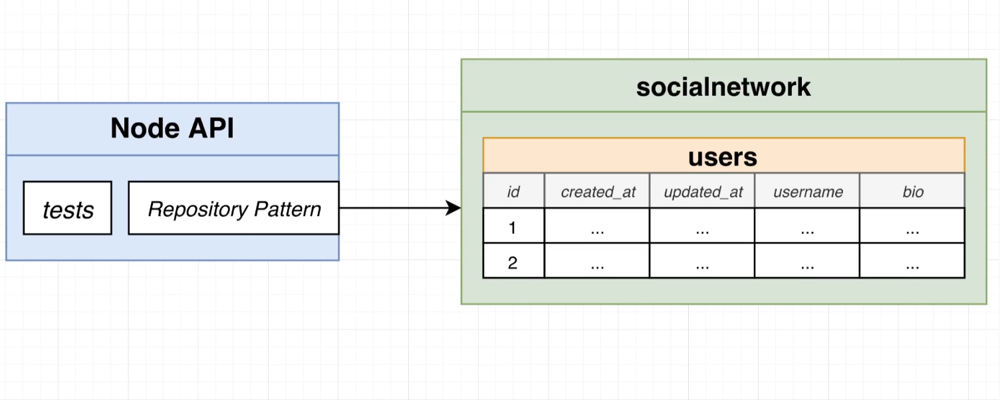](./pictures/node_to_postgres.png)

[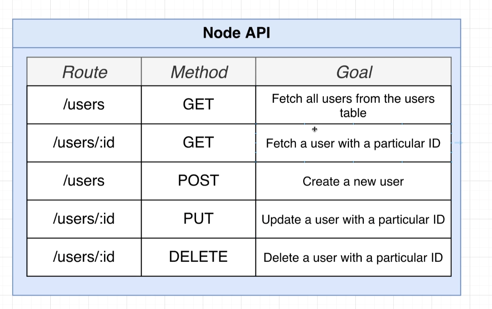](./pictures/node_api.png)

- Now, internally, the module can be used to create something called a client. We usually do not make use of a client directly, and the reason for that is very simple. When you create a client, it can only execute one query at a time. That is definitely a very big issue.

- So rather than using a client directly, we generally make use of something instead called a pool. A pool internally maintains a list of different clients. Then any time that you need to run a query, you essentially ask the pool to run a query for you. The pool will take your query, hand it off to one of the clients that is free internally, and that client will then execute the query over to Postgres.

- There is one scenario in which you will make use of a client directly, and that is whenever you need to write or run a transaction,

[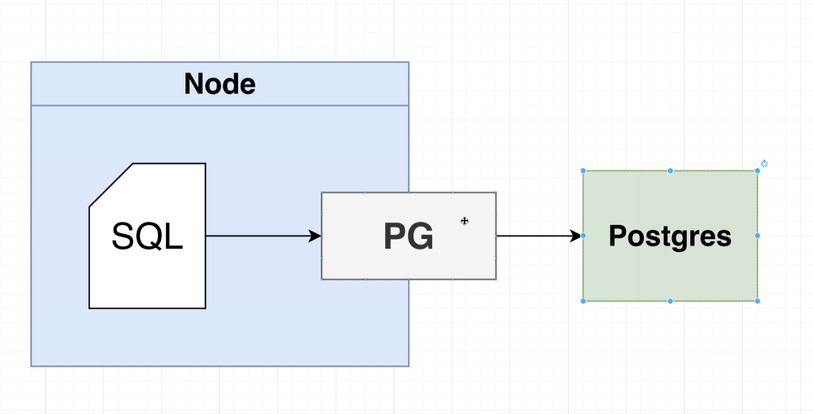](./pictures/sql_pg_01.png)

[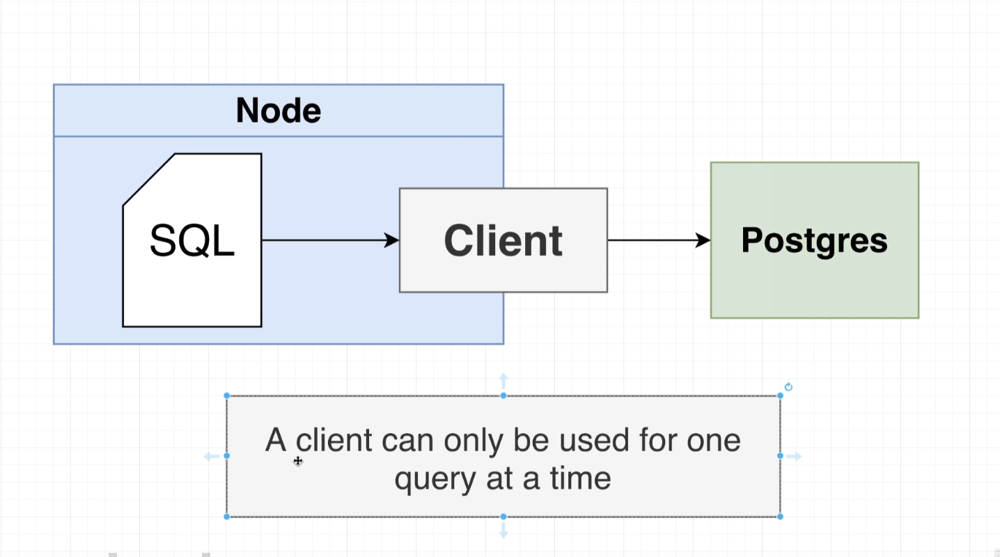](./pictures/sql_pg_02.png)

[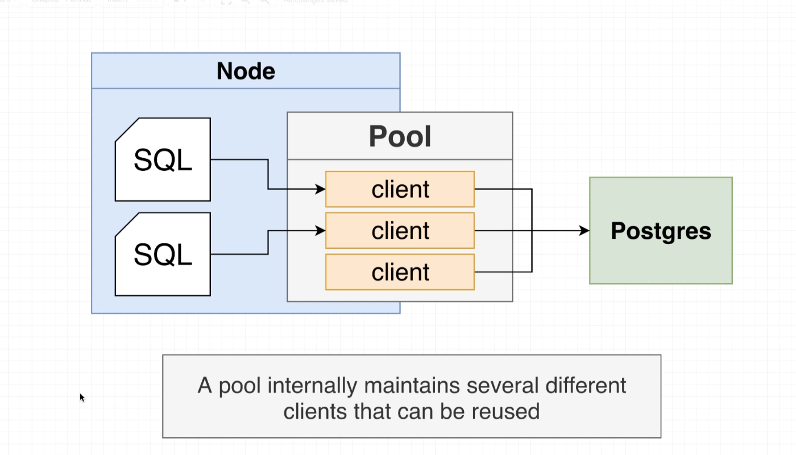](./pictures/sql_pg_03.png)

# Repository pattern

- So again, at the end of the day, all three different methods, 100% equivalent, more or less. And there's really not a great reason to use one approach over the other outside of your own personal preference as a developer, I personally rather like this static method approach because it makes this class just very easy to read.

[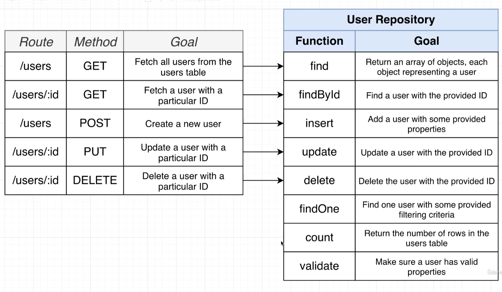](./pictures/repository_pattern_01.png)

[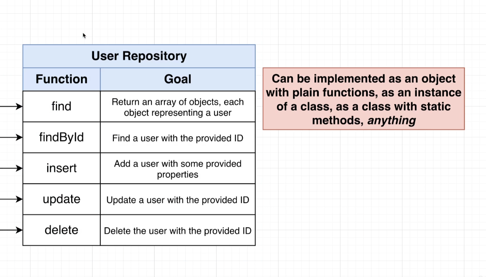](./pictures/repository_pattern_02.png)

[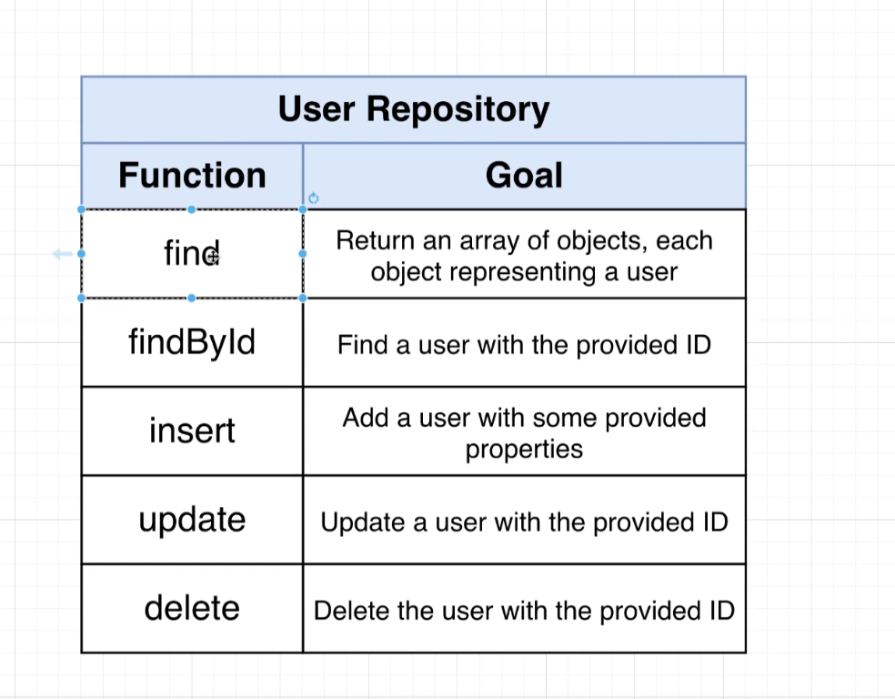](./pictures/repository_pattern_03.png)

# Security issue

- there's one error right here that says relation users does not exist. What does that error mean?

- Okay, so at present we are making requests to our application. Our application is taking that little one right there on the very end of our URL. We extract that number one as a plain string. It doesn't actually get extracted as number, even though it looks like a number to you and I. It gets extracted as a plain string with a number one inside of it.

- we wrote out one semicolon drop table users semicolon. So we can imagine that we took that one and everything after it. It was extracted as a parameter of the URL. We then put it on to the very end of our statement

- So by just modifying that very slightly, we were able to make a drastic change to our database.

- This means if we kind of deployed this code into a production environment, that any arbitrary user could run arbitrary statements inside of our database by just modifying the URL.

- We refer to this scenario as a SQL injection exploit.

- A SQL injection exploit is when you take some user provided input either inside of a form post like a user submits a form or in the form of taking some part of a URL or just about any other value that is provided directly from a user. If you take that value that is provided from a user and just plainly execute it inside of a SQL query, the user can modify that value that they provide and do any kind of arbitrary operation inside of your database that they want so they can read information off of tables that they shouldn't. They can try to make changes to your database. They can even try to delete tables or records as well.

- So we never, ever under any scenario, ever directly take user provided input and use some kind of direct string concatenation stuff to join that user provided value into a query.

- Now, of course, in some scenarios we do want to take some kind of user provided value and supply it to a query. So there are a variety of different safe ways to take user provided values and somehow get it into a query.

[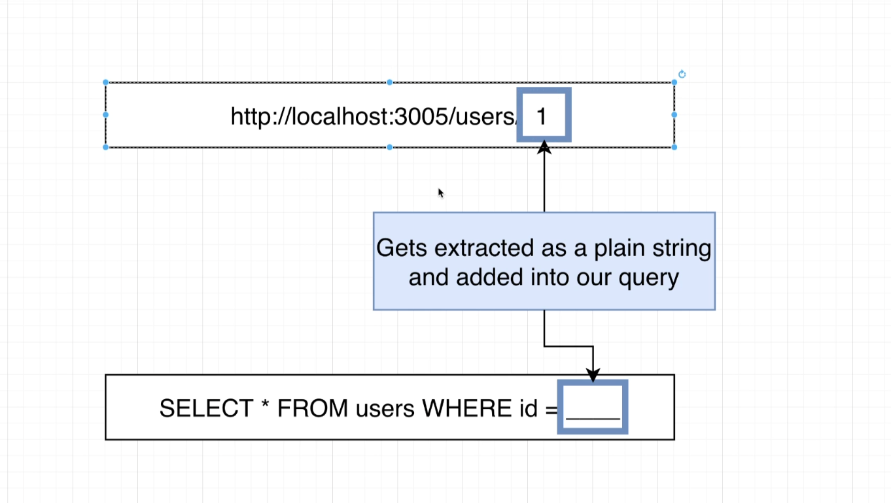](./pictures/sql_injection_00.png)

[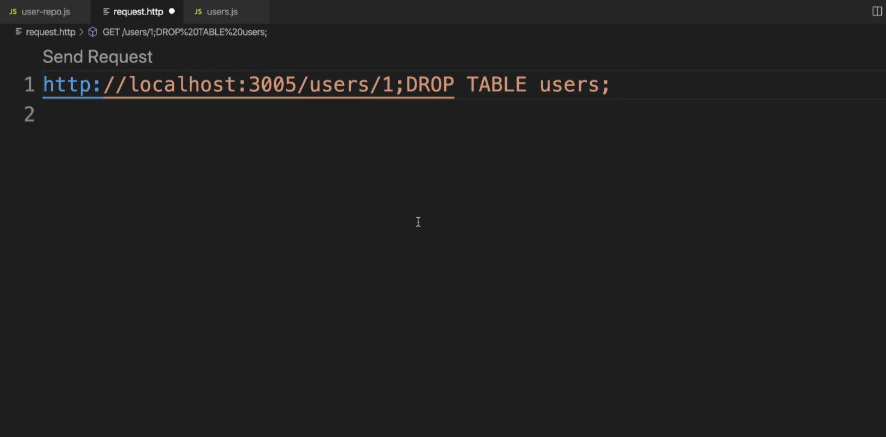](./pictures/sql_injection_01.png)

[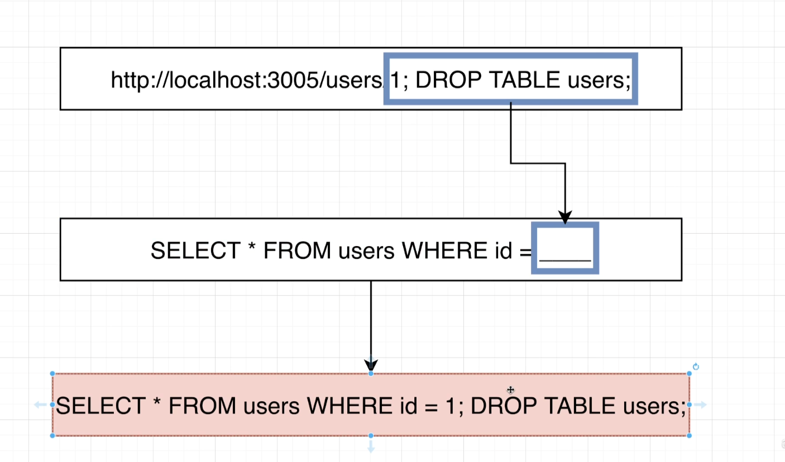](./pictures/sql_injection_02.png)

[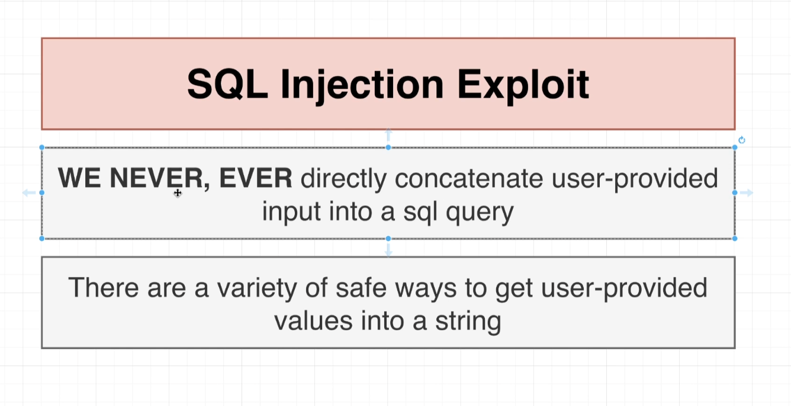](./pictures/sql_injection_03.png)

[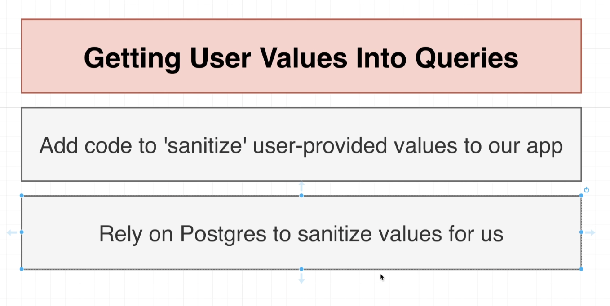](./pictures/sql_injection_04.png)

[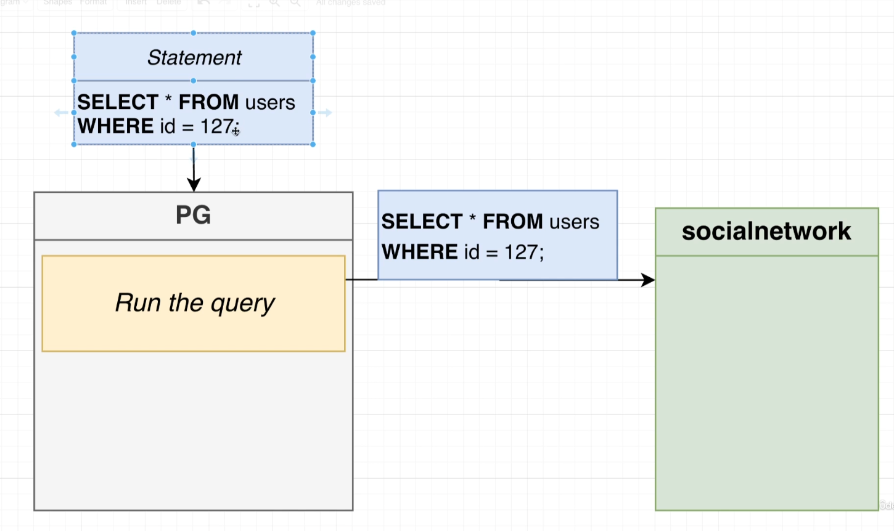](./pictures/sql_injection_05.png)

# SQL injection handle

- So node pg module is just taking that entire statement and throwing it off to the database.

- Rather than giving node PG just the completed statement by itself, we're going to kind of break this into a two step process.

- First is going to take that statement and create what is called a prepared statement. It's going to reach out to our database and say, Hey, I want you to get ready to run a query that looks like this right here.

- It's going to reach out to our database and say, Hey, I want you to get ready to run a query that looks like this right here.

- Whenever we prepare a statement ahead of time, we have to provide a identifier for it. This identifier is randomly generated by the PG module.

- So PG is essentially going to say create a prepared statement with some random name. It then says that this prepared statement is eventually going to take a string as a single argument. So that's a string that we're going to put in right there for the ID.

- So the PG module is going to create that prepared statement that tells Postgres that, hey, you're going to have to run this thing at some point in time very soon.

- Immediately after that, the PG module then says, okay, time to execute that prepared statement. So go and execute prepared statement with this name and we want to substitute that value of $1 right there with a number 127 or the string 127 whatever.

- So your database is then going to substitute in and let's zoom in here. It's going to take that prepared statement. It's going to take that 127. Substitute it in for the dollar, sign one, and then execute this right here.

- Well, Postgres is 100% aware of what you are trying to do with a prepared statement at 100% understands that when you call execute and you provide some values right here. These are values that should be placed into a query. They are not queries in their own right.

- So if you ever try to put in something like, say, drop table users right here, that will not be executed as a query. Instead, we can imagine that it would be placed inside of here as a string like. Drop table users and that would not actually get executed in any way.

- We are essentially relying upon Postgres and this idea of a prepared statement. That's what this is called. We are relying upon a prepared statement and how that prepared statement gets executed to deal with sanitizing the value for us.

- We're relying on the fact that Postgres is 100% aware that when we actually execute the statement, we're going to provide values and not some further additional query to run or anything like that.

- So the downside to this approach is that we can only use a prepared statement when we are trying to substitute in a value to a query.

[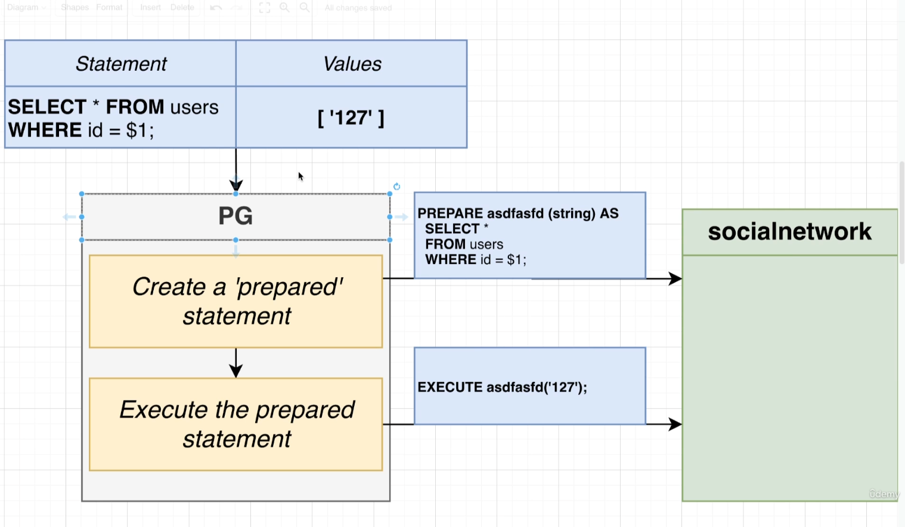](./pictures/sql_injection_save_02.png)

[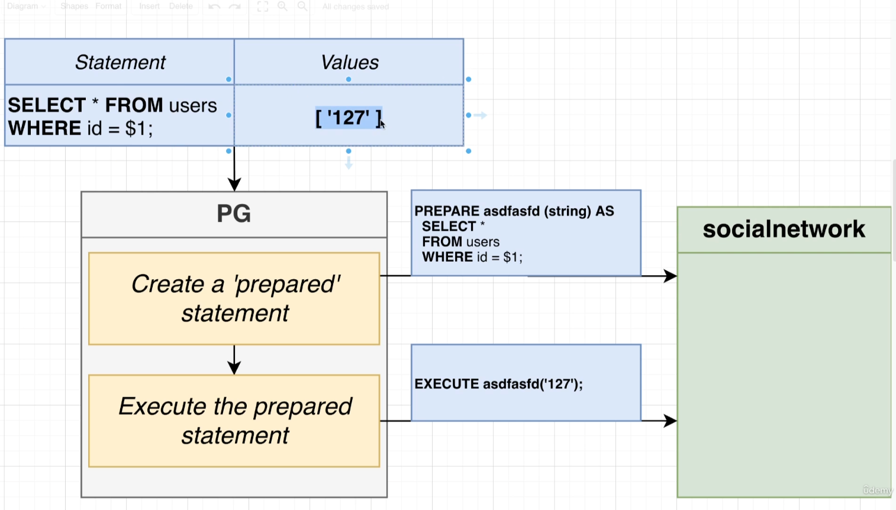](./pictures/sql_injection_save_03.png)

[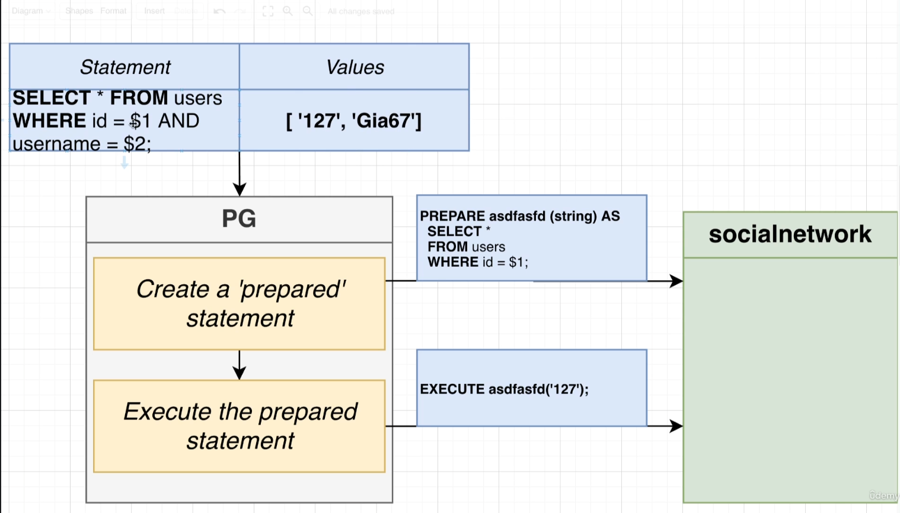](./pictures/sql_injection_save_04.png)

[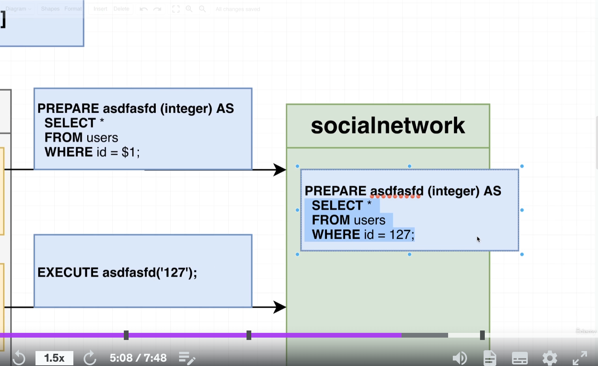](./pictures/sql_injection_save_05.png)

[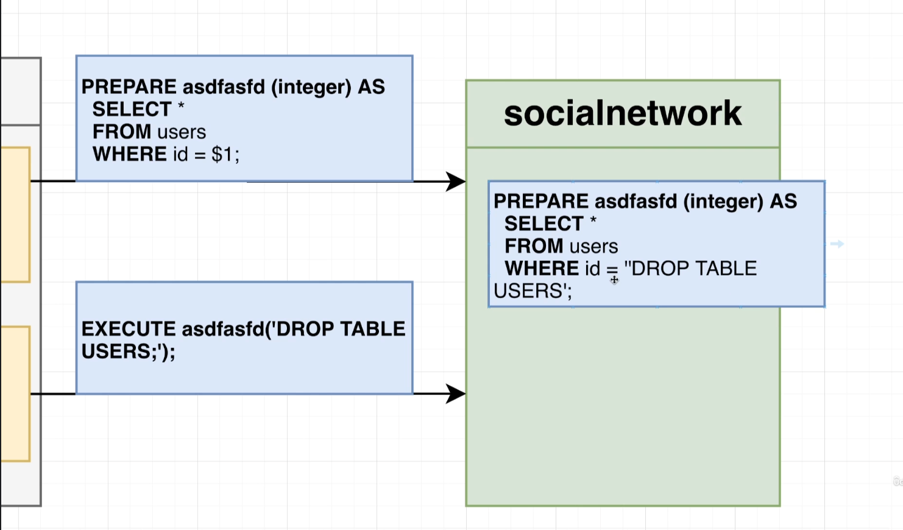](./pictures/sql_injection_save_06.png)

[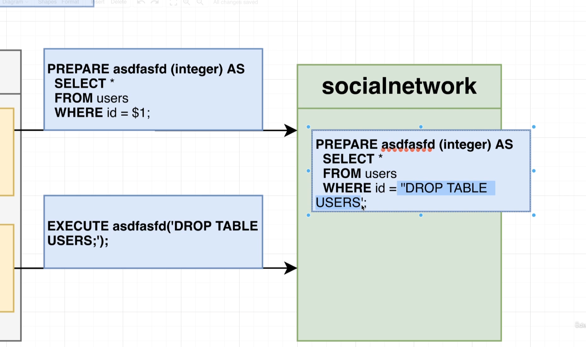](./pictures/sql_injection_save_07.png)

# Jest test runner

- So we are going to eventually write a couple of different test files. In total, we're going to write out three files and each of them is going to have some code inside that is going to try to execute some tests and make sure that our application is working as expected.

- to run these test files. We're going to be using a test runner called Jest. Jest is a program that's going to execute these three files all at the exact same time. This is a little bit atypical. A lot of other test runners out there in the JavaScript world try to run test files sequentially.

- But in order to save a little bit of time while running tests. Just runs tests in parallel.

- All three of these test files are going to be Trying to work with the same exact database. They're all going to be connecting to our social networking database and making changes to data inside there. We can very easily get into scenarios where these three different test files have little conflicts going on between them just because the nature of how we write out tests.

- So there might be some scenario where test file one might try to create a user and then maybe try to get the most recent user that was created out of the users table. And that might be part of a very normal test to create a user, get the most recently created user, make sure that user has some certain attributes. If test file one creates a user and then in the very next microsecond test, file number three creates a user as well. We could potentially break that test inside of test file number one.

- So in other words, because these tests are being executed in parallel, they might interfere with each other and cause some test to fail.