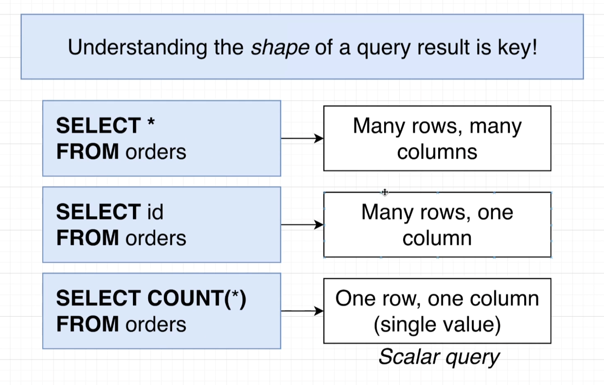
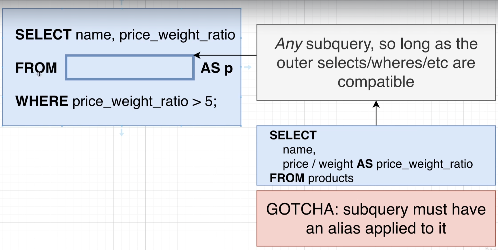

## Create table query analyzer

- keywords are always going to be capitalized and identifiers will always be lowercase.

## varchar(50)

- if try to store longer than 50 characters then postgres is going to give error.

## integers

- integers in postgres will be numbers without decimal. They can range from -2 billion to 2 billon. If try to store anything larger or smaller then these then we are going to end up getting an error.

## Math operations

- We can perform these math operations between two columns. We can write sql to transform or process data before we receive it.

## String functions

- There are also a set of operators we can use to manipulate strings. And in addition to these operators, there's something else called functions we can use as well.

## Select query where clause sequence

## Where clause 

## One to one and many to one relationship

## One to one

## many to many

## Four relationships

## Primary keys and foreign keys

- primary key is unique. value in primary key is unique and never going to be changed.
- goal of foreign key is to somehow relate 1 record in a table to another record in another or same table.

## Primary keys vs foreign keys

## Foreign keys

## Foreign key cases

## What if we delete a row in table

- If we delete a row in table with a SERIAL type column then there won't be any other record with the same id. No serial id ever gets reused even if the row ever gets deleted.

## join

- You can kind of imagine that our database is making a temporary copy of that initial table in this case comments. And then we can once again kind of imagine that this imaginary table right here gets renamed to something like comments with users. And then finally, we can also imagine that the database is then going to iterate through all these different rows and it's going to try to match each of these rows together with the row from the users table using the matching statement that we put on the other side of on.

- Here simple join statement won't print photo with null user id.

- If there is ever a row from our source table of photos that does not match up with the row from users, then that row right there gets dropped from the overall result set.

## Inner Join

- Whenever you use the keyword, join by itself inside of a query that is by default an inner join. You can write out either join or alternatively inner join to indicate that you want to do an inner join.

## Left outer join

## Right Outer join

## Full Join

## order matters

- yes, there is a difference in the order in which we list these tables in the from and join statement whenever we use a left or right outer, join the left and right outer joins. We definitely want to keep in mind the order of these tables so we list them out but with an inner join or a outer join in general, it doesn't make a difference.

## Group and aggregates

## Group by

## combining group by and aggregates

## difference between a where and a having

- Having is very similar to where. Its goal is to filter out some amount of information. The difference between where and having, however, is that where is going to operate on filtering out some number of rows, whereas having is going to filter out some number of groups. 
- You are never going to see having without a group by. So you will always have a group by net right before a having.
- You don't have to have a having if you have a group by, but if you want to do any filtering on the groups you will make use of having.

## Subquery

## Subquery in from

- The result of these subquery has only columns, name and price to weight ratio. So inside of our select statement, if we asked for just price by itself, we would get an error.

- we do not have to return a set of rows or columns from a subquery inside of a from clause. We can return just one single value as long as the outer select statements, the where and so on are compatible with it.

## One row and one column which referred to as a value. That's one single value