## Create table query analyzer

- keywords are always going to be capitalized and identifiers will always be lowercase.

## varchar(50)

- if try to store longer than 50 characters then postgres is going to give error.

## integers

- integers in postgres will be numbers without decimal. They can range from -2 billion to 2 billon. If try to store anything larger or smaller then these then we are going to end up getting an error.

## Math operations

- We can perform these math operations between two columns. We can write sql to transform or process data before we receive it.

## String functions

- There are also a set of operators we can use to manipulate strings. And in addition to these operators, there's something else called functions we can use as well.

[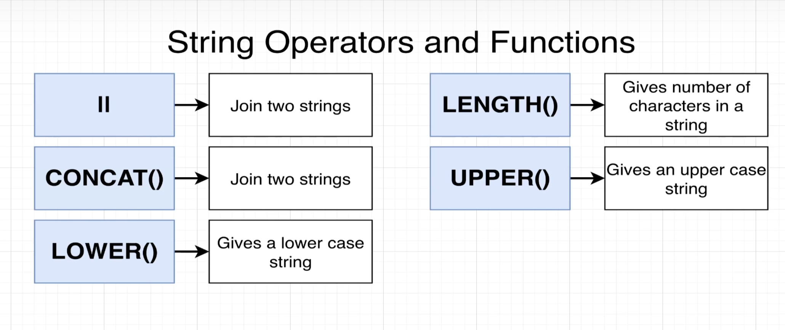](./pictures/string_operators.png)

## Select query where clause sequence

## Where clause 

[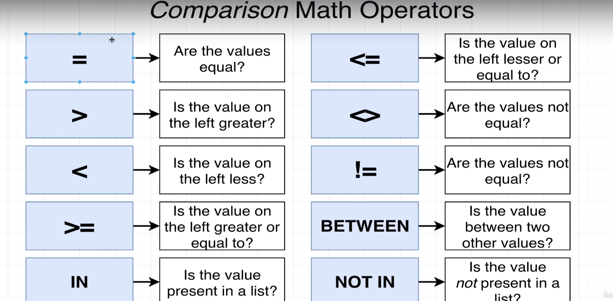](./pictures/comparision_math_operators.png)

## One to one and many to one relationship

## One to one

## many to many

## Four relationships

## Primary keys and foreign keys

- primary key is unique. value in primary key is unique and never going to be changed.
- goal of foreign key is to somehow relate 1 record in a table to another record in another or same table.

## Primary keys vs foreign keys

[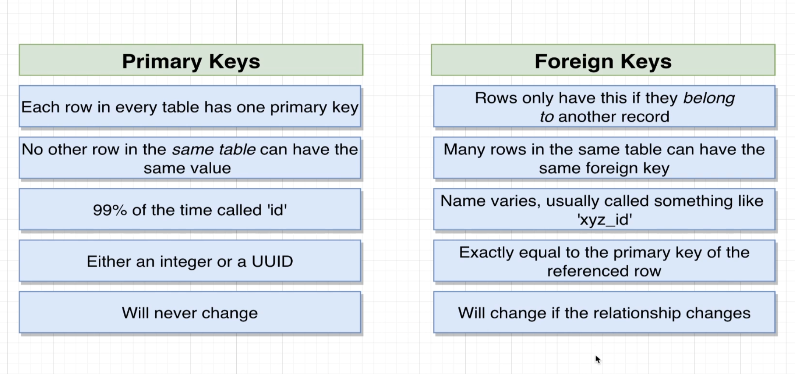](./pictures/primary_vs_foreign.png)

## Foreign keys

[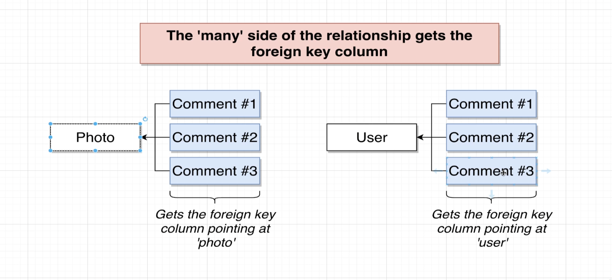](./pictures/foreign_keys1.png)

## Foreign key cases

## What if we delete a row in table

- If we delete a row in table with a SERIAL type column then there won't be any other record with the same id. No serial id ever gets reused even if the row ever gets deleted.

## join

- You can kind of imagine that our database is making a temporary copy of that initial table in this case comments. And then we can once again kind of imagine that this imaginary table right here gets renamed to something like comments with users. And then finally, we can also imagine that the database is then going to iterate through all these different rows and it's going to try to match each of these rows together with the row from the users table using the matching statement that we put on the other side of on.

- Here simple join statement won't print photo with null user id.

- If there is ever a row from our source table of photos that does not match up with the row from users, then that row right there gets dropped from the overall result set.

## Inner Join

- Whenever you use the keyword, join by itself inside of a query that is by default an inner join. You can write out either join or alternatively inner join to indicate that you want to do an inner join.

## Left outer join

## Right Outer join

## Full Join

## order matters

- yes, there is a difference in the order in which we list these tables in the from and join statement whenever we use a left or right outer, join the left and right outer joins. We definitely want to keep in mind the order of these tables so we list them out but with an inner join or a outer join in general, it doesn't make a difference.

## Group and aggregates

## Group by

## combining group by and aggregates

## difference between a where and a having

- Having is very similar to where. Its goal is to filter out some amount of information. The difference between where and having, however, is that where is going to operate on filtering out some number of rows, whereas having is going to filter out some number of groups. 
- You are never going to see having without a group by. So you will always have a group by net right before a having.
- You don't have to have a having if you have a group by, but if you want to do any filtering on the groups you will make use of having.

# Subquery

- The very first one inside the select statement is producing a single value. The two inside the from and join statements are producing a source of rows and then finally the last one down here inside the where clause is producing a single column.

- So one that produces a value, one that produces a set of rows and one that produces a single column, is the real trick to understanding this subquery stuff.

- The reason that making use of a subquery in different locations is challenging to understand is that whenever we write out these subqueries in different spots, we have to change the type or the shape of data that is being returned from the inner query.

[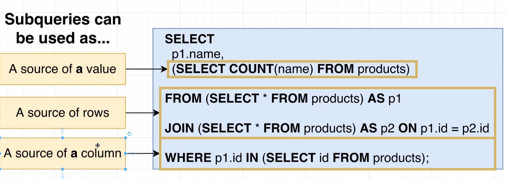](./pictures/subquery_001.png)

- As you can see there are 4 different subqueries in the below example.

# Subquery in select

## Subquery in from

- The result of these subquery has only columns, name and price to weight ratio. So inside of our select statement, if we asked for just price by itself, we would get an error.

[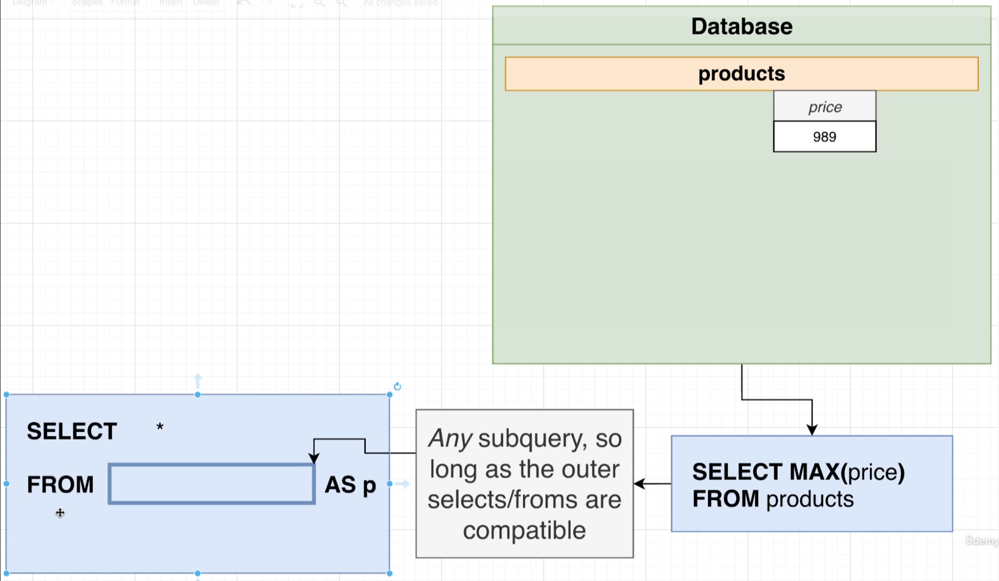](./pictures/subquery_from_01.png)

- we do not have to return a set of rows or columns from a subquery inside of a from clause. We can return just one single value as long as the outer select statements, the where and so on are compatible with it.

## One row and one column which referred to as a value. That's one single value

# Subquery in join

# Subquery in where

- So when we start talking about subqueries being used inside of a where clause and we start to think about the type or structure of data that is returned from the subquery, a valid subquery is going to be valid or not, depending upon the operator right here that we are using.

- So in some cases we are allowed to write a subquery that is going to return only one single value. In other cases, if we use a different operator, we might be allowed to write a subquery that's going to return a list or a single column of values. It all comes down to the operator that we are using.

- If we get back a single column of values, then we are allowed to use that with an in operator.

# Subquery with where operators

# Correlated queries

- So in other words, when we are executing a where for just one row right, we can imagine that the following thing occurs. The subquery runs, we get all of the different rows for products and then we execute the where for every row that we just fetched.
- You can kind of imagine that this is like a double nested for loop if you are familiar with a for loop in general, for every row that we're going to iterate over on the outer query, we're going to iterate over all of our different products on the inner query. So it's kind of like a nested for loop.
- We can make use of a correlated subquery not only inside of where, we can use them just about anywhere.

# Categories of data types in postgresql

- So here are some of the different categories of data types we have access to. Now, I want to stress the word categories and say the numbers category. There are many different subtypes that we can get access to.

- rule of thumb here is that whenever we are trying to store numbers, that must be 100% accurate, like the number of grams of gold that someone owns or the their bank account currency or how much money they have inside their bank account. Even though there is a performance hit to making use of a types decimal or numeric, we want to use decimal or numeric. If we ever trying to store some kind of number that's going to have a decimal tied to it and we don't really need to be 100% precise, that's when we will reach for these other types of real double precision and float.

[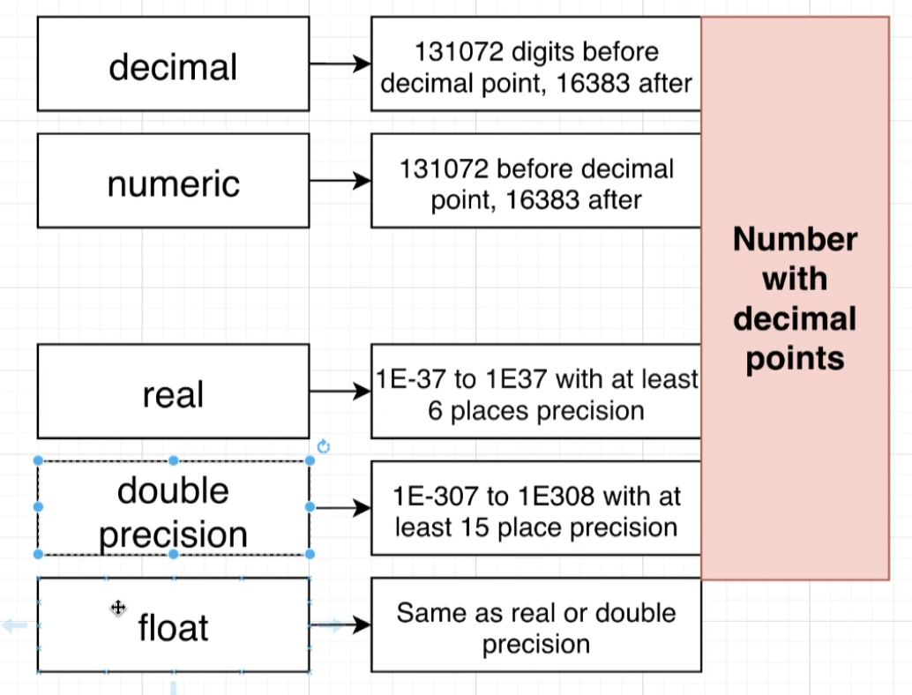](./pictures/number_data_type_02.png)

# Character data types

-  Char(5) : we provide a string to Postgres that is longer than five characters, then Postgres is going to trim characters until it just gets down to five. And likewise, if we provide a string less than five characters, Postgres is going to insert spaces to the right hand side until it gets up to five.
- VARCHAR(5): we provide a string to Postgres that is longer than five characters, then Postgres is going to trim characters until it just gets down to five. If we put in a string less than five characters, no spaces will be added, as was the case with Char.
- Now, just so you know, there is no performance difference between these different character types, which is kind of unlike many other types of databases. So you should pick the type that best suits your application. You don't have to worry about trying to pick the exact correct value of VarChar in order to optimize any performance or anything like that.

[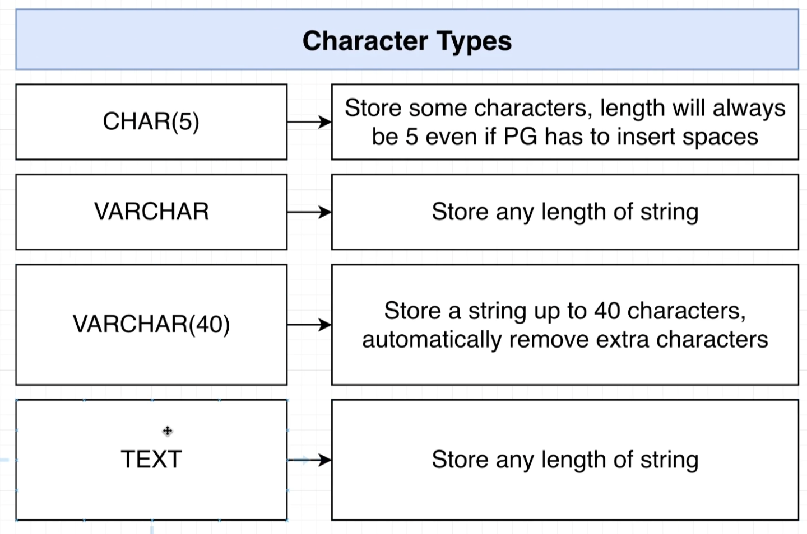](./pictures/character_data_type.png)

# Boolean data types

- But what you need to know is that we can actually provide different values to Postgres, tell it to treat it as a boolean and it will automatically convert these different values into true or false for us.
- Well, in the past, other databases and some different languages that we use to interact with databases have used a precedence of saying, rather than storing a boolean value of true or false, they instead might just store a one or a zero. So this is kind of some backwards support, support for other databases, support for other languages, or at least for other engineers coming into the Postgres world.
- And besides true and false Boolean values or Boolean type columns can also store a value of null, which essentially means, well, we don't know. There's no value here.

[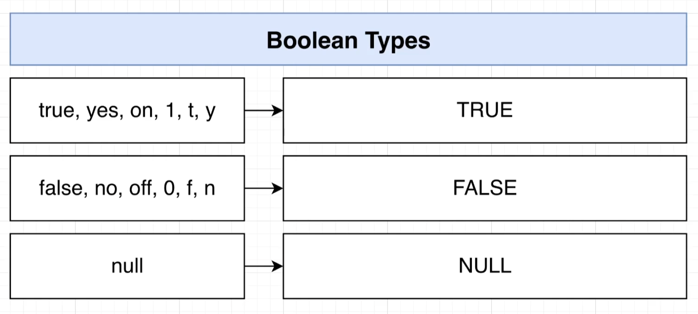](./pictures/boolean_data_type.png)

# Date data types

[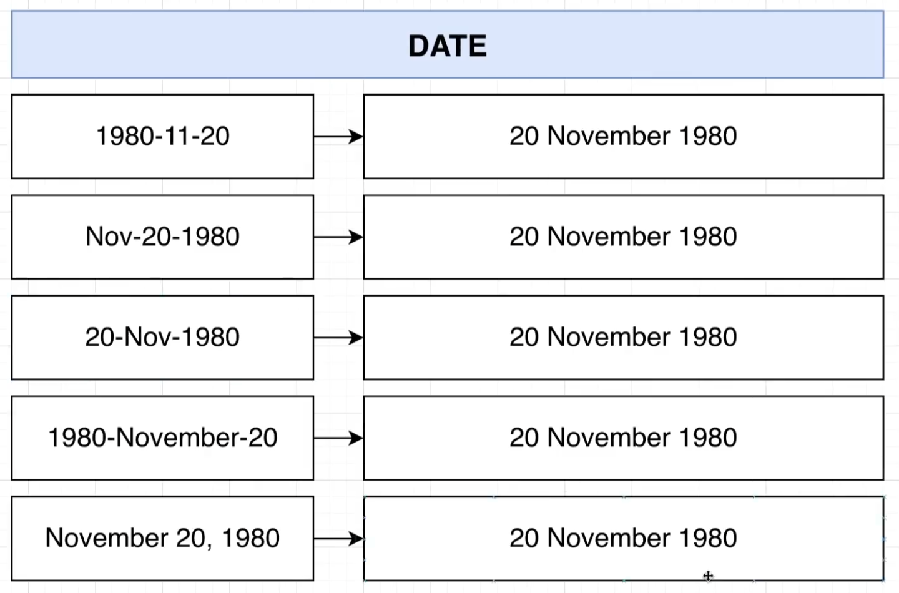](./pictures/date_data_types.png)

# Time data type

- We can store a time without a time zone or a time with a time zone as well.
- So we could designate a time type or a type of time without time zone. They mean the exact same thing.

[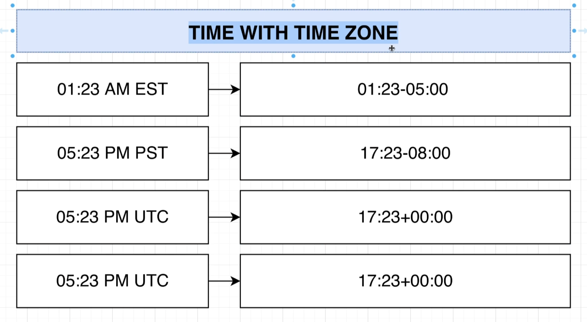](./pictures/time_with_zone.png)

- the eastern coast of the United States, it will be converted into 01:23 minus 05. The -05 right there indicates five hours behind UTC time.

[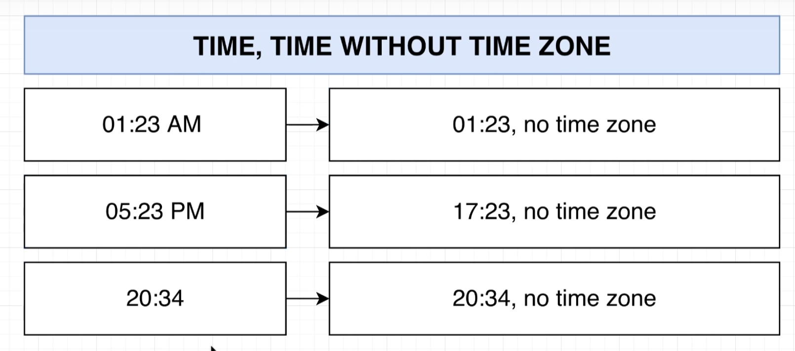](./pictures/time_without_zone.png)

# Interval data type

[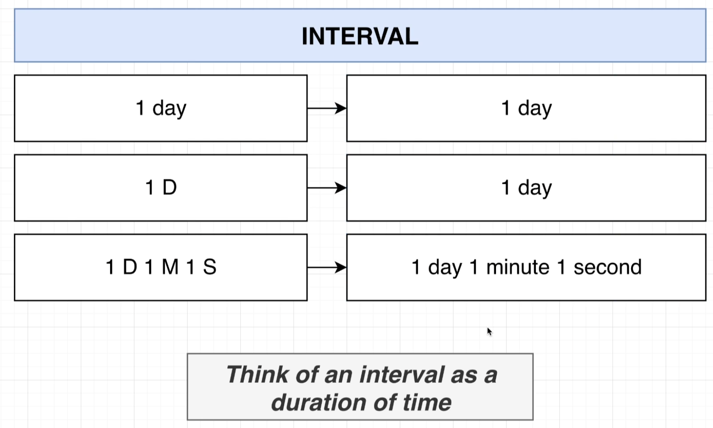](./pictures/interval_type.png)

# Row level validation

[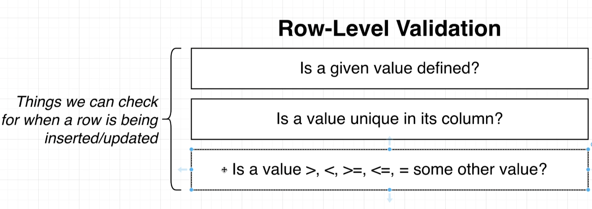](./pictures/row_level_validation.png)

# NULL constraint

- So in other words, we can't add a rule to this price column and say that there can't be null values because there's already one right there.
- So we have to somehow deal with all the null values inside this table before we can apply a constraint to it.
- We can either try to find all the rows inside this table that have a price of null and delete them. After we delete all those rows, we can then run this alter table command once again. And because there's no null values inside of price, it should succeed. Alternatively, we could write out a little bit of SQL that will find all the different rows inside this table with a price of null and update it to some other value.

[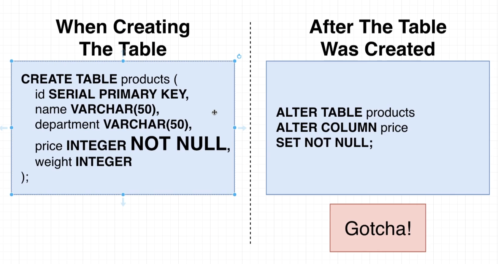](./pictures/null_constraint.png)

# default column values

- if we are setting up a default for, say, a VARCHAR column or a text column or a date or a Boolean, we could put the appropriate type inside of here. So for example, if we were setting up the default for VARCHAR. We had put in a default value of a string and set instead. So something like a string. If it was for a boolean column, we could put in a default of true or false, and for maybe a time we could put in a default time.

# unique constraint

- We cannot add this unique constraint unless all the values inside that column are already unique. So we have to clean up all the duplicate values first before we can apply this constraint.
- So let's say that we want to manually modify the name of this product right here. So I'm going to change its name to how about Red Shirt and then click Okay. Now, just making that change doesn't actually modify any value after making that change. If I refresh the table again. You'll notice that it reverts back to shirt. So after we manually make a change like this, we have to click on this little grid button right here that's going to save the changes that we have manually made inside this table.

[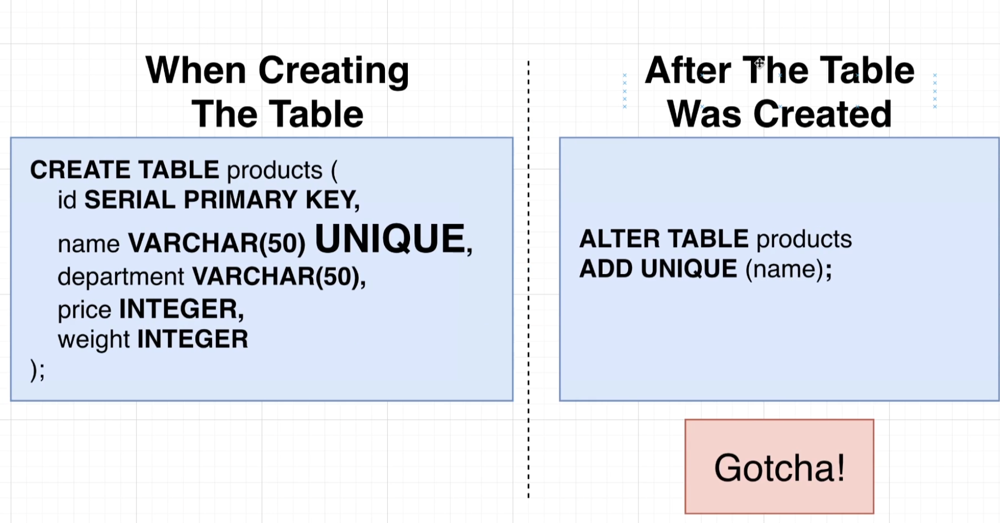](./pictures/unique_constraint.png)

# Multi column uniqueness

- We're going to make sure that all the different products we add in have a unique combination of name and department.

[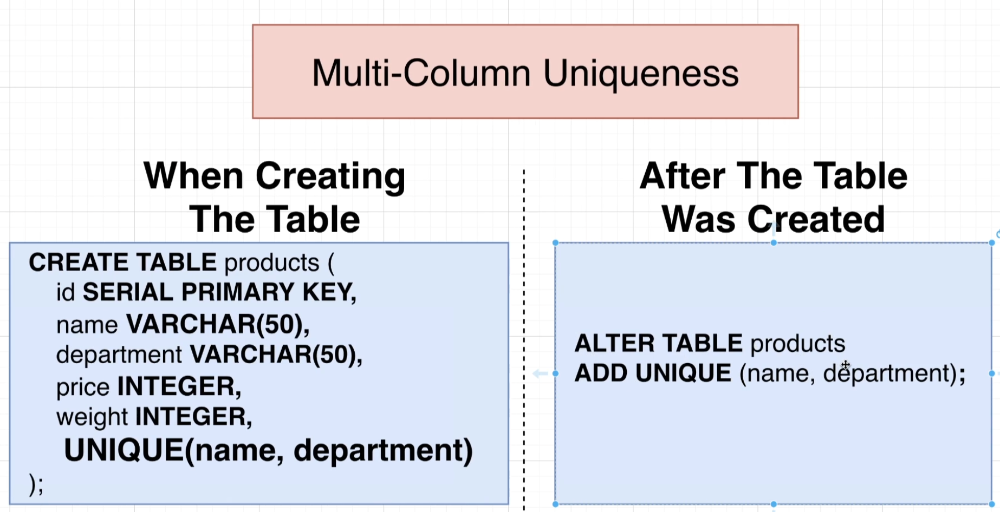](./pictures/multi_column_uniqueness.png)

# Validation check

[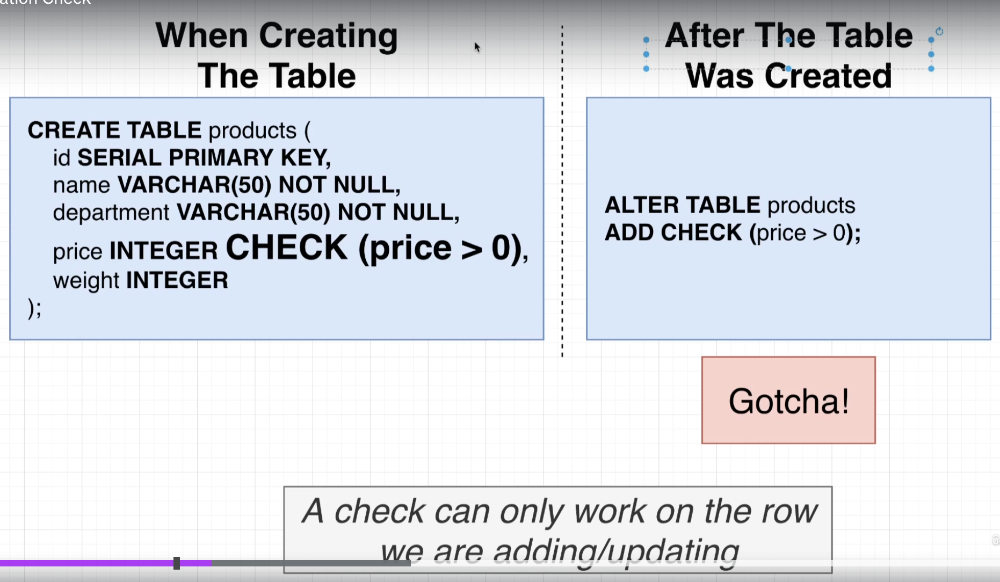](./pictures/validation_check.png)

# Likes System

[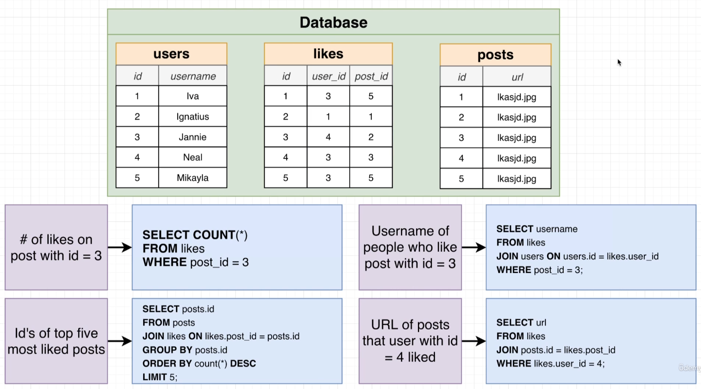](./pictures/likes_system_01.png)

[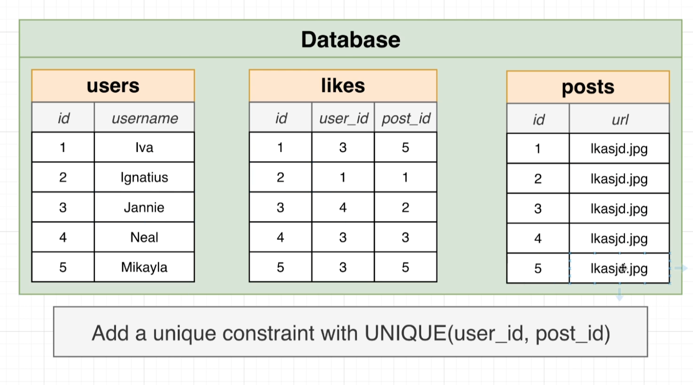](./pictures/likes_system_02.png)

# Reaction based system

[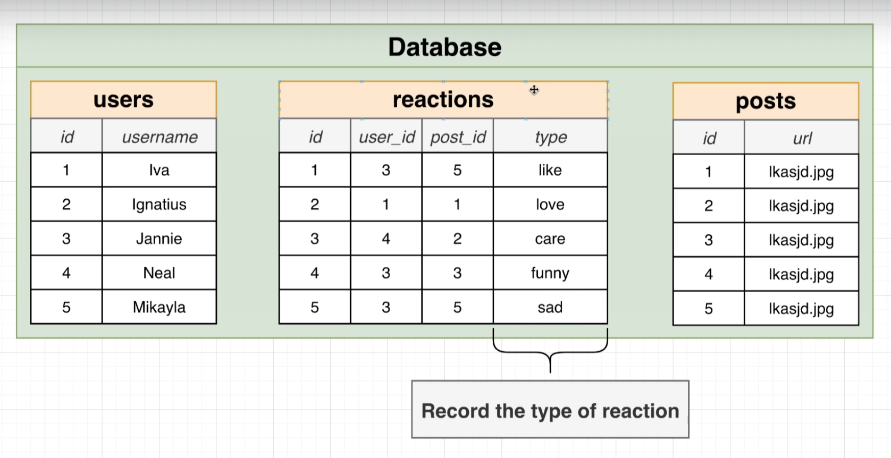](./pictures/reaction_based_system.png)

# Polymorphic associations

- Whenever we try to insert, say, a new like with this kind of original design over here, Postgres is going to take a look at the value that we put into the user ID column. In this case, if we try to insert a row with a user ID of three, then Postgres is going to go over to the users table and make sure that there actually is a user ID of three.If there is no user ID of three, then Postgres is going to say throw an error.
- And the reason for that is that when we create this table and we tell Postgres that this is going to be a foreign key column, we can't tell Postgres if it's going to be a foreign key on the post table or the comment table. We don't know up front. We only know later on when we actually insert a row into this table.
- So when we make use of this polymorphic association and we've got this like type column and this like ID column, we cannot treat this as a foreign key column. And so we lose out on this entire idea of data consistency.
- We could very easily insert a like in here. That refers to a comment with 99999. And well, we don't have a comment with that ID and so we can very easily accidentally insert data that is going to refer to some other row that just doesn't exist.

[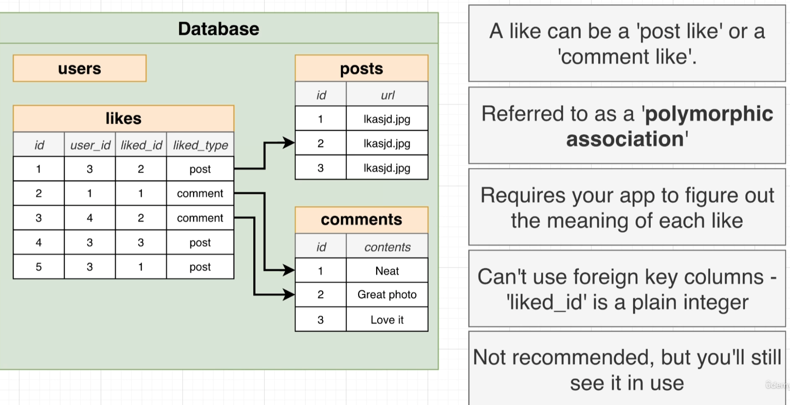](./pictures/polymorphic_associations.png)

# Polymorphic association alternative implementation

[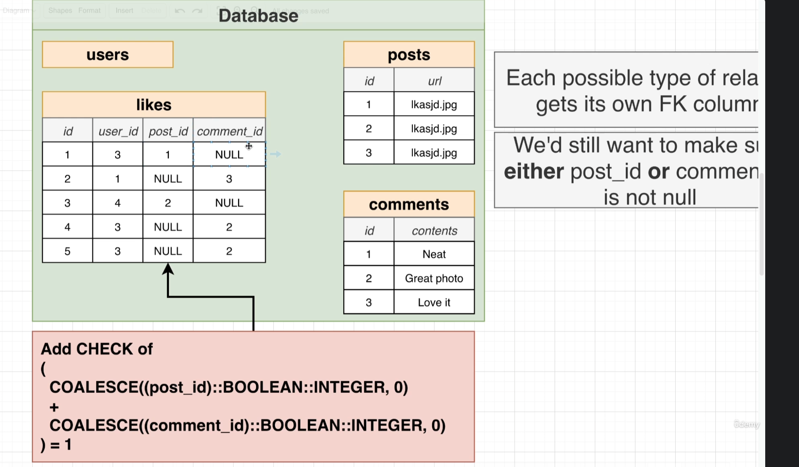](./pictures/polymorphic_association_alternative_implementation.png)

- The only downside here is that if you end up with wanting to relate a user to many different kinds of things, like let's say we want to allow a user to like a post, a comment, a channel, a video, a message, a I don't know, who knows what else, a website. If we want to allow a user to comment many different things, that means that we would end up with many different columns inside this table.

[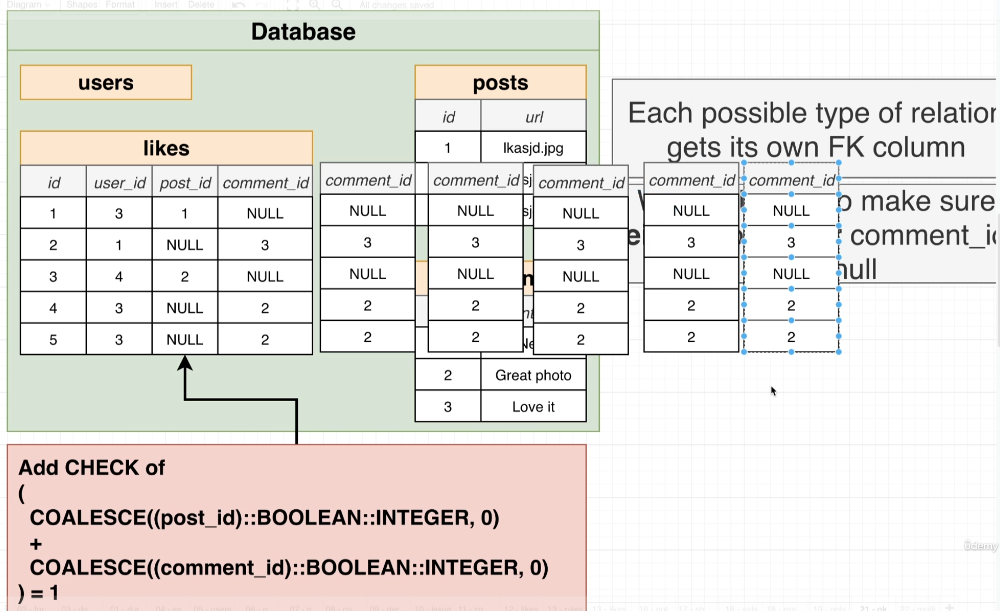](./pictures/polymorphic_association_alternative_implementation_iisue.png)

# Simplest alternative

- It does allow us to create some different check constraints or validation rules for each different kind of like.
- if we want to allow a user to like a post and also put in some kind of like reaction type to it. But we only want to allow a post to have a reaction type and maybe comments can only be liked. This would also be a pretty good solution.

[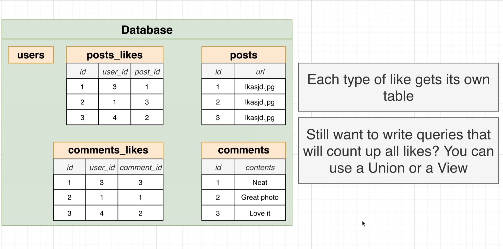](./pictures/simplest_alternative.png)

[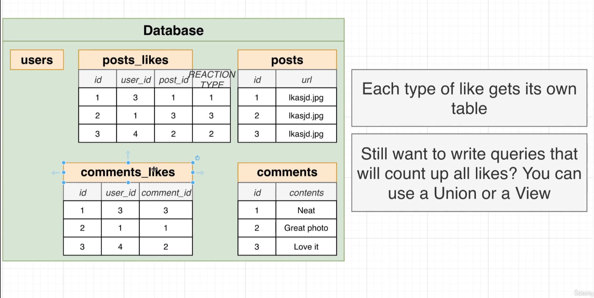](./pictures/simple_alternative_02.png)

# Photo Tags and Caption Tags

[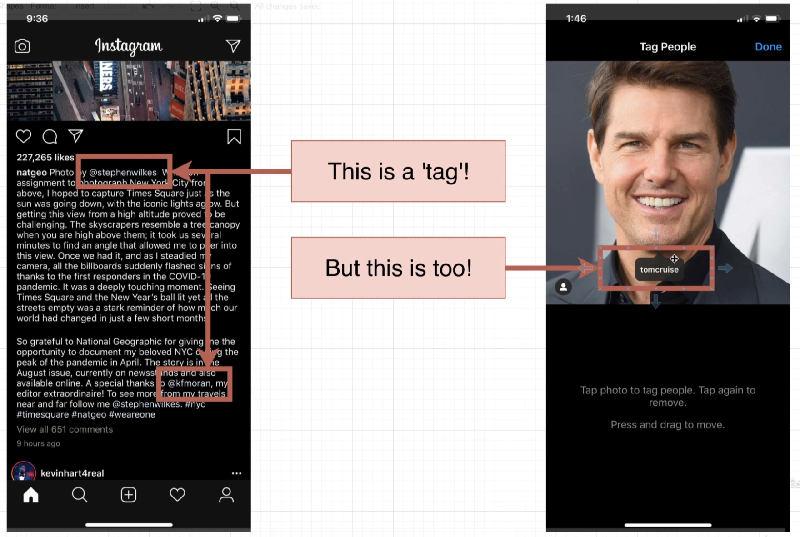](./pictures/phototags_and_captiontags.png)

[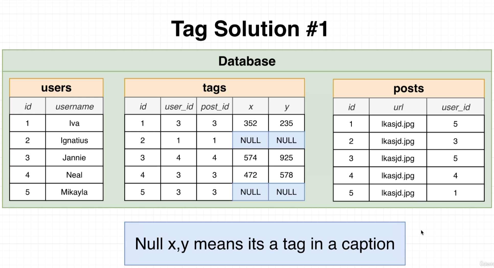](./pictures/tag_solution_1.png)

[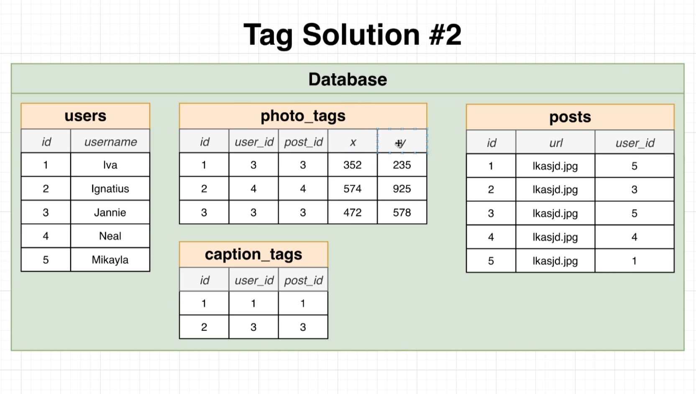](./pictures/tag_solution_2.png)

- If you ever expect to have to run queries against caption tags like ten times more frequently than for photo tags? If that is the case, then you might want to split these out into two separate tables.
- Doing an optimization like that would be a lot more challenging if we had everything combined together on one single table.
- If we ever expect a photo tag to kind of change in functionality, then well, that would really drive us towards solution number two, because that means we could start making changes to our photo tags table without having to worry about the impact on that separate definition of a tag that occurred inside of a caption.

# Hastag system

[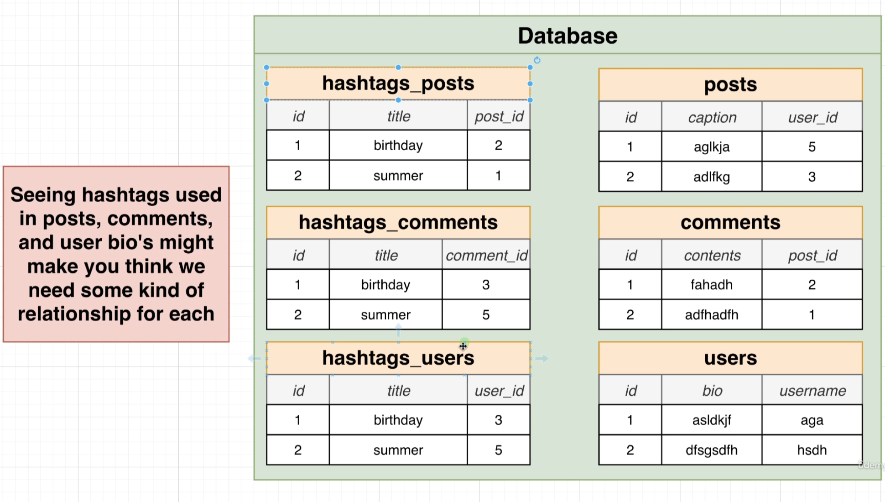](./pictures/hastag_design_first_impression.png)

- We only have to model things that we eventually expect to query. In the case of tags inside of a caption, we did decide that this was an important thing to model inside of our database because we eventually might want to run a query to figure out who the most popular users are.
- So before we start to go to down down this path of creating these three separate tables to model the relationship between a hashtag and a post, a comment or a user, we kind of have to ask ourselves the exact same question.
- Because if we don't, we don't really have to model out these relationships. If we're never going to use this data, we don't have to create these tables.
- If we search some hastag then we are being presented with only one kind of resource : a post. When you look at a hash tag, you are only seeing posts that make use of the hash tag inside of the post caption.

[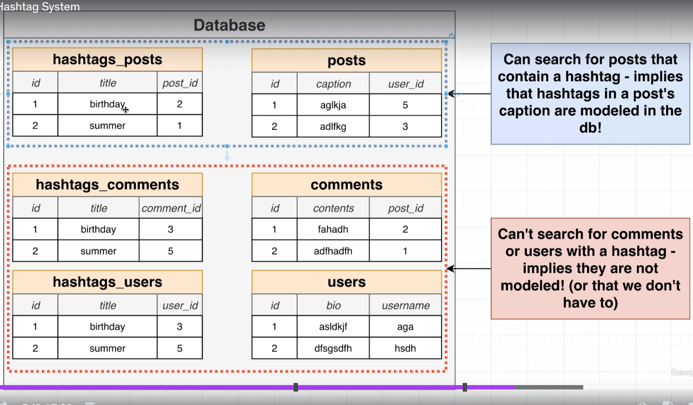](./pictures/hastag_system_design_conclusion.png)

- On the other hand, we cannot search for comments or users with a hashtag, and that kind of implies that we do not care about this relationship at all. We don't really care about which hashtags are being used inside of a given comment or which users are using a hashtag inside their biography.
- hashtags related to comments and hashtags related to users are not really being used at all. And because of that, we really don't need those tables.
- So we don't really need those two extra tables. We really just need the relationship between a hashtag and the post.

[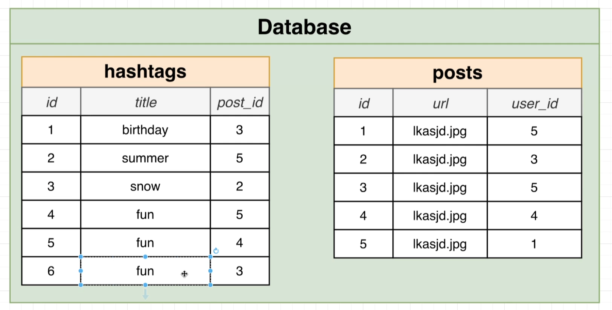](./pictures/hastag_table_design.png)

- However, for some performance reasons that we're going to go into, once we start to discuss performance performance a little bit more, you're going to frequently see a hashtag kind of system modeled in a slightly different way.
- The real big statement here, the big reason for that is that you'll notice that in the hash tags table on this first design, we had a lot of words that were being duplicated many different times. Any time that we start to duplicate strings, that might be a little bit of a space concern. We might be using a little bit more storage in our database than we would otherwise want to be using. It turns out that if we make use of this kind of relationship, we only have to list out each string just one time and then we can store a very simple integer instead to point back to the appropriate string. Storing an integer is a lot more space effective than storing a big string in general.

[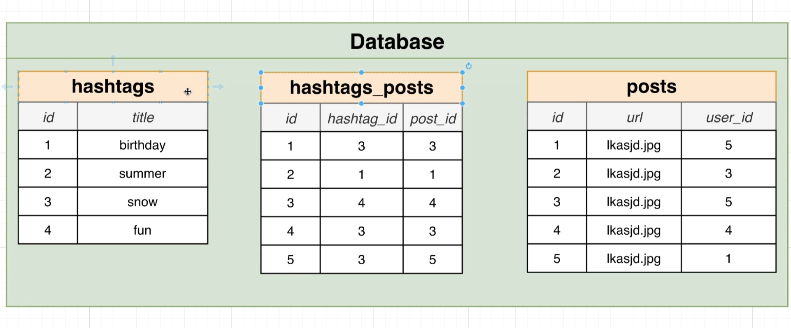](./pictures/hashtag_table_perf.png)

# follower design system

[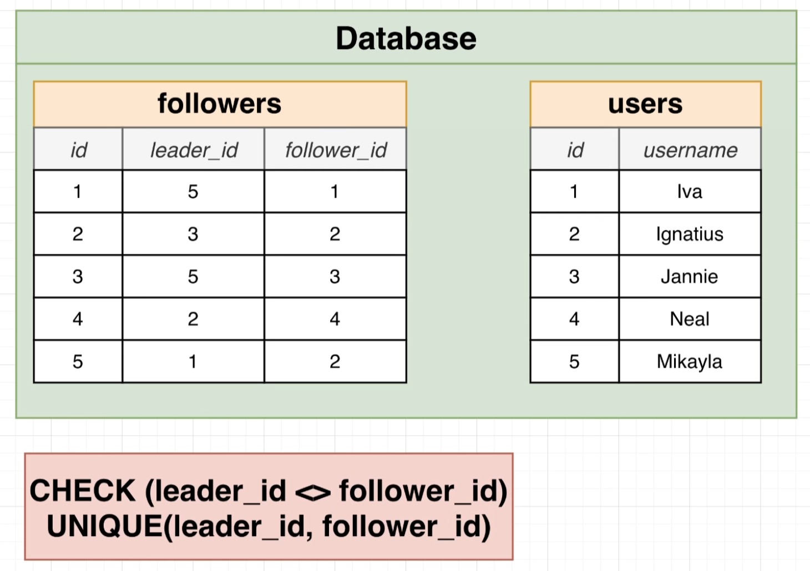](./pictures/follower_design_system.png)