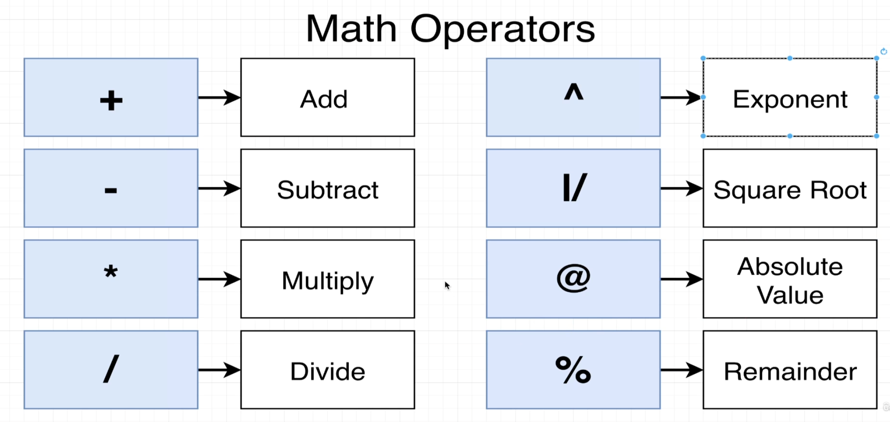

## Create table query analyzer

- keywords are always going to be capitalized and identifiers will always be lowercase.

## varchar(50)

- if try to store longer than 50 characters then postgres is going to give error.

## integers

- integers in postgres will be numbers without decimal. They can range from -2 billion to 2 billon. If try to store anything larger or smaller then these then we are going to end up getting an error.

## Math operations

- We can perform these math operations between two columns. We can write sql to transform or process data before we receive it.

## String functions

- There are also a set of operators we can use to manipulate strings. And in addition to these operators, there's something else called functions we can use as well.

## Select query where clause sequence

## join

- Whenever you use the keyword, join by itself inside of a query that is by default an inner join. You can write out either join or alternatively inner join to indicate that you want to do an inner join.

