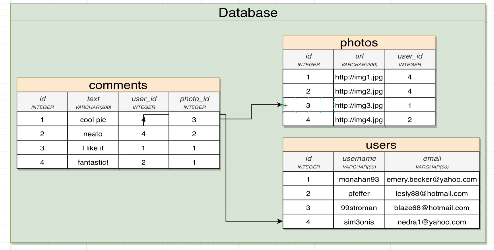
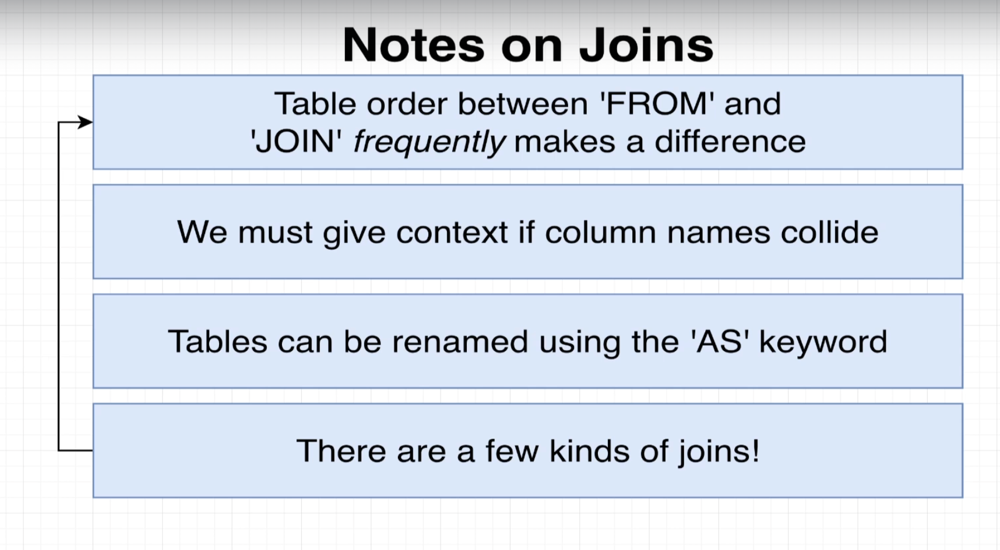
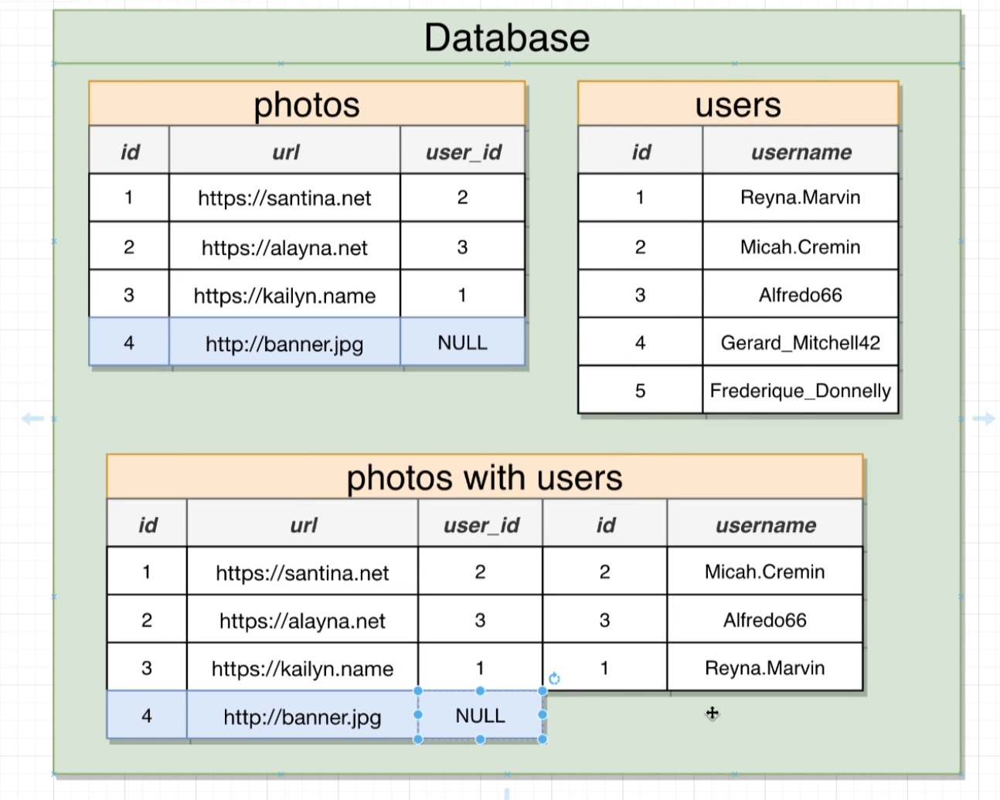
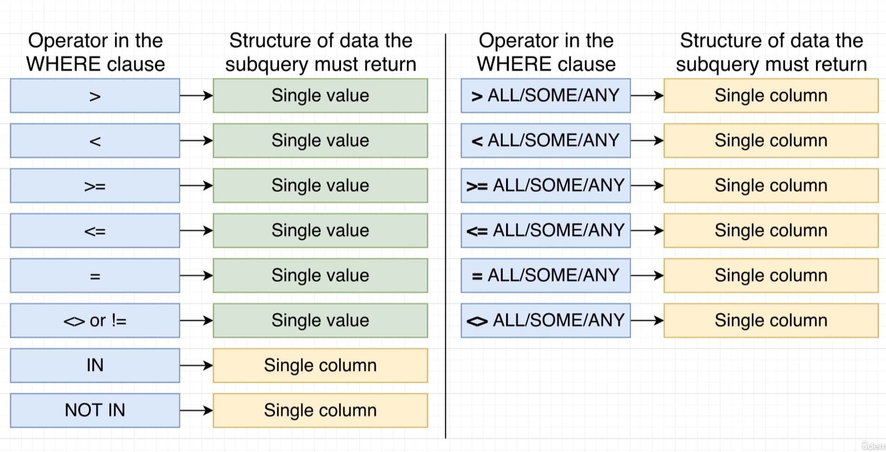

## Create table query analyzer

- keywords are always going to be capitalized and identifiers will always be lowercase.

## varchar(50)

- if try to store longer than 50 characters then postgres is going to give error.

## integers

- integers in postgres will be numbers without decimal. They can range from -2 billion to 2 billon. If try to store anything larger or smaller then these then we are going to end up getting an error.

## Math operations

- We can perform these math operations between two columns. We can write sql to transform or process data before we receive it.

## String functions

- There are also a set of operators we can use to manipulate strings. And in addition to these operators, there's something else called functions we can use as well.

## Select query where clause sequence

## Where clause 

## One to one and many to one relationship

## One to one

## many to many

## Four relationships

## Primary keys and foreign keys

- primary key is unique. value in primary key is unique and never going to be changed.
- goal of foreign key is to somehow relate 1 record in a table to another record in another or same table.

## Primary keys vs foreign keys

## Foreign keys

## Foreign key cases

## What if we delete a row in table

- If we delete a row in table with a SERIAL type column then there won't be any other record with the same id. No serial id ever gets reused even if the row ever gets deleted.

## join

- You can kind of imagine that our database is making a temporary copy of that initial table in this case comments. And then we can once again kind of imagine that this imaginary table right here gets renamed to something like comments with users. And then finally, we can also imagine that the database is then going to iterate through all these different rows and it's going to try to match each of these rows together with the row from the users table using the matching statement that we put on the other side of on.

- Here simple join statement won't print photo with null user id.

- If there is ever a row from our source table of photos that does not match up with the row from users, then that row right there gets dropped from the overall result set.

## Inner Join

- Whenever you use the keyword, join by itself inside of a query that is by default an inner join. You can write out either join or alternatively inner join to indicate that you want to do an inner join.

## Left outer join

## Right Outer join

## Full Join

## order matters

- yes, there is a difference in the order in which we list these tables in the from and join statement whenever we use a left or right outer, join the left and right outer joins. We definitely want to keep in mind the order of these tables so we list them out but with an inner join or a outer join in general, it doesn't make a difference.

## Group and aggregates

## Group by

## combining group by and aggregates

## difference between a where and a having

- Having is very similar to where. Its goal is to filter out some amount of information. The difference between where and having, however, is that where is going to operate on filtering out some number of rows, whereas having is going to filter out some number of groups. 
- You are never going to see having without a group by. So you will always have a group by net right before a having.
- You don't have to have a having if you have a group by, but if you want to do any filtering on the groups you will make use of having.

# Subquery

- The very first one inside the select statement is producing a single value. The two inside the from and join statements are producing a source of rows and then finally the last one down here inside the where clause is producing a single column.

- So one that produces a value, one that produces a set of rows and one that produces a single column, is the real trick to understanding this subquery stuff.

- The reason that making use of a subquery in different locations is challenging to understand is that whenever we write out these subqueries in different spots, we have to change the type or the shape of data that is being returned from the inner query.

- As you can see there are 4 different subqueries in the below example.

# Subquery in select

## Subquery in from

- The result of these subquery has only columns, name and price to weight ratio. So inside of our select statement, if we asked for just price by itself, we would get an error.

- we do not have to return a set of rows or columns from a subquery inside of a from clause. We can return just one single value as long as the outer select statements, the where and so on are compatible with it.

## One row and one column which referred to as a value. That's one single value

# Subquery in join

# Subquery in where

- So when we start talking about subqueries being used inside of a where clause and we start to think about the type or structure of data that is returned from the subquery, a valid subquery is going to be valid or not, depending upon the operator right here that we are using.

- So in some cases we are allowed to write a subquery that is going to return only one single value. In other cases, if we use a different operator, we might be allowed to write a subquery that's going to return a list or a single column of values. It all comes down to the operator that we are using.

- If we get back a single column of values, then we are allowed to use that with an in operator.

# Subquery with where operators

# Correlated queries

- So in other words, when we are executing a where for just one row right, we can imagine that the following thing occurs. The subquery runs, we get all of the different rows for products and then we execute the where for every row that we just fetched.
- You can kind of imagine that this is like a double nested for loop if you are familiar with a for loop in general, for every row that we're going to iterate over on the outer query, we're going to iterate over all of our different products on the inner query. So it's kind of like a nested for loop.
- We can make use of a correlated subquery not only inside of where, we can use them just about anywhere.

# Categories of data types in postgresql

- So here are some of the different categories of data types we have access to. Now, I want to stress the word categories and say the numbers category. There are many different subtypes that we can get access to.

- rule of thumb here is that whenever we are trying to store numbers, that must be 100% accurate, like the number of grams of gold that someone owns or the their bank account currency or how much money they have inside their bank account. Even though there is a performance hit to making use of a types decimal or numeric, we want to use decimal or numeric. If we ever trying to store some kind of number that's going to have a decimal tied to it and we don't really need to be 100% precise, that's when we will reach for these other types of real double precision and float.

# Character data types

-  Char(5) : we provide a string to Postgres that is longer than five characters, then Postgres is going to trim characters until it just gets down to five. And likewise, if we provide a string less than five characters, Postgres is going to insert spaces to the right hand side until it gets up to five.
- VARCHAR(5): we provide a string to Postgres that is longer than five characters, then Postgres is going to trim characters until it just gets down to five. If we put in a string less than five characters, no spaces will be added, as was the case with Char.

