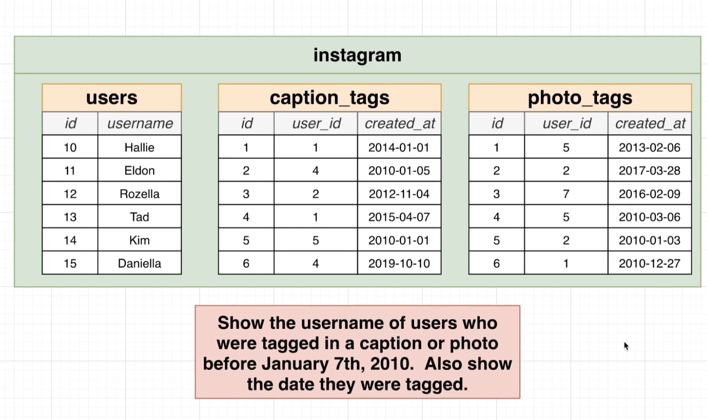
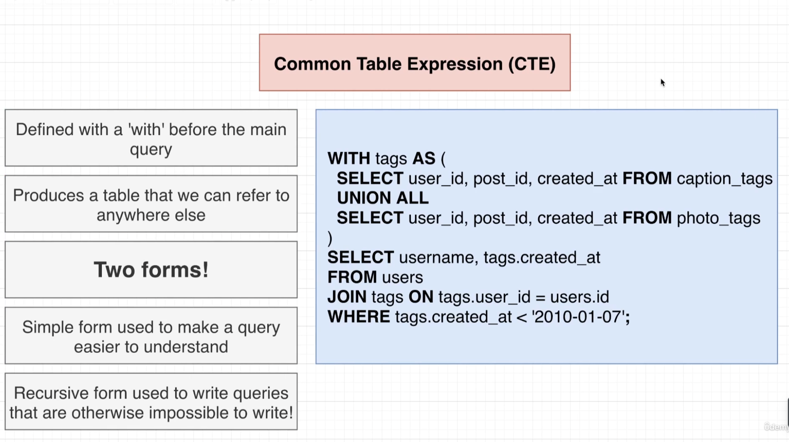
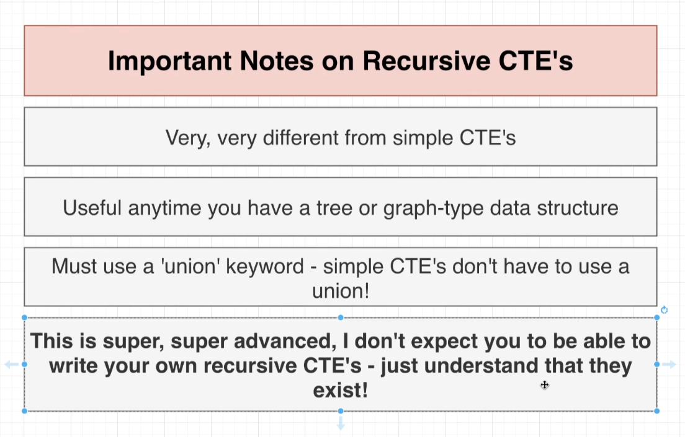
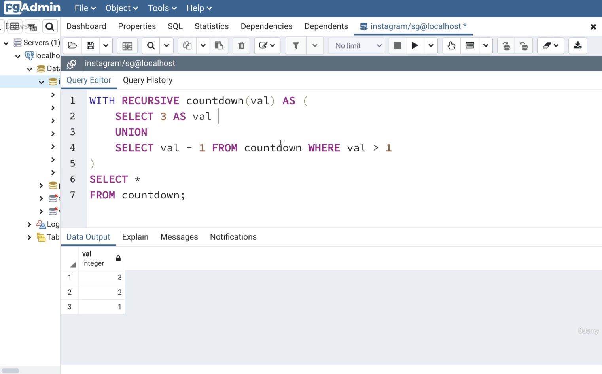
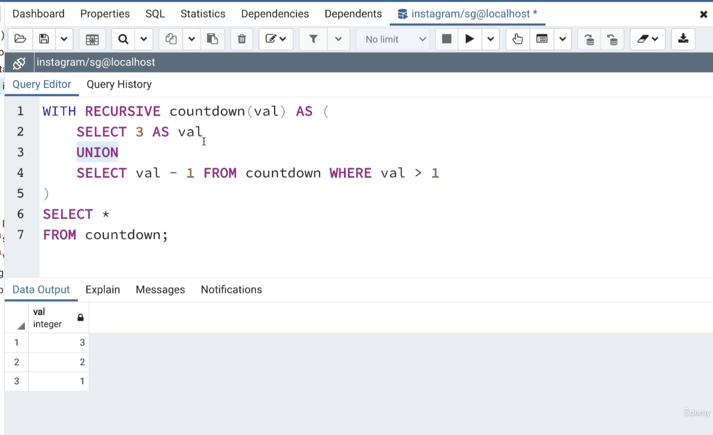
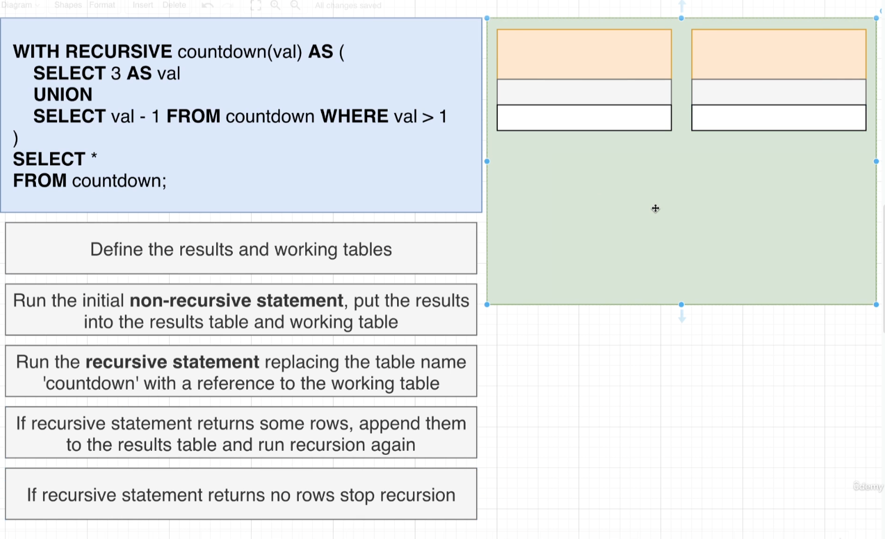
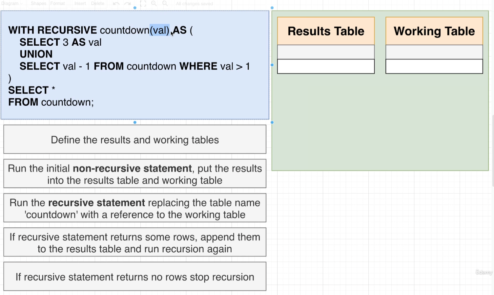
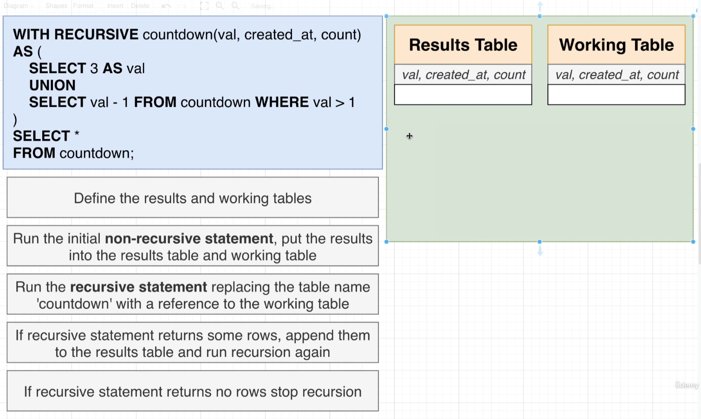

# Common table expressions

-- So the only thing we have really done here in rewriting this query is make it easier for you and I to read and understand what is going on. Making use of this common table expression doesn't actually change how this entire query gets executed.

- The behind the scenes. What we can kind of imagine is happening now is we're going to run that sub query that's going to give us back some number of rows and columns. Those rows and columns can then be accessed through the tags identifier.

- We define them with a with keyword right before the main query.

- Well, it turns out that there's actually two different uses or kind of two different forms of common table expressions.

- There's the simple form which we are using right now, and this is used to make a query query easier to understand, and that is pretty much it. Nothing else is really changing behind the scenes.

- But there is a second form of a common table expression referred to as a recursive form. A recursive common table expression allows you to write queries that are otherwise impossible to to express with just plain SQL by itself.

# Recursive CTE(Common table expressions)

- As I've mentioned, every recursive CTE is going to have a union inside of it, whether or not you think you need it.

- We then have one select immediately above, we refer to the select statement above the Union. As the initial or non-recursive query.

- Then immediately after the union, we've got another select. We refer to this statement right here as the recursive query.

- The first thing that occurs when we run this query, Postgres is going to define two tables behind the scenes. So you're not really going to see these immediately or really see them in any kind of output. We refer to these two temporary tables as a results table and the working table.

- Both these tables are going to be given some number of columns. The columns that they get assigned are whatever you have inside of that set of parentheses right there. So we have with recursive, then some name and then a set of parentheses.

- In this case, we have just one word inside those parentheses of Val, which again is short for value. That means that both of our tables are going to have one single column labeled Val.

- If we had additional words inside of here, such as maybe created_at or count, that means that we would have additional columns inside of both these tables.

