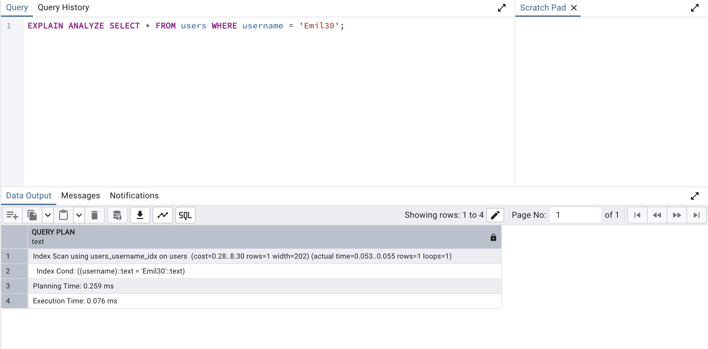

- the important thing to keep in mind is that when data is inside of a heap file on your hard drive, Postgres cannot really just examine that file in place. In other words, in order to take a look at the different users, we have to first load these users up into memory.
- step number one for a query like this would be to take a look at all of our different blocks inside of the heap file. We would extract or load up all the different users into memory, and then once they are inside of memory, we could start to do some further querying or filter on this data. So in our particular case, we might walk through every single one of these users one by one until we found some that had a username of Ryan.
- anytime that we are loading up information from our hard drive over to memory that has a relatively large performance cost. So wherever possible, as database engineers, we try to minimize the amount of data that is being moved between our hard drive over to memory.
- Once this data has been loaded into memory, we then have to execute a search record by record. So even once this information is in memory, we then have to walk through each individual one until eventually we find some number of rows that satisfy this criteria of having a username of Ryan.
- anytime that we are loading up a ton of information out of a table and then iterating over those records one by one, we refer to that as a full table scan.
- a full table scan is whenever Postgres has to load up a ton or even possibly all the different rows out of a heap file into memory and then execute some kind of iteration over those rows to find some number of records.
- you do not always run into poor performance when you are doing a full table scan. There are actually some scenarios where a full table scan is kind of desirable over any alternative.

# index

- An index is a data structure that very efficiently tells us exactly what block and index a particular record is stored at.
- That's what an index is all about. It is an external record of sorts. Record book of sorts that tells us exactly where some records are stored inside of a heap file.

# How indexing is created

- the series of steps we're about to go through is not exactly what occurs inside of Postgres, but the series of steps I'm going to show you is close enough that it's going to help you understand some of the inner workings of an index, how it works, and some big caveats around them as well.
- for step number one, in creating an index, you and I are first going to decide exactly which column we want to have a very fast lookup on.
- whenever we create an index, we create it on a very specific column that allows us to do a fast lookup on our table of users whenever we are doing some kind of filtering logic on that same column.
- Now we can technically have an index that takes into account the value in multiple different columns for each row, not just one.
- Step number two, we're going to take a look at our user table or really our heap file, and we're going to look for every single row. We're going to extract just that one property that we want to create the index for. And then when we extract that property, we're also going to record the block and the index that we found that property at.
- So we're now going to take a look at all the different values that we have extracted and sort them in some meaningful way. So in this case, we're going to sort all of our user names in alphabetical order from A to Z.
- Now, the next step is going to take that list of records right there and we're going to organize them all into a tree data structure.
- notice that I preserved alphabetical order here. So if we look at all these records from left to right, they are still in alphabetical order.
- so now last big step. We're going to add some helpers to the root node.
- Inside these white boxes, we're going to put in some directions to say whether or not someone who's trying to execute a query or find some particular record should go down to that leaf node.
- When we went through this sort of operation, we were able to find the exact record we were looking for without having to load up the vast majority of records inside of our heap file so we did not have to access block zero inside the heap file.
- So we were able to skip a huge portion of this entire search operation by just using the inequalities that we had set up ahead of time.

- So the index that was created was automatically given a name of users username id ID being short for index.
- Whenever you create an index, if you do not provide a name, one will be assigned for you automatically. The name that gets assigned is always going to follow this naming convention. It's always going to be the name of the table, the name of the column. And then idx at the very end.
- So now in theory queries on our username column inside that users table will be rather quick.

# Query speed

-  whenever you run a query right now, you do see query returned successfully in some number of milliseconds. That millisecond value right there is just a little bit misleading because it includes travel time for the query from essentially the Pgadmin interface over to the database and back. So in other words, it includes some network travel time that doesn't really reflect very nicely or is really relevant on the actual execution speed of the query itself.

- So for right now, there's really just one value I want to focus on, and that is this fourth row right here, execution time. That execution time is how long it took to actually run this query.

- So when we have the index in place, it looks like running this query or doing the select statement is just unbelievably fast.

- it is way slower than how long it took to fetch a user when we had the index in place.

# Downsides on indexes

- There are many scenarios where an index is not super useful. There are even more scenarios where an index can actually ultimately slow down your database.

- When we created the index, we were essentially creating some kind of tree data structure behind the scenes and inside that tree data structure. For every row of our actual table, we extracted one piece of information along with a pointer over to some location inside of our heap file.

- in other words, for every single row we are now storing in addition inside of our index some piece of information and a pointer that comes with some amount of storage cost. It takes some amount of hard drive space just to store this index. It doesn't just persist inside of memory. There's actually a file that is created on our hard drive to store all this index data.

- So any time that you create an index, you are using some additional amount of storage space on your computer.

- So in other words, if you are relying upon to host a copy of Postgres for you, the amount of money that you pay on storage space is actually rather large. So in some cases you can actually save a lot of money by not kind of stuffing a ton of extra information into your database.

- Having an index around can also slow down the insert update and delete operations on that table because every single time that you make a change to that table. Now Postgres also has to go and update the index. So if you decide to, say, insert 20 rows into your table, well, that means Postgres has to make 20 updates to the index as well.

- It turns out that there are actually some scenarios where Postgres is not going to use an index to speed up a particular query. So just because an index exists doesn't guarantee that Postgres is going to actually use it. There are actually some queries that are going to run faster without using an index at all.

# Index Types

# Types of indexes

- Anytime that we run the Create Index command, we are creating a very specific type of index. So in Postgres there are several different types of indices that we can create. The most common one and the one that you want the vast majority of the time is a b-tree index.

- All of our information stored in the leaf nodes and then the more parent nodes direct us to the leaf node that we want to visit is referred to as a b-tree index.

# automatic_index

- Any time that you create a column that is a primary key column or anytime you create a column that has a unique constraint on it, Postgres is going to automatically create an index for you for specifically that column.

- Now, the one thing that's really confusing about this is that these indexes don't actually get listed under the indexes section in Pgadmin.

- This pg_class table lists all the different objects that exist inside of our database. So all the different tables, indexes, sequences and so on.

- A relkind='i' means that this object listed out inside of here is an index.

# Behind the scenes of indexes

- When we create an index, an actual file is created on your hard drive. The file is assigned some kind of random number identifier.

- The structure of this file internally has the same kind of structure that we had for those heap files.

- So inside of this index file we have eight kilobyte pages.

- In the case of an index each page has a very specific purpose. Whereas back inside of a heat file each page was essentially identical to another.

- The very first page is called the meta page. So this has some information about the overall index. We then might have some number of leaf pages and then eventually one called the root page. So all the pages you see right here are essentially represent the different nodes of our b-tree.

- So at the very top is the meta page that has information about the entire tree. We've then got the root block or the root page right here that has some directions inside of it to direct us to which page or which leaf has some particular records. And then the leaf pages themselves are where our actual information is stored for the index.

- So for example, this leaf right here might have some listing of usernames. And for each username there might be a pointer to where we could find the record corresponding to that username inside of our users heap file.

- the index file or these individual pages are actually identical in nature to those heap file pages we had looked at previously. So inside of each of these pages there is a header. There is that item id index array. There's then some free space, and then the actual items that are stored in each of these leaf pages.

- An extension is some piece of code that gives us some additional functionality inside of Postgres.
- the page Inspect extension gives us some functions that we can use to take a look at the data that is stored on different pages inside of either an index or a heap file.

- We are being told that if we have some data matching, some condition that is listed over here inside the data column, then we should go to the page index listed inside of the CT id column. So in other words, if we satisfy like some data criteria right here, we should go to page one inside this index. So in other words page one is leaf node one. If we satisfy some other data criteria then we should go to page two.

- You'll notice that we do not see an index of three here. That is because index three is the actual root node itself. We are looking at the root node right now. So all the id CT IDs right here 1, 2, 4, 5, 6, 7, 8, Those are the index of the different leaf nodes that we can go to.

- data column of the first row is empty.

- Well when we said that there is some kind of comparison in the root node going on, we was kind of exaggerating just a little bit, just to make things a little bit more clear. In reality, the comparison that we do here is a little bit more complicated.

- So we see some hex value inside of data column.

- hex value in the second row translates to Allison14 which is an actual username tied to one of our users.

- when we first come into this root node. We would go to the first cell right here. We would skip over it because it's empty. And we would say okay, do we have a value that is greater than or equal to Alison14 if we do not, we would go back to the previous and go down to page one.

- Otherwise, if we are looking for some value that is greater than or equal to Alison14 we could possibly go down to page two, but first we would probably want to check the next possible page over.

- So now if we have a value that is greater than Allison 14, we would go to the next one. Say do we have a value that is greater than or equal to Austin zero. If we do, then we would kind of continue on the comparison. Otherwise, if we have a value that is less than Austin dot zero, but greater than or equal to Allison14, that means we would go down into page two.

- process is a little bit confusing, but basically we start on the left hand side and go over until we eventually kind of fail this comparison. And as soon as we do, that is a sign that we need to go kind of back one step and go down to the respective page.

