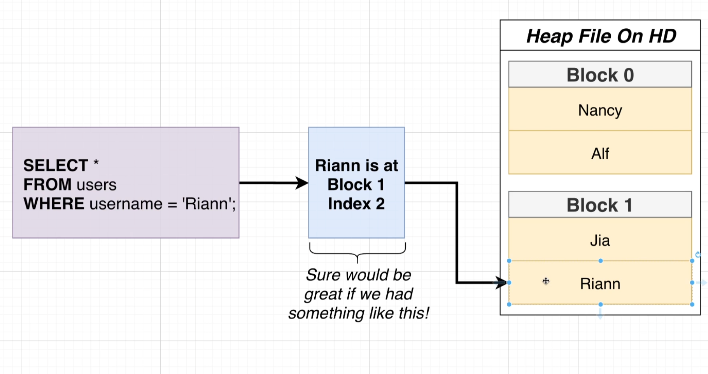
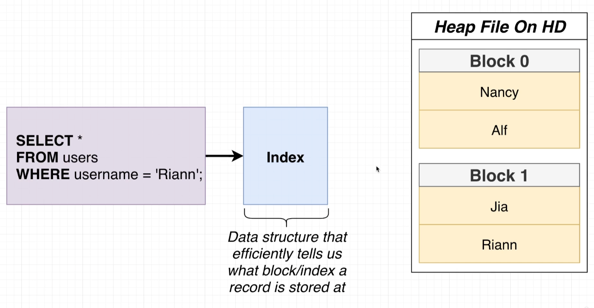
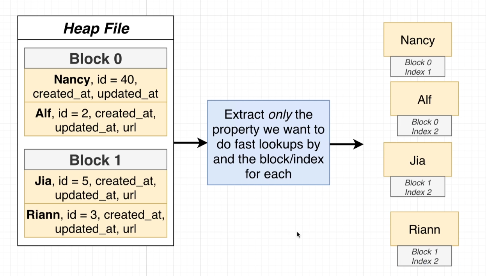

- the important thing to keep in mind is that when data is inside of a heap file on your hard drive, Postgres cannot really just examine that file in place. In other words, in order to take a look at the different users, we have to first load these users up into memory.
- step number one for a query like this would be to take a look at all of our different blocks inside of the heap file. We would extract or load up all the different users into memory, and then once they are inside of memory, we could start to do some further querying or filter on this data. So in our particular case, we might walk through every single one of these users one by one until we found some that had a username of Ryan.
- anytime that we are loading up information from our hard drive over to memory that has a relatively large performance cost. So wherever possible, as database engineers, we try to minimize the amount of data that is being moved between our hard drive over to memory.
- Once this data has been loaded into memory, we then have to execute a search record by record. So even once this information is in memory, we then have to walk through each individual one until eventually we find some number of rows that satisfy this criteria of having a username of Ryan.
- anytime that we are loading up a ton of information out of a table and then iterating over those records one by one, we refer to that as a full table scan.
- a full table scan is whenever Postgres has to load up a ton or even possibly all the different rows out of a heap file into memory and then execute some kind of iteration over those rows to find some number of records.
- you do not always run into poor performance when you are doing a full table scan. There are actually some scenarios where a full table scan is kind of desirable over any alternative.

# index

- An index is a data structure that very efficiently tells us exactly what block and index a particular record is stored at.
- That's what an index is all about. It is an external record of sorts. Record book of sorts that tells us exactly where some records are stored inside of a heap file.

# How indexing is created

- the series of steps we're about to go through is not exactly what occurs inside of Postgres, but the series of steps I'm going to show you is close enough that it's going to help you understand some of the inner workings of an index, how it works, and some big caveats around them as well.
- for step number one, in creating an index, you and I are first going to decide exactly which column we want to have a very fast lookup on.
- whenever we create an index, we create it on a very specific column that allows us to do a fast lookup on our table of users whenever we are doing some kind of filtering logic on that same column.
- Now we can technically have an index that takes into account the value in multiple different columns for each row, not just one.
- Step number two, we're going to take a look at our user table or really our heap file, and we're going to look for every single row. We're going to extract just that one property that we want to create the index for. And then when we extract that property, we're also going to record the block and the index that we found that property at.
- So we're now going to take a look at all the different values that we have extracted and sort them in some meaningful way. So in this case, we're going to sort all of our user names in alphabetical order from A to Z.
- Now, the next step is going to take that list of records right there and we're going to organize them all into a tree data structure.
- notice that I preserved alphabetical order here. So if we look at all these records from left to right, they are still in alphabetical order.
- so now last big step. We're going to add some helpers to the root node.
- Inside these white boxes, we're going to put in some directions to say whether or not someone who's trying to execute a query or find some particular record should go down to that leaf node.
- When we went through this sort of operation, we were able to find the exact record we were looking for without having to load up the vast majority of records inside of our heap file so we did not have to access block zero inside the heap file.
- So we were able to skip a huge portion of this entire search operation by just using the inequalities that we had set up ahead of time.

- So the index that was created was automatically given a name of users username id ID being short for index.
- Whenever you create an index, if you do not provide a name, one will be assigned for you automatically. The name that gets assigned is always going to follow this naming convention. It's always going to be the name of the table, the name of the column. And then idx at the very end.
- So now in theory queries on our username column inside that users table will be rather quick.

# Query speed

-  whenever you run a query right now, you do see query returned successfully in some number of milliseconds. That millisecond value right there is just a little bit misleading because it includes travel time for the query from essentially the Pgadmin interface over to the database and back. So in other words, it includes some network travel time that doesn't really reflect very nicely or is really relevant on the actual execution speed of the query itself.

- So for right now, there's really just one value I want to focus on, and that is this fourth row right here, execution time. That execution time is how long it took to actually run this query.

- So when we have the index in place, it looks like running this query or doing the select statement is just unbelievably fast.

- it is way slower than how long it took to fetch a user when we had the index in place.

- There are many scenarios where an index is not super useful. There are even more scenarios where an index can actually ultimately slow down your database.