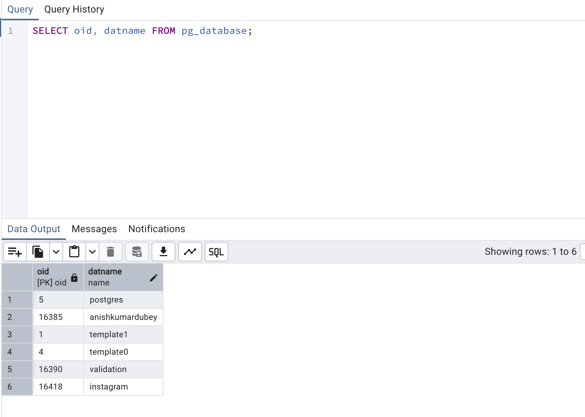
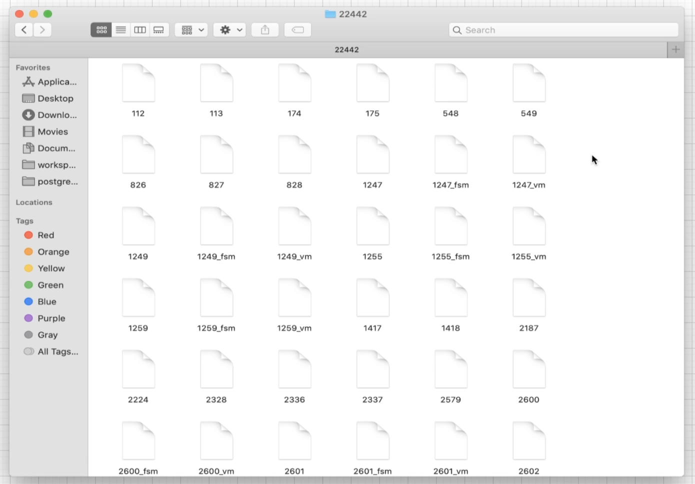
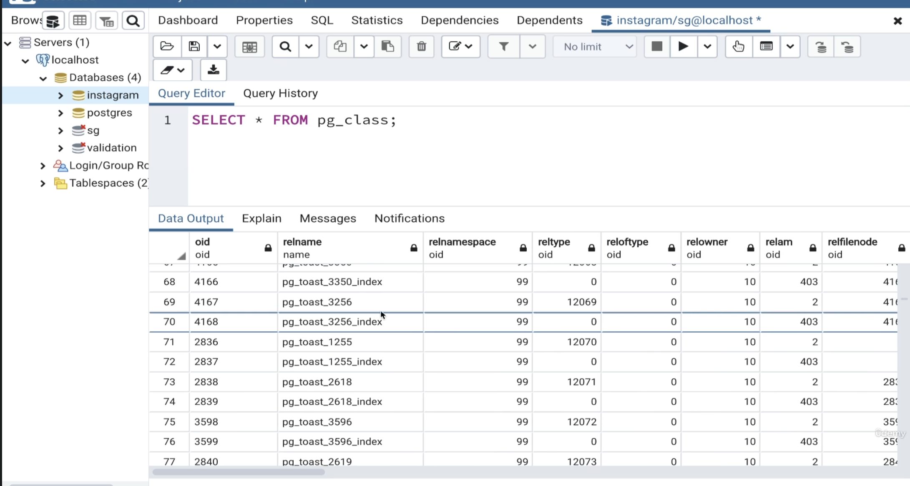
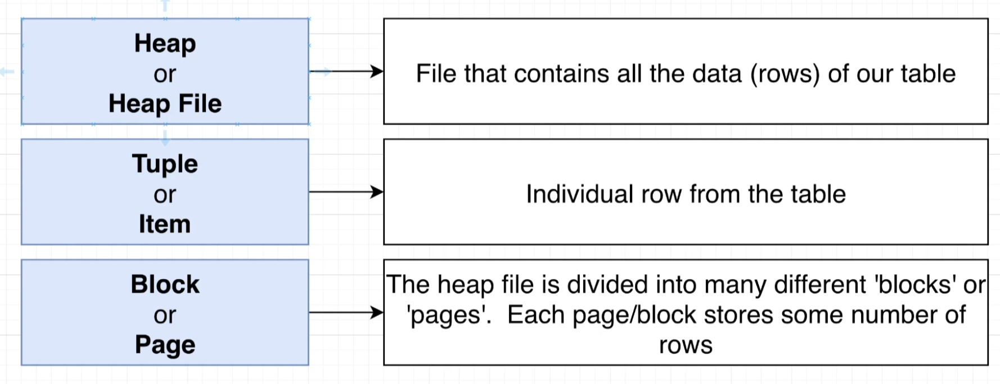
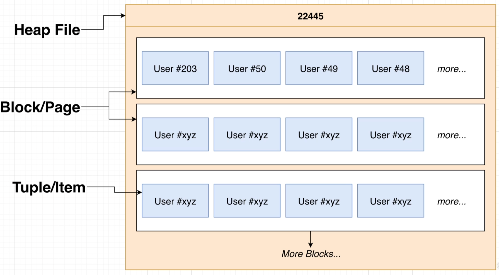
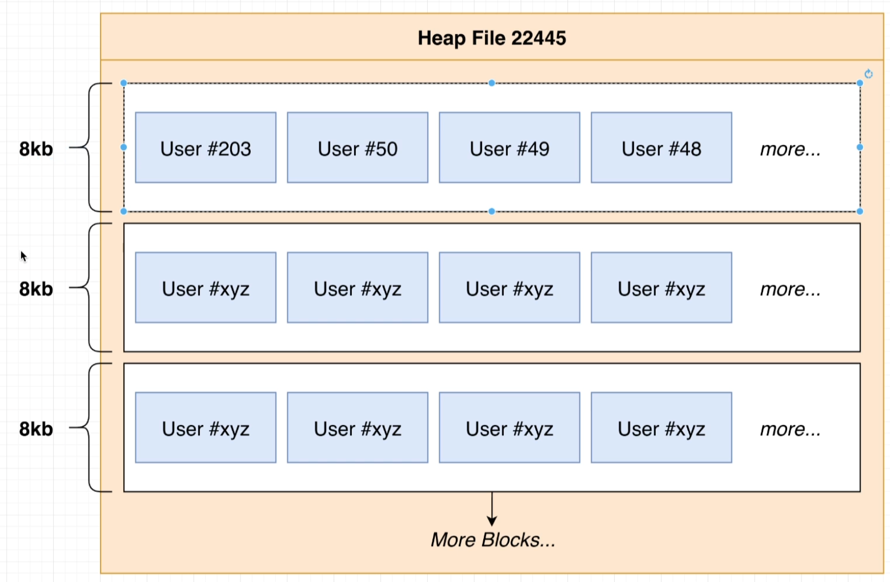
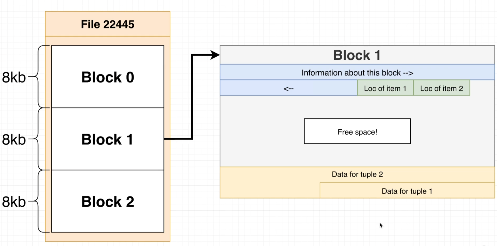

# raw_data_files_in_db

- So all the files you see right here, these represent the raw data inside of our database.
- And when we look at this, it kind of looks like there are too many files for them to represent the individual tables that we have. And it looks like there's too few for it to be like maybe one file for every row and every table.
- 22442 is oid of instagram in my local database

- So each of these different rows. Contains information about one of those different files that we're taking a look at above.
- Each file, in turn, represents one individual object inside of our database.
- So this file 16420 which is is shown against users table in below, in theory, contains all of the data for my entire users table.

- So at this point in time, we've established that inside of your hard disk somewhere, Postgres is storing all the information tied to one individual database inside of one folder.
- And inside of that directory are a ton of different files. And each of these different files represent one different thing inside the database. An example of a individual thing is a table. And so we identified two files that store all the data related to our users table and our post table.

# HEAPS, BLOCKS AND TUPLES 

- HEAP or HEAP file: This is a file that contains all the data related to one particular table.
- 16420 is a heap file as it contains all of the data for my entire users table.
- A heap data structure is very different than a heap file, so we don't really want to be thinking about a heap data structure at all when we're thinking about these heap file things.
- Tuple or Item: These are referring to individual rows from one particular table.
- A single heat file is divided into many different blocks or pages. And then inside of each block or page, we have many different tuples items/Rows.

- The entire file itself is referred to as the heap or heap file. The file is subdivided into many different blocks or pages, and then each block or page stores some number of tuples items rows. Each block or page can store no items. So like no users whatsoever or can can store many different items.

- By default. Each of these blocks or pages are eight kilobytes in size. So we might have one block right here. Regardless of how many items are inside of it, it is always eight kilobytes large. The next one, regardless of how many items are stored inside of it, it is always eight kilobytes large.

# Block Data layout

