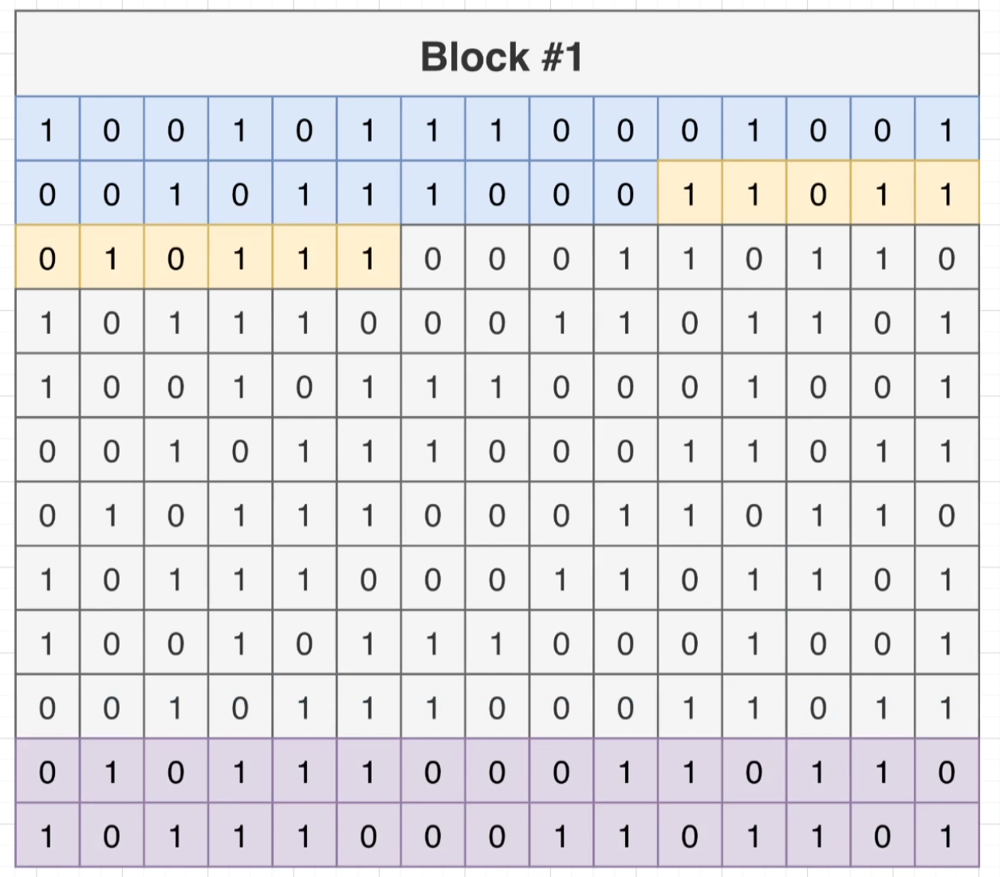
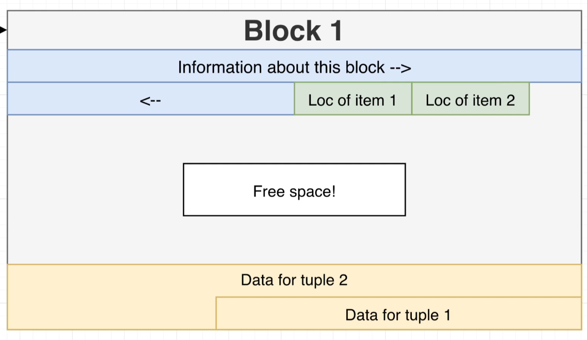
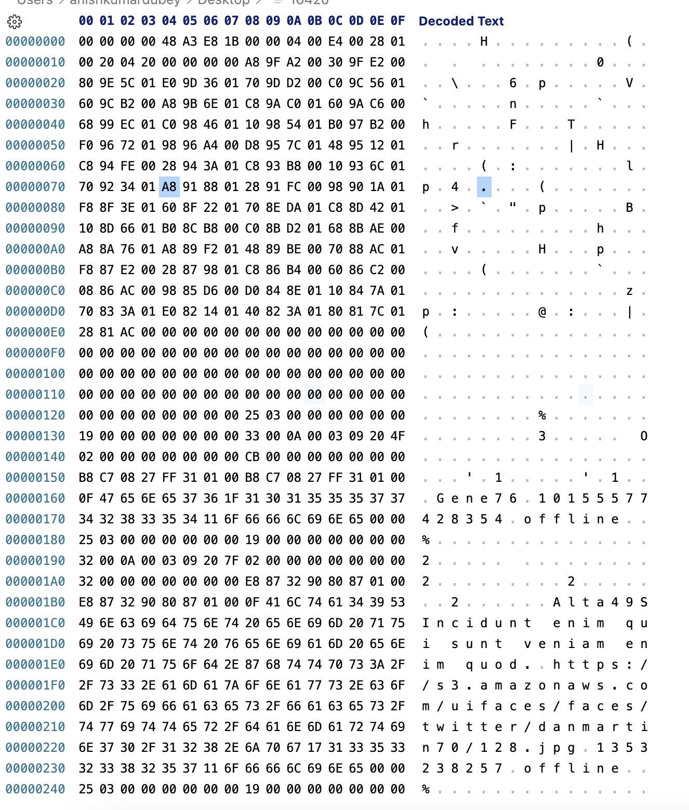
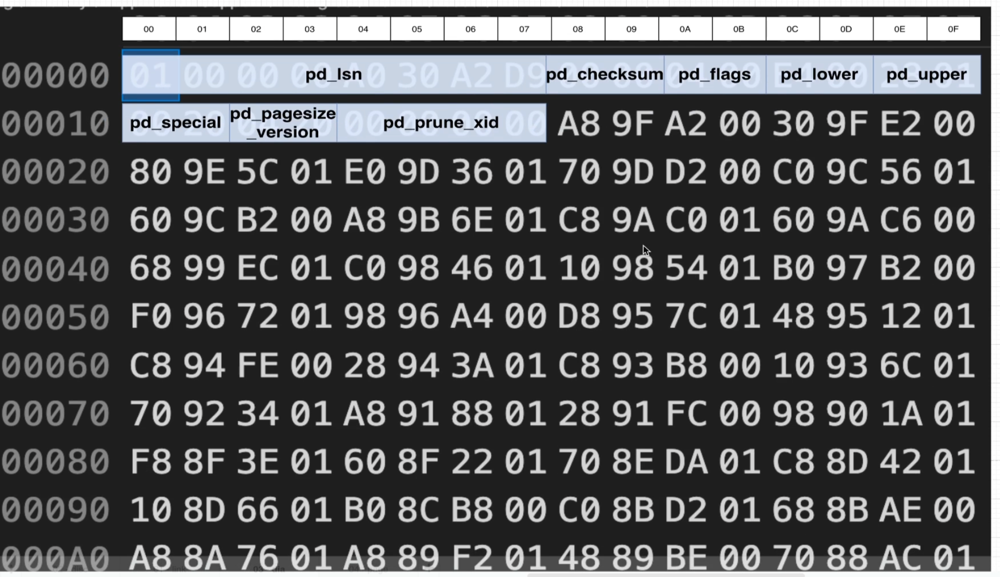
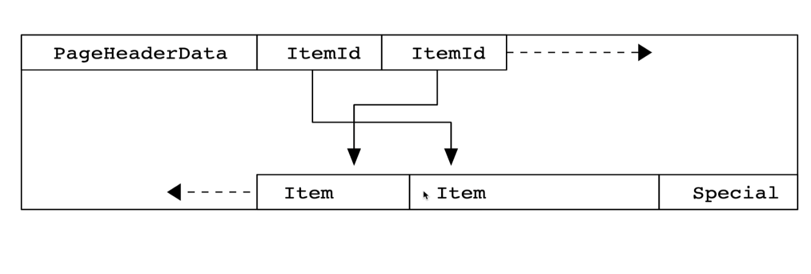
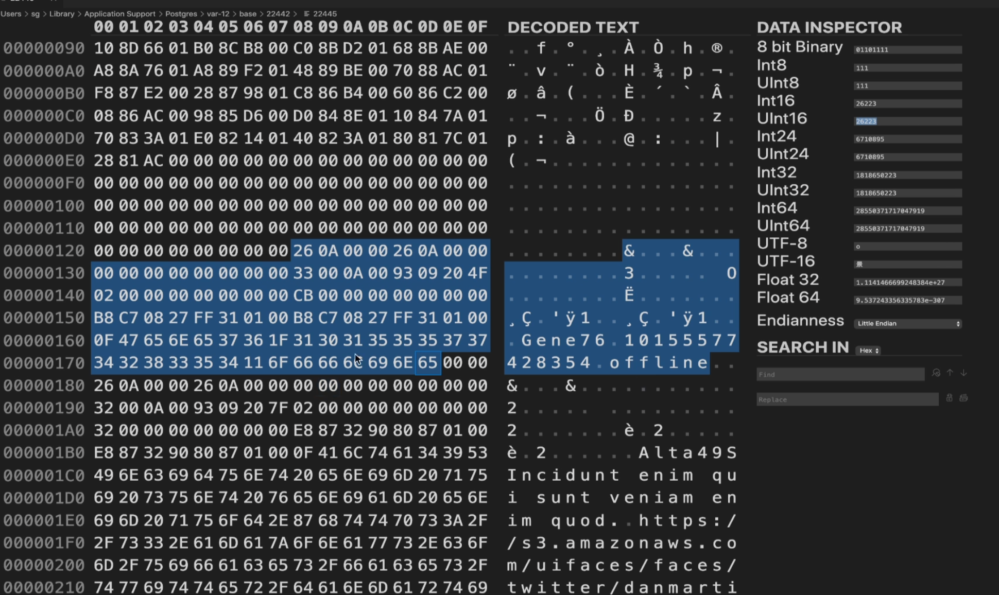

# raw_data_files_in_db

- So all the files you see right here, these represent the raw data inside of our database.
- And when we look at this, it kind of looks like there are too many files for them to represent the individual tables that we have. And it looks like there's too few for it to be like maybe one file for every row and every table.
- 22442 is oid of instagram in my local database

- So each of these different rows. Contains information about one of those different files that we're taking a look at above.
- Each file, in turn, represents one individual object inside of our database.
- So this file 16420 which is is shown against users table in below, in theory, contains all of the data for my entire users table.

- So at this point in time, we've established that inside of your hard disk somewhere, Postgres is storing all the information tied to one individual database inside of one folder.
- And inside of that directory are a ton of different files. And each of these different files represent one different thing inside the database. An example of a individual thing is a table. And so we identified two files that store all the data related to our users table and our post table.

# HEAPS, BLOCKS AND TUPLES 

- HEAP or HEAP file: This is a file that contains all the data related to one particular table.
- 16420 is a heap file as it contains all of the data for my entire users table.
- A heap data structure is very different than a heap file, so we don't really want to be thinking about a heap data structure at all when we're thinking about these heap file things.
- Tuple or Item: These are referring to individual rows from one particular table.
- A single heat file is divided into many different blocks or pages. And then inside of each block or page, we have many different tuples items/Rows.

- The entire file itself is referred to as the heap or heap file. The file is subdivided into many different blocks or pages, and then each block or page stores some number of tuples items rows. Each block or page can store no items. So like no users whatsoever or can can store many different items.

- By default. Each of these blocks or pages are eight kilobytes in size. So we might have one block right here. Regardless of how many items are inside of it, it is always eight kilobytes large. The next one, regardless of how many items are stored inside of it, it is always eight kilobytes large.

# Block Data layout

- Each block. has this kind of structure.
- Well, when we are thinking about block number one, we are really talking about some information that is being stored on the hard disk of your computer. Your hard disk stores information as binary. So zeros and ones.

- So when you are looking at above diagram, we can kind of imagine that behind the scenes, we are looking at some collection of zeros and ones. So maybe the first set of zeros and ones right here. The first couple of zeroes and ones are being dedicated to store some very particular type of information. Maybe the next couple of zeros and ones are being dedicated to store some other kind of information. And then eventually maybe the zeros and ones at the very bottom are dedicated to storing yet another kind of information.

- So right now, as you're looking at this diagram, this is kind of a representation of the actual physical data being stored on your hard drive and the purpose of every little zero and one in there. So as I mentioned, this is a very low level lecture that we're going through right now.

- So inside the block we have some collection of zeros and ones at the very start of the block that are made to represent information about the block itself. The next section of zeros and ones contain information about the actual data that is stored inside this block. So information about the actual rows. This does not actually contain information for the rows themselves. So in other words, there's not necessarily any IDs or user names or anything like that inside of here. These are just little pieces of information that say where you can find the different rows that are stored inside the block.
- After that, we've got this big gray area in the middle that is dedicated to free space. By free space. I just mean to say there are some collection of zeros and ones that are not actually being used by the block right now.
- At the very end, we've got some collection of zeros and ones down here for information about tuple two perhaps, and then maybe some information about tuple Number one, perhaps.

- If we scroll up to the very top, we are looking at the start of page zero right here. This is page zero. If we counted off 8096 bytes. So if we counted off like one, two, three, four, and then all the way down, we would eventually get to page number two. Because remember, every page is eight kilobytes and inside of eight kilobytes there are 8096 bytes.

# PageHeaderData layout

- pd_lower is a two byte value. It is an offset to the start of free space.
- Right after pd_lower, the next two bytes are referred to as upper. That is also going to be an integer value and it's going to be the number of bytes from the start of the page all the way down to the end of free space.

# itemiddata

- Here's our header, the first 24 bytes. So then every four bytes section after that represents one individual itemiddata. So you can see that in total from the end of the header all the way down to the start of our free space. So these are all item data's, each one is four bytes long.
- Each item ID data has a byte offset to the start of an item. In this case, remember an item is a tuple or a row. So the byte offset to the start of the item essentially means the number of bytes from the start of the page to the start of an actual item or a tuple or a row inside of this block. It then relates the length of that individual row or item in bytes and then some other information that we don't really care about. So in reality, these itemID things, item ID datas are telling us the byte offset to the start of item and its length in bytes.
- Remember, each item ID is actually referring to an individual or different item inside the data section.

# Table row layout

- for an individual item, this is the tricky part. There's actually 23 bytes worth of information at the start of the item. Then some other information after that. And then finally, after all that filler stuff is the actual user data. Like the actual ID that we care about, the created_at, the username and so on.
- The start of this item is actually the start of the header for the item only after about 23 bytes plus or minus some additional amount do we actually get to the data that we really care about.

