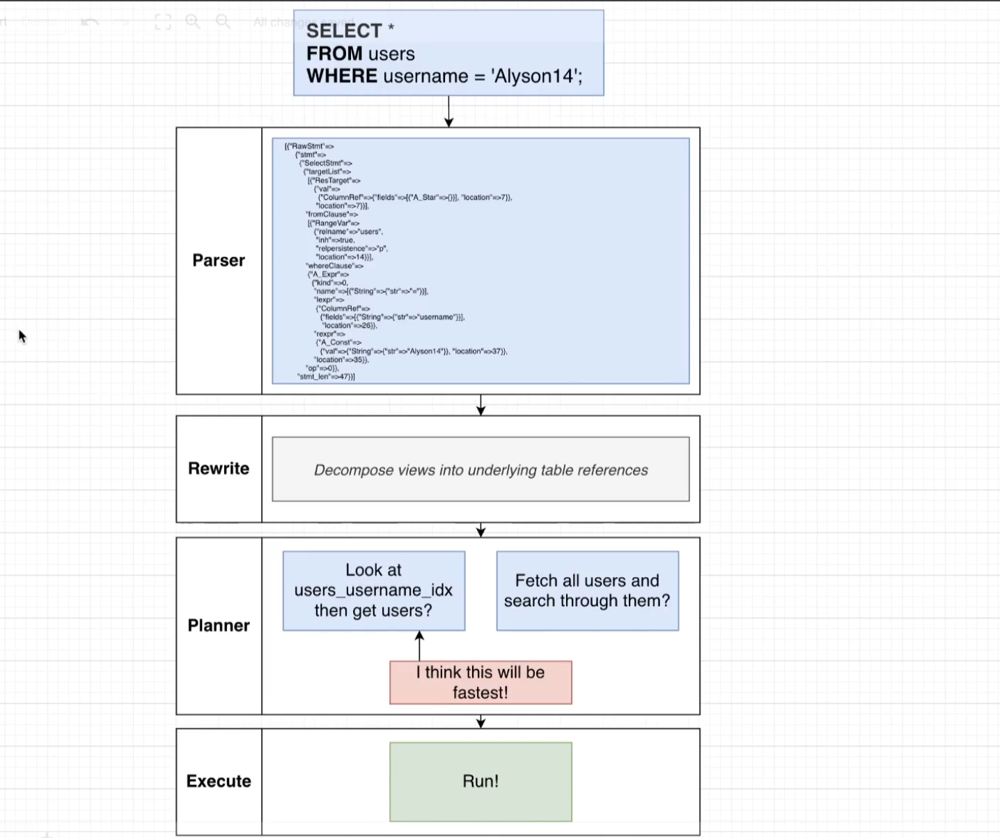

# Query Processing pipeline

- This query is going to be fed into Postgres and it's going to go through a series of processing steps. It's going to go through the parser, a rewriter, a planner and an executor.

