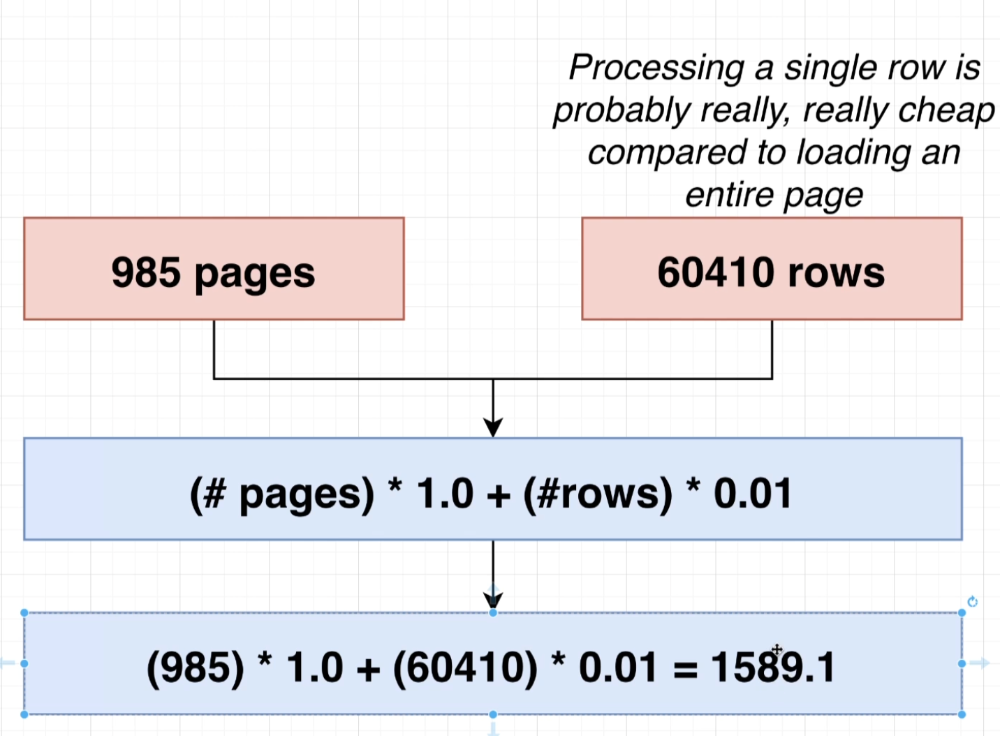

# Query Processing pipeline

- This query is going to be fed into Postgres and it's going to go through a series of processing steps. It's going to go through the parser, a rewriter, a planner and an executor.

# parser

- When you feed a query like this into Postgres, immediately Postgres is going to try to take all the different characters of that string and tear it apart one by one and figure out what the meaning of every character in every word is inside there. The parser is going to make sure that what you wrote out inside this query is actually valid SQL. So you have referred to actual keywords that actually exist. They're all spelled correctly. We've got appropriate punctuation and so on, all that kind of stuff.

- After evaluating this query, it's going to build up something called a query tree. The query tree is essentially a programmatic description of the query that you are trying to run. So again, this is referred to as the query tree and it breaks apart the entire query that you feed in into these more kind of logical steps that can be understood by a computer program.

# Rewritter

- Once the query tree has been written, it's then handed off to the rewriter. 

- The rewriter is going to take a look at the query tree and possibly make little modifications to it. If Postgres thinks that certain parts could be executed a little bit more efficiently. However, what happens much more frequently is it applies the idea of views to the query tree itself.

# planner

- After that, the query tree is going to move on to the planner.

- The goal of the planner is to take a look at the query tree, figure out what information you are trying to fetch, and then come up with a series of different plans or strategies that could be used to actually get that information.

- it might say, you know what, we could probably get that information very efficiently by using the user's username index and then use the references or pointers inside there to go and fetch some appropriate users from the user heap file. The planner might also come up with a plan where it says you know it rather than using the index. We could just go into the user table directly, fetch all the different users and do a one by one search through them.

- After coming up with all these different plans, the planner is going to evaluate which one it thinks is going to actually execute the fastest and then choose that plan to actually run.

# Executer

- After the planner decides on what the most efficient strategy is, it is handed off to the executor, which is going to actually run the query.

# Explain and Explain analyze

- If we write out, just explain in front of a query, then Postgres is going to build up a query plan and then show us some information about it. It doesn't actually run the underlying query.

- However, if we put in Explain Analyze, Postgres is going to build up a query plan. It's going to execute the query plan and then show us some information about the query plan and some statistics around how long it took to actually run it.

- So in other words, explain kind of tells us what Postgres plans to do but doesn't actually do it. Explain analyze, tells us what Postgres intends to do and then actually executes it as well.

- We are only ever going to use explain and explain, analyze while we are trying to do some performance evaluation. We're never going to leave these in any kind of production application where we want to actually fetch some data.

- The reason for that is that if you make use of explain or explain analyze, you do not actually get back the rows that are coming out of your query. Instead, you just get the query plan itself and possibly some information about it.

- Each of the rows that have an arrow on them we refer to as a query node.

- So this is essentially some step where we are trying to access some data that is stored inside the database or we are trying to do some processing.

- In addition, the very top line up here is technically also a query node as well.

- The way we read this is by going to the innermost rows. So in this case it is this index scan on username index. Every single place where we see one of these little arrows, we imagine it is trying to access some data inside of our database or inside of an index. And then it is trying to emit that data or pass that data up next to the or to the nearest parent that has an arrow on it.

- So we imagine that the index scan is accessing some information on our hard disk. It is then passing that information up to the most parent or the nearest parent node, which in this case is the hash step, the purple one right here.

- The hash step is then doing some processing on that data. It is then emitting that data up to the nearest parent node, which in this case is the hash join.

- At the same time, we've also got a step inside of here sequential scan on comments. You'll recall that a sequential scan means we're going to access all the different rows inside of a table. So we're taking everything inside a sequential scan and we're going to also pass up all those rows up to hash join as well.

- this hash join step is combining the output from the hash and the sequential scan nodes. Then finally, the output of the hash join step is our final result.

- So in addition to telling us the individual steps and how they're kind of sharing information amongst each other, you'll notice that there are some other interesting numbers inside of here.

- So the term hash join is telling us exactly how this particular node or this line right here is either generating data or processing some data. In this case, we are doing a hash join operation, which, as you might guess, is going to implement some kind of join process, like the same kind of join.

- the cost is kind of telling us the amount of processing power that is required for this step.

- So rows is an estimate or a guess at how many rows this step right here is going to produce. And then the width is an estimate of the average number of bytes for each of those rows.

-  you'll notice that we no longer have any information about how long it took to execute any of these different steps. And the reason for that is that we did not actually execute any of these steps.

- when we run this with just explain in theory, we have not really accessed or gone through all the information in our users index or the users table or the comments table. We have not actually accessed any of that data. However, you'll notice that we still have a rows number and a width number on here. 

- How does Postgres know or how is it able to make a guess at the number of rows that we're going to get out and the average width of each of those rows, if Postgres did not actually access the users table or comments or the users index and so on.

- Well, it turns out that Postgres actually keeps some very detailed statistics about what is going on inside of each of your different tables.

# pg_stats

- So pg_stats is a table that is maintained by, you guessed it, Postgres. It has detailed statistics about all the different values and all the different columns of your different tables. So these statistics inside these tables are is what allows Postgres to kind of make a guess at some of the different number of rows coming out of each of those steps of the query plan and possibly the number of bytes for each of those rows as well. So we've got, say, average width right here, which is the number of bytes. status right now has only values inside of it of online or offline. So there's a column inside of here or this statistics table of most common values. So this records the most common values that are found inside of this column. n_distinct : that's actually the number of distinct items inside there. We are also given the frequency of those items as well. So on average, about 50.1% of rows have an status of offline and about 49.8 have a status of offline.

- this stats table is how that query planner is able to make a guess about the efficiency or kind of the cost or the outcome of each of those different steps without having to actually do any processing of those steps ahead of time.

# Cost

- cost is referring to the amount of time, maybe seconds, maybe milliseconds to execute some part of our query plan.

- Well, if we had to kind of assign a score to both steps, maybe a good way of doing that would be to think about the number of different pages that we have to load up off the hard drive.

- So at first glance, it's really obvious that this stuff on the left hand side is more efficient because we are loading up 50 less or by a factor of 50 less pages. It's two versus 100.

- Any time that we are loading data off of random areas of our hard drive, there's usually actually a performance penalty associated with that. So if you are just randomly jumping all over your hard drive and loading up data from all over the place, that usually takes a lot longer to do than if you load up a bunch of data that's kind of all in one line.

- So in other words, if you're loading up a ton of data from one file, just kind of block by block throughout that file, that generally is a faster operation than jumping all over the place.

- This typically occurs a little bit faster than if we do a random load.

- But let's just assume for a moment that loading up a random page of data takes four times longer than loading up pages sequentially.

- processing a comment is probably not free. There's probably some kind of CPU time involved with it or something like that. So I just want to make some kind of real big guess or estimate at how long it takes to process each individual row.

